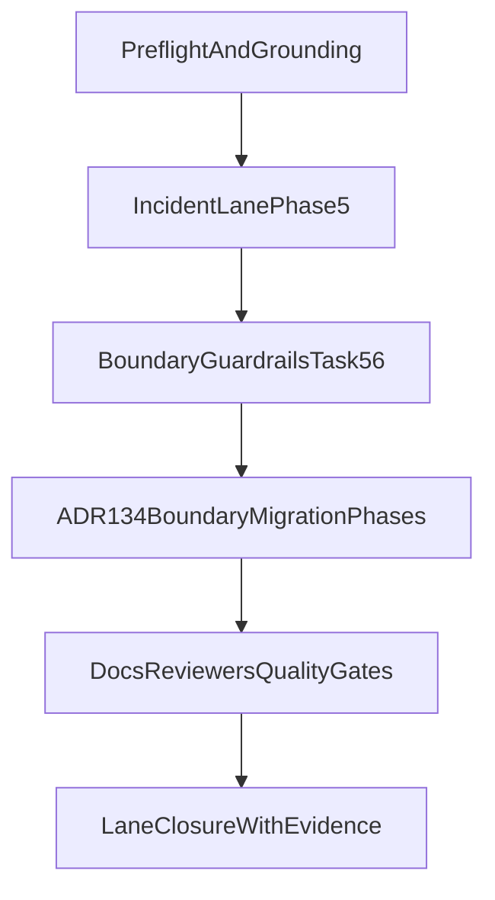

# Semantic Search Implementation Session Plan

## Goal

Close the active `semantic-search` work by executing the incident lane first, then completing ADR-134 boundary migration/enforcement, and finishing with deterministic closure evidence.

## Source-of-truth Inputs

- Session prompt: [.agent/prompts/semantic-search/semantic-search.prompt.md](.agent/prompts/semantic-search/semantic-search.prompt.md)
- Incident lane: [.agent/plans/semantic-search/active/cli-robustness.plan.md](.agent/plans/semantic-search/active/cli-robustness.plan.md)
- Boundary lane: [.agent/plans/semantic-search/active/search-cli-sdk-boundary-migration.execution.plan.md](.agent/plans/semantic-search/active/search-cli-sdk-boundary-migration.execution.plan.md)
- Doctrine: [docs/architecture/architectural-decisions/134-search-sdk-capability-surface-boundary.md](docs/architecture/architectural-decisions/134-search-sdk-capability-surface-boundary.md)
- Foundations: [.agent/directives/principles.md](.agent/directives/principles.md), [.agent/directives/testing-strategy.md](.agent/directives/testing-strategy.md), [.agent/directives/schema-first-execution.md](.agent/directives/schema-first-execution.md)

## Execution Order (authoritative)

1. Re-ground on foundations and confirm branch/worktree state.
2. Run incident checkpoint (`validate-aliases` -> `versioned-ingest` -> `validate-aliases`).
3. If metadata contract path fails, complete Phase 5 GREEN/REFACTOR in `cli-robustness` before any other lane.
4. Complete boundary guardrails (`Task 5.6`) and then execute boundary migration phases (0–4) from the ADR-134 plan.
5. Perform docs/ADR propagation and full gates only after both lanes’ acceptance criteria pass.

## Implementation Phases

### Phase 0 — Preflight and Baseline Capture

- Re-read foundations and ADR-134.
- Capture deterministic baseline (`git status --short`, `git branch --show-current`, active plan inventory).
- Capture current boundary signals with package-scoped lint/type checks from the boundary plan preflight.

### Phase 1 — Incident Lane Completion (`cli-robustness`)

- Execute Task 5.1–5.5 to close `previous_version` strict mapping contract drift through generator-backed flow.
- Confirm artefact coherence via `pnpm sdk-codegen`, `pnpm build`, `pnpm type-check`.
- Re-run lifecycle validation chain and prove alias health plus rollback-branch closure.
- Complete Phase 5 REFACTOR cleanup and preserve fail-fast diagnostics.

### Phase 2 — Boundary Doctrine Execution (`search-cli-sdk-boundary-migration`)

- Phase 0 RED proofs: write failing checks for root leakage and import-policy violations.
- Phase 1–2 GREEN: split SDK `read`/`admin` surfaces and migrate CLI imports by capability.
- Phase 3 REFACTOR: remove CLI duplicate canonical retrieval/preprocessing semantics.
- Phase 4 enforcement: encode boundary policy in lint (positive/negative fixtures, blocking behaviour).

### Phase 3 — Unified Closeout

- Complete pending specialist reviewer passes for both lanes: `test-reviewer`, `type-reviewer`, `docs-adr-reviewer`, `elasticsearch-reviewer` (plus re-check `code-reviewer` if substantive diffs changed).
- Propagate documentation updates to:
  - [apps/oak-search-cli/README.md](apps/oak-search-cli/README.md)
  - [apps/oak-search-cli/docs/ARCHITECTURE.md](apps/oak-search-cli/docs/ARCHITECTURE.md)
  - [packages/sdks/oak-search-sdk/README.md](packages/sdks/oak-search-sdk/README.md)
  - Relevant ADR updates/index consistency in [docs/architecture/architectural-decisions/](docs/architecture/architectural-decisions/)
- Run full one-gate-at-a-time sequence from repo root and restart from first failing gate after each fix.

## Cross-lane Dependency Map

## Evidence and Exit Criteria

- Incident evidence: no strict mapping exception for `previous_version`, `versioned-ingest` exits 0, post-ingest alias targets healthy.
- Boundary evidence: non-admin CLI cannot import `@oaknational/oak-search-sdk/admin`; no app deep/internal imports; root surface no admin/internal leakage.
- Governance evidence: reviewer findings resolved or explicitly owner-triaged; all quality gates pass without bypasses.

## Scope Controls (Non-goals)

- No compatibility layers, no fallback dynamic-mapping workarounds, no reopening already-completed historical phases without new regression evidence.
- No expansion into unrelated semantic-search roadmap items outside these two active lanes.

