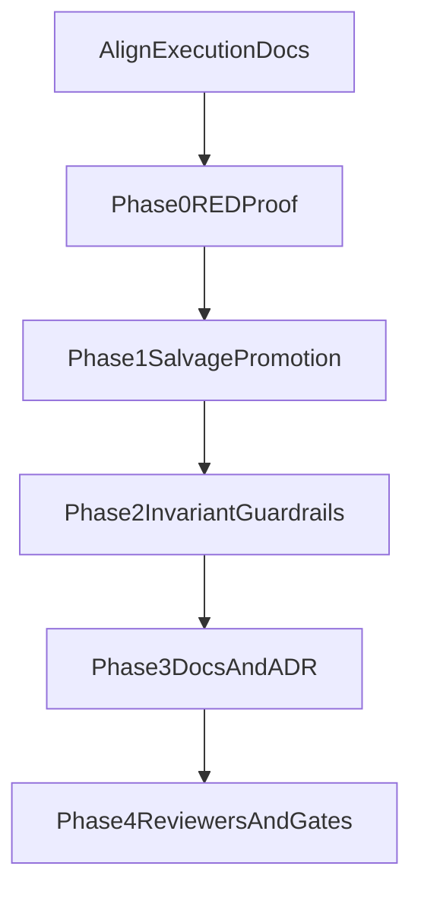

# Semantic Search Recovery Next Steps

## Intent

Establish one authoritative execution path for the recovery incident, remove contradictory instructions across active artefacts, and make Phase 0/1 execution deterministic and auditable.

## Current Situation

- Primary active lane is the recovery plan: [.agent/plans/semantic-search/active/semantic-search-recovery-and-guardrails.execution.plan.md](.agent/plans/semantic-search/active/semantic-search-recovery-and-guardrails.execution.plan.md).
- Session prompt already points to recovery-first sequencing: [.agent/prompts/semantic-search/semantic-search.prompt.md](.agent/prompts/semantic-search/semantic-search.prompt.md).
- The runbook still contains older lane assumptions and closeout steps tied to `cli-robustness`, creating execution risk: [.agent/plans/semantic-search/active/semantic-search-ingest-runbook.md](.agent/plans/semantic-search/active/semantic-search-ingest-runbook.md).

## Execution Plan

### 1) Reconcile authoritative execution surfaces

- Align runbook lane ownership, phase naming, reviewer set, and closeout order with the recovery plan and session prompt.
- Keep `cli-robustness` explicitly as supporting historical evidence only.
- Add a single authoritative statement of "which document governs what" across:
  - [.agent/plans/semantic-search/active/semantic-search-recovery-and-guardrails.execution.plan.md](.agent/plans/semantic-search/active/semantic-search-recovery-and-guardrails.execution.plan.md)
  - [.agent/plans/semantic-search/active/semantic-search-ingest-runbook.md](.agent/plans/semantic-search/active/semantic-search-ingest-runbook.md)
  - [.agent/prompts/semantic-search/semantic-search.prompt.md](.agent/prompts/semantic-search/semantic-search.prompt.md)

### 2) Tighten executable-plan compliance in the recovery plan

- Add missing deterministic validation blocks and completion criteria for tasks that currently lack them (2.2, 3.1, 3.2, 4.1).
- Add explicit phase-closeout gate checkpoints after Phases 0/1/2/3 (not only at final closeout), aligned with:
  - [.agent/commands/plan.md](.agent/commands/plan.md)
  - [.agent/plans/templates/components/quality-gates.md](.agent/plans/templates/components/quality-gates.md)
- Strengthen RED evidence by defining expected failing outcomes for guardrail tests before GREEN implementation.

### 3) Complete Phase 0 RED with immutable evidence pack

- Re-run and record deterministic baseline evidence set:
  - alias validation
  - metadata document
  - metadata mapping
  - staged counts for all six index families
- Add stop/go criteria for entering Phase 1 that require the full evidence pack to exist and agree.

### 4) Make Phase 1 salvage path deterministic

- Remove version ambiguity by documenting deterministic staged-version selection rule.
- Encode hard preconditions before promote:
  - `oak_meta.previous_version` mapping present
  - metadata/alias coherence established
- Define exact post-mutation triage branch predicates and mandatory readback commands before retry/rollback/unlock.

### 5) Prepare guardrail landing sequence (Phase 2 onward)

- Sequence Phase 2 invariant work to land first in tests (RED), then implementation (GREEN), then docs/ADR propagation (REFACTOR).
- Keep distributed lease design explicit and dependency-linked to scheduled refresh plan:
  - [.agent/plans/semantic-search/active/semantic-search-scheduled-refresh.operations.plan.md](.agent/plans/semantic-search/active/semantic-search-scheduled-refresh.operations.plan.md)
- Preserve no-compatibility-layer and fail-fast constraints from foundations.

## Dependency Flow

## Acceptance Signals

- No contradiction remains between recovery plan, runbook, and session prompt for lane ownership or phase order.
- Recovery plan satisfies executable-plan requirements for every task: acceptance criteria, deterministic commands, and completion rule.
- Phase 0 evidence is complete and supports a single unambiguous Phase 1 action path.
- Phase 1 instructions are deterministic, including failure triage and retry/rollback discipline.
- Reviewer and quality-gate closure expectations are explicit and aligned with repository doctrine.
