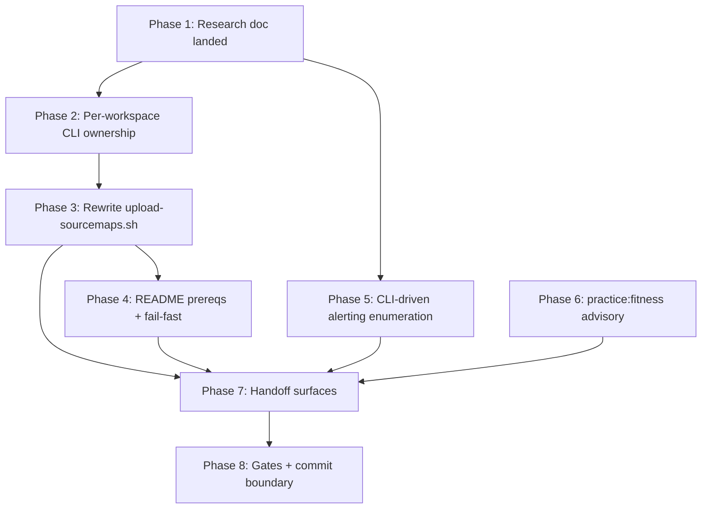

# Sentry CLI Hygiene Follow-up

## Branch policy (explicit)

- **Work lands on the current branch**: `feat/otel_sentry_enhancements` (HEAD `0f9245f5`, `fix: undo oauth scope changes`). **Do not cut a new branch.** The existing Sentry validation commits, the landed evidence bundle at [`.agent/plans/architecture-and-infrastructure/evidence/2026-04-16-http-mcp-sentry-validation/README.md`](.agent/plans/architecture-and-infrastructure/evidence/2026-04-16-http-mcp-sentry-validation/README.md), and this follow-up hygiene work all ship from the same branch.
- Before starting Phase 1, verify with `git status` + `git branch --show-current` that the active branch is `feat/otel_sentry_enhancements` and that the working tree matches the expected pre-state (the current uncommitted changes listed in the initial git status are the in-flight Sentry validation surfaces; they stay as they are and get extended by this plan, not replaced).
- Parent-plan authority stays with [`sentry-otel-integration.execution.plan.md`](.agent/plans/architecture-and-infrastructure/active/sentry-otel-integration.execution.plan.md) ("Follow-up hygiene" block). Explicitly **not** in scope: `search-observability.plan.md`, `codex-mcp-server-compatibility.plan.md`, [`clerk-cli-adoption.plan.md`](.agent/plans/architecture-and-infrastructure/future/clerk-cli-adoption.plan.md).

## Hard invariants (carried from the user instruction)

- Rule 3.5: pnpm-installable tools MUST be pnpm-installed.
- All infrastructure configuration lives in the repo; no user-global CLI state is allowed to substitute for committed configuration. After this branch, remove the user-global `~/.sentry/cli.db` project-pin left over from the previous session.
- Per-workspace ownership: each of the three Sentry-using workspaces declares its own `devDependency` and commits its own project-scoped config. No root hoisting.
- `pnpm practice:fitness` is advisory; only fix violations *this hygiene lane* introduces on top of the current branch state. Pre-existing violations are out of scope.
- Do not edit the 2026-04-16 evidence bundle `README.md`. Extend via a sibling follow-up note file (e.g. `item-8-alerting-enumeration-followup.md`) inside the same bundle directory.

## Phase 1 — Research deliverable (first landed change)

**Produce a durable side-by-side matrix for both Sentry CLIs and land it at a new file:** [`docs/operations/sentry-cli-usage.md`](docs/operations/sentry-cli-usage.md). Cross-link from [`docs/operations/sentry-deployment-runbook.md`](docs/operations/sentry-deployment-runbook.md) (replace the "Source map upload is not yet automated" note with a pointer to the new doc) and from [`docs/operations/README.md`](docs/operations/README.md).

Required coverage, keyed to upstream docs:

- `sentry-cli` (<https://docs.sentry.io/cli/>, installed via `@sentry/cli` on npm):
  - Subcommands: `releases`, `sourcemaps`, `debug-files` (DIF), `send-event`, `send-envelope`, `organizations`, `projects`, `info`, `login`, `monitors` (crons), `deploys`, `files` (code mappings upload paths).
  - Config model: `.sentryclirc` (INI), ancestor-discovered upward from cwd; env vars (`SENTRY_AUTH_TOKEN`, `SENTRY_ORG`, `SENTRY_PROJECT`, `SENTRY_URL`); `--org` / `--project` / `--url` flags.
  - Confirm behaviour when **multiple** `.sentryclirc` files exist between cwd and the repo root (does the nearest win, or do keys merge?). This answer decides the shape of Phase 2b.
  - API reach: `sentry-cli send-event` / `send-envelope` plus auth-tokened `curl` for anything the CLI does not expose directly (e.g. `/api/0/projects/{org}/{project}/alert-rules/`).
- `sentry` (<https://cli.sentry.dev/>, curl/brew install only, not npm):
  - Subcommands: `issues`, `events`, `releases`, `sourcemap`, `projects`, `auth`, `ai` (Sentry AI), `api` (generic REST), `open`, `doctor`.
  - Config model: `~/.sentry/cli.db` (user-global), `sentry auth login` / `sentry cli defaults`.
  - Explicit confirmation (or correction) of the napkin stance that `sentry-cli` is automation/CI and `sentry` is dev-time interactive + Sentry AI + `sentry api`; they are two tools split by **purpose**, not by age.
- Per-use-case recommendation table, keyed to real repo use cases:
  - CI / build-time source-map upload → `sentry-cli` via pnpm.
  - Dev-time issue triage, event inspection, Sentry AI → `sentry`.
  - Ad-hoc API calls (e.g. alert-rule enumeration) → prefer whichever CLI reaches the endpoint; note that `sentry-cli` does not expose `api` natively but `sentry api` does.
  - Release tagging and deploy markers → `sentry-cli releases` (automation surface).

All subsequent phases reference this doc rather than re-deriving the split.

## Phase 2 — Per-workspace Sentry CLI ownership

Apply to each of the three Sentry-using workspaces: [`apps/oak-curriculum-mcp-streamable-http`](apps/oak-curriculum-mcp-streamable-http/), [`apps/oak-search-cli`](apps/oak-search-cli/), and [`packages/libs/sentry-node`](packages/libs/sentry-node/).

### 2a — Add `@sentry/cli` as a workspace-local `devDependency`

Edit the three `package.json` files. Do **not** hoist to the root `package.json`. Run `pnpm install` once at the end.

### 2b — Commit workspace-local project-scoping config

Choice is **determined by the Phase 1 research answer** on `.sentryclirc` ancestor-discovery composition:

- If multiple `.sentryclirc` files compose cleanly (nearest-wins or keyed merge without surprises): commit one `.sentryclirc` per workspace:
  - `apps/oak-curriculum-mcp-streamable-http/.sentryclirc` → `oak-open-curriculum-mcp`
  - `apps/oak-search-cli/.sentryclirc` → `oak-open-curriculum-search-cli`
  - `packages/libs/sentry-node/.sentryclirc` → the project the package's tests/fixtures would target (confirm with owner if ambiguous; this package has no runtime currently invoking the CLI, so the config is readiness-only).
  - Each file pins `[defaults] org=`, `project=`, `url=https://de.sentry.io`; auth token remains `SENTRY_AUTH_TOKEN` env only (never committed).
- If ancestor-discovery does **not** compose cleanly across workspaces: commit a tiny workspace-local wrapper script per workspace (e.g. `scripts/sentry-cli.sh`) that calls `pnpm exec sentry-cli --org ... --project ... --url ... "$@"`, and route every workspace script through it.

Either shape MUST make it impossible for a command in workspace A to touch workspace B's Sentry project.

### 2c — Remove user-global project pin

Document in the research doc (and mention in the Phase 7 napkin entry) that `sentry cli defaults` in `~/.sentry/cli.db` is **not** infrastructure configuration and is not a substitute for the committed config. Remove any leftover user-global pin from the previous session as the final step of this phase.

## Phase 3 — Rewrite `upload-sourcemaps.sh` against `sentry-cli`

Rewrite [`apps/oak-curriculum-mcp-streamable-http/scripts/upload-sourcemaps.sh`](apps/oak-curriculum-mcp-streamable-http/scripts/upload-sourcemaps.sh) so it:

- Invokes `pnpm exec sentry-cli sourcemaps upload --release "$RELEASE" "$DIST_DIR"` (with `--org`/`--project`/`--url` either from the committed `.sentryclirc` or via the wrapper — whichever Phase 2b chose).
- Replaces the current `command -v sentry` check with a `require_command "sentry-cli" …` fail-fast matching the helper style in [`apps/oak-curriculum-mcp-streamable-http/scripts/dev-widget-in-host.sh`](apps/oak-curriculum-mcp-streamable-http/scripts/dev-widget-in-host.sh#L29-L41). Since `sentry-cli` is now a workspace devDependency, the check primarily confirms `pnpm exec` resolves it (e.g. `pnpm exec sentry-cli --version`).
- Updates the header comment block to cite `sentry-cli` instead of the dev `sentry` CLI, and to link to `docs/operations/sentry-cli-usage.md`.

Re-verify end-to-end on a fresh session-specific release tag:

```bash
pnpm build
SENTRY_RELEASE_OVERRIDE=hygiene-<YYYY-MM-DD>-sentry-cli-check pnpm start   # (with ENABLE_TEST_ERROR_TOOL=true, DANGEROUSLY_DISABLE_AUTH=true)
RELEASE=hygiene-<YYYY-MM-DD>-sentry-cli-check pnpm sourcemaps:upload
# then trigger the three evidence tool errors; confirm frames symbolicate in Sentry
```

Record the verification outcome (one line, no raw payloads) in a new file `item-8-alerting-enumeration-followup.md` (or sibling `sentry-cli-reverify-note.md`) next to the 2026-04-16 evidence bundle README. The bundle README stays frozen.

## Phase 4 — README prereqs and fail-fast for the dev `sentry` CLI

Since the dev `sentry` CLI is not pnpm-installable, it goes into [`README.md`](README.md) prerequisites:

- Add a bullet to the Quick Start → Prerequisites list alongside `bun` / `jq` / `lsof` / `gitleaks`:

  ```markdown
  - **sentry** (optional, for dev-time issue triage, event inspection, and Sentry AI) — install via [cli.sentry.dev](https://cli.sentry.dev/) (`curl https://cli.sentry.dev/install -fsS | bash`). Required only for agents and humans using Sentry AI or `sentry api` locally; CI and source-map automation use the pnpm-installed `sentry-cli` instead.
  ```

- Add the `require_command "sentry" "https://cli.sentry.dev/"` fail-fast pattern (matching the dev-widget-in-host helper) to any script that calls the dev `sentry` CLI. Current branch state has none left after Phase 3's rewrite; add it defensively to any future script template. Extend the helper if a script exists that is best kept on the dev CLI (unlikely — everything with `--release` scoping should move to `sentry-cli`).

## Phase 5 — CLI-driven alerting enumeration (exhaust before asking)

Query `/api/0/projects/oak-national-academy/oak-open-curriculum-mcp/alert-rules/` via, in order of preference:

1. `pnpm exec sentry-cli` + `SENTRY_AUTH_TOKEN` → `curl` (if `sentry-cli` does not itself expose the endpoint).
2. `sentry api GET /projects/oak-national-academy/oak-open-curriculum-mcp/alert-rules/` (dev CLI).

Record the response (metadata-only, scrubbed) inline in the new `item-8-alerting-enumeration-followup.md` file in the evidence bundle:

- If rules exist: list rule id + title + condition summary; flip item 8 in the follow-up note to **MET** (the bundle README stays frozen, but the parent plan's [Road to Provably Working Sentry table](.agent/plans/architecture-and-infrastructure/active/sentry-otel-integration.execution.plan.md) step 5 can be updated to reflect that evidence item 8 is now resolved via the follow-up note).
- If the API genuinely cannot enumerate rule state from either CLI: paste the exact API response that proves the gap (scrubbed), and raise a **single focused** question to the parent-plan owner with a one-line recommendation.

## Phase 6 — Treat `practice:fitness` as advisory

Run `pnpm practice:fitness` at closure. Only fix violations introduced by *this hygiene lane on top of the current branch state* (most plausibly the new `docs/operations/sentry-cli-usage.md` if it lands long, or napkin entries). Pre-existing violations on the branch are out of scope and become candidate follow-up.

## Phase 7 — Handoff surfaces

Edit exactly these files, nothing else:

- [`sentry-otel-integration.execution.plan.md`](.agent/plans/architecture-and-infrastructure/active/sentry-otel-integration.execution.plan.md):
  - Mark the "Follow-up hygiene" bullets as closed on this branch, with citations to the new research doc and the follow-up note file. Rewrite items referring to `upload-sourcemaps.sh` to reflect the `pnpm exec sentry-cli` reality.
  - Update the Road to Provably Working Sentry step 5 row to "**DONE**" **only if** Phase 5 resolves item 8 via the CLI path.
  - Update the 2026-04-16 execution snapshot "Next steps" so the next restart reads: validation lane cleared → `sentry-observability-expansion.plan.md` resumes.
- [`.agent/prompts/session-continuation.prompt.md`](.agent/prompts/session-continuation.prompt.md): refresh `Current state`, `Current objective`, and `Next safe step` to reflect closure of the Sentry CLI hygiene lane and the pivot back to the expansion plan.
- [`.agent/memory/active/napkin.md`](.agent/memory/active/napkin.md): one session entry in the surprise/behaviour-change format per the [napkin skill](.agent/skills/napkin/SKILL.md).

The 2026-04-16 evidence bundle `README.md` is **not** edited; any item-8 update is recorded in the sibling follow-up note file created in Phase 3/5.

## Phase 8 — Gates and commit boundary

- `pnpm markdownlint:root` over edited markdown.
- `pnpm type-check` and `pnpm lint` across the three affected workspaces (devDependency addition is a `package.json` change; no product-code edits are expected, so the `sentry-node` tests should stay green without modification).
- `pnpm practice:fitness` (advisory).
- Stop at the commit boundary. Surface the planned commit(s) and diff summary for owner approval.

## Deliverable inventory

- `docs/operations/sentry-cli-usage.md` (new).
- `apps/oak-curriculum-mcp-streamable-http/package.json` + workspace-local scoping config.
- `apps/oak-search-cli/package.json` + workspace-local scoping config.
- `packages/libs/sentry-node/package.json` + workspace-local scoping config.
- `apps/oak-curriculum-mcp-streamable-http/scripts/upload-sourcemaps.sh` (rewrite).
- `README.md` (prereqs update).
- `.agent/plans/architecture-and-infrastructure/evidence/2026-04-16-http-mcp-sentry-validation/item-8-alerting-enumeration-followup.md` (new; sibling to the frozen bundle README).
- `sentry-otel-integration.execution.plan.md`, `session-continuation.prompt.md`, `napkin.md` (handoff sweep).

## Exit condition

Research doc landed; all three Sentry-using workspaces own their own devDependency + scoping config; `upload-sourcemaps.sh` uses `pnpm exec sentry-cli`; root README lists the dev `sentry` CLI with a fail-fast warning; item 8 has been re-evaluated against the CLI enumeration result (either resolved in the follow-up note, or recorded as genuinely owner-blocked with the proof payload); the branch is ready for owner review; Sentry validation lane is cleared so `sentry-observability-expansion.plan.md` can resume.


