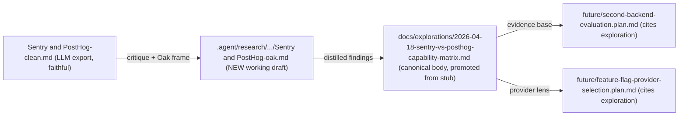

# Sentry vs PostHog: Oak Overlay + Exploration Body

## Intent and frame

The original [`.agent/research/sentry-and-posthog/Sentry and PostHog-clean.md`](.agent/research/sentry-and-posthog/Sentry%20and%20PostHog-clean.md) is a normalised LLM-exported vendor comparison written for a greenfield buyer. Oak is not a greenfield buyer, but Oak is also **not yet at a usage level where evidence-driven gap analysis is meaningful**:

- Sentry integration is **actively in-flight** — another agent is working the [`active/sentry-observability-maximisation-mcp.plan.md`](.agent/plans/observability/active/sentry-observability-maximisation-mcp.plan.md) lanes in this repo right now. Any "what's wired today" claim risks being stale within the hour and risks confusing the parallel agent. This plan must coordinate, not collide.
- The MCP server is **private alpha with very few users**. There is no meaningful traffic, so no usage data, no volume curves, no issue-grouping evidence, no replay sample, no realistic cost projection from current numbers. Any analysis grounded in "current usage" would be a category error.
- PostHog is the principal Oak product's analytics tool, but **this project has no PostHog account**. PostHog MCP is unavailable.
- ADR-162 mandates vendor-independence via `@oaknational/observability-events`; ADR-160 makes the redaction barrier non-bypassable.

So the question this artefact answers is deliberately **possibility-shaped, not justification-shaped**:

> *Given Oak's five-axis observability MVP target (per ADR-162 and [`high-level-observability-plan.md`](.agent/plans/observability/high-level-observability-plan.md)), what does each platform make possible, what would each cost at modelled launch and post-launch volumes, and what are the architectural and capability decision points the strategic plans need framed before real traffic starts producing evidence?*

The deliverable is the evidence body that lets [`future/second-backend-evaluation.plan.md`](.agent/plans/observability/future/second-backend-evaluation.plan.md) and [`future/feature-flag-provider-selection.plan.md`](.agent/plans/observability/future/feature-flag-provider-selection.plan.md) **stay strategic with sharper edges** — not promote, not block, but be promotion-ready the day a real signal appears.

PostHog MCP cannot be used (no account). Sentry MCP is treated as a low-value, coordination-sensitive secondary lens (see Stream C).

## Artefact map

The overlay is the working scratchpad with all original research, dated arithmetic, MCP-derived "what's actually wired" snapshots, alternatives explored, and rejected lines of thought. The exploration body is the curated, citation-disciplined output that the strategic plans actually consume.

## Files to create / modify

- **Create**: `.agent/research/sentry-and-posthog/Sentry and PostHog-oak.md` (working draft; ~600–1000 lines; matches existing space-in-filename convention).
- **Modify**: [`docs/explorations/2026-04-18-sentry-vs-posthog-capability-matrix.md`](docs/explorations/2026-04-18-sentry-vs-posthog-capability-matrix.md) — flip status from `stub` to `active`, replace §2–§5 with full-text content; preserve §1 problem statement and §6 references; expand frontmatter promotion-trigger record.
- **Append**: `.agent/memory/napkin.md` — provenance audit (web fetches dated, Sentry MCP queries cited, reviewer rounds recorded), per the napkin discipline.
- **Do not touch**: the original `Sentry and PostHog-clean.md` (faithful copy, leave intact).

## Original-research streams (parallel where possible)

**Stream A — Repo grounding (read-only)**
- ADR-160 (redaction barrier), ADR-162 (observability-first), ADR-154 (framework/consumer separation), ADR-078 (per-request DI).
- [`active/sentry-observability-maximisation-mcp.plan.md`](.agent/plans/observability/active/sentry-observability-maximisation-mcp.plan.md) — all 17 lanes, especially L-15 (close-out ADR), L-7 (release linkage), L-10 (flag scaffolding), L-12 (widget Sentry).
- [`current/observability-events-workspace.plan.md`](.agent/plans/observability/current/observability-events-workspace.plan.md) — the 7 MVP event schemas.
- [`current/multi-sink-vendor-independence-conformance.plan.md`](.agent/plans/observability/current/multi-sink-vendor-independence-conformance.plan.md) — the conformance shape.
- `packages/libs/sentry-node/` source + README — what's actually wired vs. what's documented.
- `apps/oak-curriculum-mcp-streamable-http/docs/observability.md` — the in-flight observability doc.
- `docs/explorations/2026-04-18-*` — the seven sibling explorations (so positioning is consistent).

**Stream B — Live web verification (dated 2026-04-19) — PRIMARY EVIDENCE**
Because there is no usage data to ground claims, capability and pricing facts from primary vendor sources do most of the work. Each external claim that survives into the exploration body must carry a fetch date:
- Sentry: capability surface (errors, tracing, profiling, replay, monitors, uptime, releases, Seer, feature-flag integration, AI Code Review, Codecov, source maps, Relay), pricing, retention, BAA/HIPAA, EU residency, self-host scope.
- PostHog: capability surface (product analytics, web analytics, session replay, feature flags, experiments, surveys, error tracking, customer analytics, CDP/warehouse, LLM analytics, logs), pricing (analytics, replay, error tracking, feature flags), retention, EU Frankfurt region, BAA scoping, self-host caveats.
- **Modelled** pricing scenarios (not "current usage" scenarios): pick three modelled volume tiers — *private-alpha-today* (≈ near-zero), *public-beta-launch* (modelled from the launch-criteria envelope in [`high-level-observability-plan.md`](.agent/plans/observability/high-level-observability-plan.md) §Launch Criteria), and *post-launch-12-months* (a defensible scaling assumption). Show arithmetic; explicitly mark all three as **modelled, not measured**.
- OpenFeature spec status (since [`future/feature-flag-provider-selection.plan.md`](.agent/plans/observability/future/feature-flag-provider-selection.plan.md) names it as the boundary).
- Spot-check the original document's recency-sensitive claims (Sentry "100+ platforms / 30+ languages", PostHog free-tier numbers, retention windows by tier) against current vendor pages.

**Stream C — Sentry MCP (de-prioritised; coordination-sensitive)**
The parallel Sentry-integration agent is actively modifying state on `oak-national-academy/oak-open-curriculum-mcp`. Live volume / issue / span queries would be both low-signal (no traffic) and noisy for the parallel agent. Restrict to **static project-config facts**, and only when needed to anchor a specific architectural claim:
- Project existence, region, member of `oak-national-academy` org.
- Whether source-map upload is configured (project-side flag, not "are maps present in recent events").
- Declared alert rules (config, not firing history).
- Declared retention windows.
Skip entirely if there's any ambiguity about overlap with the parallel agent's work. Flag any read explicitly in the napkin so the parallel agent can see it. **Do not** make claims about ingestion volume, issue counts, replay samples, span throughput, metric receipt, or release-tag history — none of those are evidentially grounded yet.

**Stream D — Assumption stress tests** (the explicit "question assumptions" pass)
Seven assumptions to test, each documented in the overlay with the test method and verdict. Tests are **possibility-shaped** (does the capability exist, does it map to the MVP) — not usage-shaped (does current traffic justify it):
1. *"Vendor choice should be evidence-driven."* Test: with no traffic, can we even defer this question to evidence, or is there a class of architectural decision (schema shape, redaction policy, OpenFeature seam) that **must** be settled before traffic to avoid retrofit cost?
2. *"PostHog is the natural second sink."* Test: cross-reference exploration §3 question 4 against the events-workspace schema list — would PostHog `capture()` shape add a meaningful axis, or only re-emit what Sentry already receives?
3. *"OpenFeature behind any provider."* Test: does Sentry's feature-flag integration satisfy the L-10 contract through OpenFeature, or does it pull the seam open?
4. *"Sentry can answer the data scientist's product-axis questions alone."* Test against [exploration 4](docs/explorations/2026-04-18-structured-event-schemas-for-curriculum-analytics.md) §4.3 categorical-axis vocabulary — capability comparison, not "does Sentry have data yet".
5. *"Replay overlap is double-billing."* Test: are debugging replay (Sentry, replay-on-error sampling) and behaviour replay (PostHog, cohort-driven) the same recording or different scopes/sampling? Possibility-only — not "we're paying for it today".
6. *"The promotion trigger should fire on usage evidence."* Test: at private-alpha volume the named triggers in [`docs/explorations/2026-04-18-sentry-vs-posthog-capability-matrix.md`](docs/explorations/2026-04-18-sentry-vs-posthog-capability-matrix.md) §5 cannot fire from data. Re-frame: which triggers are **architecturally decidable today** and which genuinely need post-launch traffic?
7. *"Doing this analysis now is proportional."* Meta-test (assumptions-reviewer's natural beat): given private alpha + parallel Sentry agent + no PostHog account, is authoring this exploration body now the right move, or should it wait? Record the call explicitly so a future reader can audit it.

## Document structures

**Overlay (working draft) — proposed sections**
1. Provenance & how to read this — including the **possibility-not-justification** disclaimer, the parallel-Sentry-agent coordination note, and the no-PostHog-account note
2. Oak frame (the facts the original missed: Sentry in-flight, private-alpha traffic floor, PostHog product-side only, ADR-160/162 envelope, parallel agent)
3. Restatement of the original's thesis in Oak terms
4. Per-axis **capability** matrix (engineering / product / usability / accessibility / security; columns: Sentry can / PostHog can / events workspace covers regardless / neither covers). Capability, not current usage.
5. Seven-assumption stress test (Stream D output, with verdicts including the meta-proportionality test)
6. Modelled pricing scenarios with arithmetic (Stream B output, dated; three modelled tiers, all explicitly marked **modelled, not measured**)
7. Sentry-side static-config snapshot (Stream C output, dated, with explicit "no usage data" caveat and parallel-agent coordination note); short by design
8. Answers to the six exploration research questions, capability-shaped (concise; long-form lives in the exploration)
9. **Architectural decisions decidable today vs. genuinely-needs-traffic** split — replaces the "promotion-trigger fired/not-fired" framing
10. Open questions and follow-on slices (including: when should we re-run this with real traffic; what would the trigger evidence look like)
11. References (overlay-local; separate from exploration's references)

**Exploration body — proposed sections** (replacing current §2–§5; preserving §1 and §6)
1. Scope and method — explicitly capability-shaped, not usage-justified; date-stamped; cites overlay; notes private-alpha state and parallel Sentry agent
2. Per-axis **capability** matrix (curated subset of overlay §4)
3. Answers to the six research questions (full-form, capability-shaped)
4. Architectural decisions decidable today vs. genuinely-needs-traffic split — replaces the original "promotion-trigger fired" framing; for each strategic plan, name what would be needed to fire its trigger and which of those need real traffic
5. Risks and unknowns (including: this analysis runs ahead of evidence; rerun obligation when traffic appears)
6. Decision recommendation framing (no decisions made; just the framing the strategic plans need)
7. Promotion-trigger record update — keep stub status open with a frontmatter note recording that a possibility-shaped body has been authored under explicit "no usage data" framing; the original promotion trigger remains intact for the post-launch re-run

## Reviewer choreography (two rounds)

**Round 1 — after overlay draft (before exploration draft)**
- `assumptions-reviewer` reviews the overlay's six assumption tests + per-axis matrix for proportionality, assumption validity, and blocking legitimacy.
- `docs-adr-reviewer` reviews overlay completeness, ADR alignment (160 / 162 / 154 / 078), citation discipline, and drift against the existing observability plan set.
- I revise the overlay; the exploration body is then drafted from the revised overlay.

**Round 2 — after exploration body draft**
- Both reviewers review the exploration body in its plan-citing context (i.e. against `future/second-backend-evaluation.plan.md` and `future/feature-flag-provider-selection.plan.md`).
- Findings are dispositioned ACTIONED / REJECTED-with-rationale, recorded in the napkin per `findings-route-to-lane-or-rejection` pattern.

Reviewers are invoked in parallel within each round, `readonly: true`.

## What is explicitly out of scope

- Any change to the original `Sentry and PostHog-clean.md` (faithful copy).
- Any change to ADR-160, ADR-162, or any other accepted ADR.
- Any change to `future/second-backend-evaluation.plan.md` or `future/feature-flag-provider-selection.plan.md` themselves (they consume the exploration; they aren't rewritten by it).
- Any change to `active/sentry-observability-maximisation-mcp.plan.md` or any of its lanes — the parallel Sentry-integration agent owns that surface.
- Any code change anywhere in `apps/`, `packages/`, or `agent-tools/`.
- Any claim grounded in current usage/volume/issue/replay/span data — there isn't any (private alpha).
- Sentry MCP writes; Sentry MCP reads that touch live event/issue/replay/span surfaces (read-only static config only, see Stream C).
- PostHog MCP queries (no account).
- Promotion of either plan from `future/` to `current/` (that's a separate decision, post-traffic).
- Promotion of the exploration stub itself out of `stub` status — the body is authored, but stub status is preserved with a frontmatter annotation, because the stub's promotion trigger is usage-shaped and that hasn't fired.
- Any commits.

## Validation before finishing

- Overlay structural parity (overlay's section list matches the structure declared above).
- Exploration body markdownlint via the doc-estate's actual validator (the exploration lives under `docs/`, which is in the markdownlint scope; the overlay lives under `.agent/`, which is excluded — apply structural validation only there).
- Every external claim in the exploration body carries a fetch date.
- Every Sentry MCP claim cites the query.
- Both reviewers returned clean (or remaining findings explicitly REJECTED with rationale).
- Napkin entry recorded (provenance audit + reviewer rounds + dispositions).
- No edits to the original clean file or to any ADR.

## Risks and how I'll handle them

- **Collision with the parallel Sentry-integration agent**: another agent is editing the maximisation-plan surface and may be touching `packages/libs/sentry-node/`, `apps/oak-curriculum-mcp-streamable-http/docs/observability.md`, the napkin, and Sentry project state. Mitigation: this plan does not edit any of those files; it only reads them, and reads of the maximisation plan are taken as a snapshot at start with explicit "as of" stamps. The napkin entry at the end will note the parallel agent and the snapshot times so any conflict is auditable.
- **Justification leakage**: the biggest temptation is to drift from "what's possible" into "what's needed today" — which can't be evidenced. Mitigation: every section header that could carry usage framing (pricing, promotion, decisions) is explicitly possibility-shaped, and assumption #7 (proportionality) plus assumptions-reviewer Round 1 are the gates.
- **Scope creep**: the overlay is the only place where I'm allowed to ramble; the exploration body is curated. Reviewer Round 1 polices this boundary.
- **Stale arithmetic**: every pricing claim is dated and explicitly modelled-not-measured; if a page changes between draft and review, I re-fetch and re-stamp.
- **Sentry MCP overreach**: I will not invoke any Sentry MCP tool that mutates state, and not even reads against live event/issue/replay/span surfaces — only static project-config reads, and only when an architectural claim genuinely needs the anchor.
- **Assumption-shaped overreach**: the seven tests in Stream D are explicitly designed to surface places where this exploration could overstep — assumptions-reviewer is the second gate on that.
- **Reviewer disagreement**: if assumptions-reviewer and docs-adr-reviewer disagree on a finding, the napkin records the conflict and I make the call in the overlay's "open questions" section, not in the exploration body.
- **Re-run obligation forgotten**: an explicit follow-up note in the exploration's "Risks and unknowns" section commits to re-running this analysis once real traffic exists, with a named trigger (e.g. "first 30 days of post-launch data").