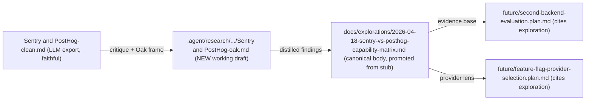

# Sentry vs PostHog: Oak Overlay + Exploration Body

## Intent and frame

The original [`.agent/research/sentry-and-posthog/Sentry and PostHog-clean.md`](.agent/research/sentry-and-posthog/Sentry%20and%20PostHog-clean.md) is a normalised LLM-exported vendor comparison written for a greenfield buyer. Oak is not a greenfield buyer:

- Sentry is already wired on `oak-open-curriculum-mcp` (Vercel, EU region, source maps, redaction barrier, alert rule 521866).
- PostHog is the principal product's analytics tool (no account on this project yet).
- ADR-162 mandates vendor-independence via `@oaknational/observability-events`; ADR-160 makes the redaction barrier non-bypassable.
- [`future/second-backend-evaluation.plan.md`](.agent/plans/observability/future/second-backend-evaluation.plan.md) explicitly reframes the question as "what specific Sentry gap requires a second backend" and cites the exploration stub as its evidence base.

The deliverable is therefore **not** a re-comparison of vendors. It is the evidence body that lets `future/second-backend-evaluation.plan.md` and `future/feature-flag-provider-selection.plan.md` either promote, narrow, or stay strategic — and the working draft that backs that body.

PostHog MCP cannot be used (no account); Sentry MCP can.

## Artefact map

The overlay is the working scratchpad with all original research, dated arithmetic, MCP-derived "what's actually wired" snapshots, alternatives explored, and rejected lines of thought. The exploration body is the curated, citation-disciplined output that the strategic plans actually consume.

## Files to create / modify

- **Create**: `.agent/research/sentry-and-posthog/Sentry and PostHog-oak.md` (working draft; ~600–1000 lines; matches existing space-in-filename convention).
- **Modify**: [`docs/explorations/2026-04-18-sentry-vs-posthog-capability-matrix.md`](docs/explorations/2026-04-18-sentry-vs-posthog-capability-matrix.md) — flip status from `stub` to `active`, replace §2–§5 with full-text content; preserve §1 problem statement and §6 references; expand frontmatter promotion-trigger record.
- **Append**: `.agent/memory/napkin.md` — provenance audit (web fetches dated, Sentry MCP queries cited, reviewer rounds recorded), per the napkin discipline.
- **Do not touch**: the original `Sentry and PostHog-clean.md` (faithful copy, leave intact).

## Original-research streams (parallel where possible)

**Stream A — Repo grounding (read-only)**
- ADR-160 (redaction barrier), ADR-162 (observability-first), ADR-154 (framework/consumer separation), ADR-078 (per-request DI).
- [`active/sentry-observability-maximisation-mcp.plan.md`](.agent/plans/observability/active/sentry-observability-maximisation-mcp.plan.md) — all 17 lanes, especially L-15 (close-out ADR), L-7 (release linkage), L-10 (flag scaffolding), L-12 (widget Sentry).
- [`current/observability-events-workspace.plan.md`](.agent/plans/observability/current/observability-events-workspace.plan.md) — the 7 MVP event schemas.
- [`current/multi-sink-vendor-independence-conformance.plan.md`](.agent/plans/observability/current/multi-sink-vendor-independence-conformance.plan.md) — the conformance shape.
- `packages/libs/sentry-node/` source + README — what's actually wired vs. what's documented.
- `apps/oak-curriculum-mcp-streamable-http/docs/observability.md` — the in-flight observability doc.
- `docs/explorations/2026-04-18-*` — the seven sibling explorations (so positioning is consistent).

**Stream B — Live web verification (dated 2026-04-19)**
Each external claim that survives into the exploration body must carry a fetch date:
- Sentry pricing, retention, BAA/HIPAA, EU residency, self-host scope.
- PostHog pricing (analytics, replay, error tracking, feature flags), retention, EU Frankfurt region, BAA scoping, self-host caveats.
- Re-derive every pricing scenario in the original document with arithmetic shown; flag the PostHog mid-tier and enterprise rows that looked low.
- OpenFeature spec status (since [`future/feature-flag-provider-selection.plan.md`](.agent/plans/observability/future/feature-flag-provider-selection.plan.md) names it as the boundary).

**Stream C — Sentry MCP (de.sentry.io, oak-national-academy/oak-open-curriculum-mcp)**
- Project metadata, ingestion volume by category (errors, transactions, replays, profiles, monitors), retention windows actually applied to our plan.
- Recent issue volume + grouping quality.
- Release tags present (validates L-7 status).
- Source-map upload status.
- Existing alert rules (validate "521866" is the only smoke-shape rule).
- Any spans / profiles / metrics already flowing.
- Whether `Sentry.metrics.*` is being received (validates L-4b status).

**Stream D — Assumption stress tests** (the explicit "question assumptions" pass)
Six assumptions to test, each documented in the overlay with the test method and verdict:
1. *"Both vendors live = use both is the natural posture."* Test: does ADR-162's vendor-independence clause actually require dual-export, or only require the **option** of dual-export?
2. *"PostHog is the natural second sink."* Test: cross-reference exploration §3 question 4 against the events-workspace schema list — does PostHog `capture()` shape add or only re-emit?
3. *"OpenFeature behind any provider."* Test: does Sentry's flag integration cover the L-10 contract, or does it require a non-OpenFeature path?
4. *"Sentry can answer the data scientist's product-axis questions alone."* Test against [exploration 4](docs/explorations/2026-04-18-structured-event-schemas-for-curriculum-analytics.md) §4.3 categorical-axis vocabulary.
5. *"Replay overlap is double-billing."* Test: are debugging replay and behaviour replay the same recording, or different scopes/sampling?
6. *"The promotion trigger has not yet fired."* Test against the three named triggers in the exploration §5; if any one has fired in evidence, name it.

## Document structures

**Overlay (working draft) — proposed sections**
1. Provenance & how to read this (one paragraph; links to original + exploration)
2. Oak frame (five facts the original missed)
3. Restatement of the original's thesis in Oak terms
4. Per-axis verdict matrix (engineering / product / usability / accessibility / security; columns: Sentry covers / PostHog covers / events workspace covers regardless / neither covers)
5. Six-assumption stress test (Stream D output, with verdicts)
6. Re-derived pricing scenarios with arithmetic (Stream B output, dated)
7. Sentry MCP snapshot (Stream C output, dated, with caveat that PostHog MCP unavailable)
8. Answers to the six exploration research questions (concise; long-form lives in the exploration)
9. Promotion-trigger verdict for `future/second-backend-evaluation.plan.md` and `future/feature-flag-provider-selection.plan.md` (fired / not fired / partially fired, with named evidence)
10. Open questions and follow-on slices
11. References (overlay-local; separate from exploration's references)

**Exploration body — proposed sections** (replacing current §2–§5; preserving §1 and §6)
1. Scope and method (date-stamped; cites overlay)
2. Per-axis verdict matrix (curated subset of overlay §4)
3. Answers to the six research questions (full-form)
4. Promotion-trigger verdict (fired / not / partial; per dependent plan)
5. Risks and unknowns
6. Decision recommendation framing (no decisions made; just the framing the strategic plans need)
7. Promotion-trigger record update (frontmatter + body, including which plan-side trigger this exploration discharges)

## Reviewer choreography (two rounds)

**Round 1 — after overlay draft (before exploration draft)**
- `assumptions-reviewer` reviews the overlay's six assumption tests + per-axis matrix for proportionality, assumption validity, and blocking legitimacy.
- `docs-adr-reviewer` reviews overlay completeness, ADR alignment (160 / 162 / 154 / 078), citation discipline, and drift against the existing observability plan set.
- I revise the overlay; the exploration body is then drafted from the revised overlay.

**Round 2 — after exploration body draft**
- Both reviewers review the exploration body in its plan-citing context (i.e. against `future/second-backend-evaluation.plan.md` and `future/feature-flag-provider-selection.plan.md`).
- Findings are dispositioned ACTIONED / REJECTED-with-rationale, recorded in the napkin per `findings-route-to-lane-or-rejection` pattern.

Reviewers are invoked in parallel within each round, `readonly: true`.

## What is explicitly out of scope

- Any change to the original `Sentry and PostHog-clean.md` (faithful copy).
- Any change to ADR-160, ADR-162, or any other accepted ADR.
- Any change to `future/second-backend-evaluation.plan.md` or `future/feature-flag-provider-selection.plan.md` themselves (they consume the exploration; they aren't rewritten by it).
- Any code change anywhere in `apps/`, `packages/`, or `agent-tools/`.
- PostHog MCP queries (no account).
- Promotion of either plan from `future/` to `current/` (that's a separate decision, possibly enabled by this evidence).
- Any commits.

## Validation before finishing

- Overlay structural parity (overlay's section list matches the structure declared above).
- Exploration body markdownlint via the doc-estate's actual validator (the exploration lives under `docs/`, which is in the markdownlint scope; the overlay lives under `.agent/`, which is excluded — apply structural validation only there).
- Every external claim in the exploration body carries a fetch date.
- Every Sentry MCP claim cites the query.
- Both reviewers returned clean (or remaining findings explicitly REJECTED with rationale).
- Napkin entry recorded (provenance audit + reviewer rounds + dispositions).
- No edits to the original clean file or to any ADR.

## Risks and how I'll handle them

- **Scope creep**: the overlay is the only place where I'm allowed to ramble; the exploration body is curated. Reviewer Round 1 polices this boundary.
- **Stale arithmetic**: every pricing claim is dated; if a page changes between draft and review, I re-fetch and re-stamp.
- **Sentry MCP read-only assumption**: I will not invoke any Sentry MCP tool that mutates project state; only read tools.
- **Assumption-shaped overreach**: the six tests in Stream D are explicitly designed to surface places where this exploration could overstep — assumptions-reviewer is the second gate on that.
- **Reviewer disagreement**: if assumptions-reviewer and docs-adr-reviewer disagree on a finding, the napkin records the conflict and I make the call in the overlay's "open questions" section, not in the exploration body.