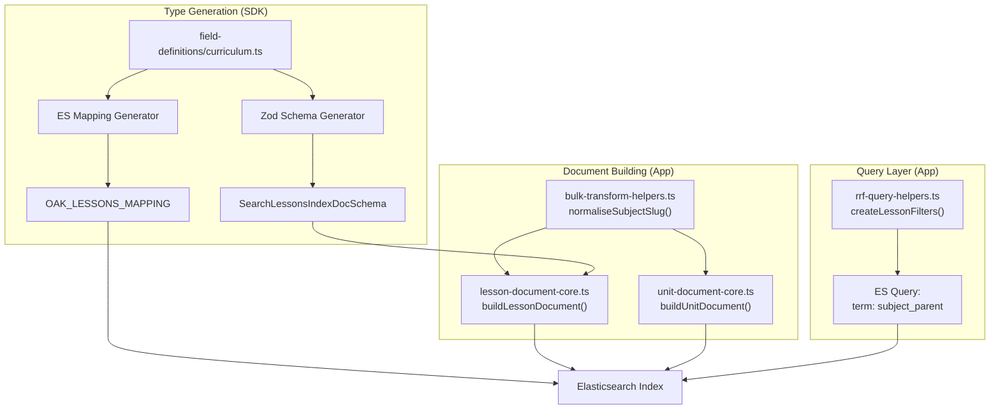

# Subject Parent Field Implementation

This plan implements ADR-101: Subject Hierarchy for Search Filtering. The goal is to add a `subject_parent` field to the Elasticsearch index that captures the hierarchical relationship between KS4 Science subjects (physics, chemistry, biology, combined-science) and their parent subject "science".

## Foundation Principles

Before each task, re-read:

- [rules.md](/.agent/directives-and-memory/rules.md) - TDD, First Question, Cardinal Rule
- [testing-strategy.md](/.agent/directives-and-memory/testing-strategy.md) - Test behaviour not implementation
- [schema-first-execution.md](/.agent/directives-and-memory/schema-first-execution.md) - Generator is source of truth

## Architecture Overview



## Phase 1: SDK Field Definition (TDD)

Add `subject_parent` field to the type-gen field definitions. This is the single source of truth.

**File**: [packages/sdks/oak-curriculum-sdk/type-gen/typegen/search/field-definitions/curriculum.ts](/packages/sdks/oak-curriculum-sdk/type-gen/typegen/search/field-definitions/curriculum.ts)

Add after `subject_slug` in each index definition:

```typescript
// In LESSONS_INDEX_FIELDS (after line 45)
{ name: 'subject_parent', zodType: 'string', optional: false, enumRef: 'SUBJECT_TUPLE' },

// In UNITS_INDEX_FIELDS (after line 114)
{ name: 'subject_parent', zodType: 'string', optional: false, enumRef: 'SUBJECT_TUPLE' },

// In UNIT_ROLLUP_INDEX_FIELDS (after line 165)
{ name: 'subject_parent', zodType: 'string', optional: false, enumRef: 'SUBJECT_TUPLE' },
```

**Test**: Run `pnpm type-gen -- --ci` (offline mode) and verify generated schemas include `subject_parent`.

## Phase 2: Document Builder Tests (RED)

Write failing tests FIRST for the document builders.

**File**: [apps/oak-open-curriculum-semantic-search/src/lib/indexing/lesson-document-core.unit.test.ts](/apps/oak-open-curriculum-semantic-search/src/lib/indexing/lesson-document-core.unit.test.ts)

Add test cases:

```typescript
describe('subject_parent derivation', () => {
  it('sets subject_parent to "science" for physics lessons', () => {
    const params = createMinimalParams({ subjectSlug: 'physics' });
    const doc = buildLessonDocument(params);
    expect(doc.subject_parent).toBe('science');
  });

  it('sets subject_parent to same as subject_slug for non-science subjects', () => {
    const params = createMinimalParams({ subjectSlug: 'maths' });
    const doc = buildLessonDocument(params);
    expect(doc.subject_parent).toBe('maths');
  });
});
```

Similar tests for `unit-document-core.unit.test.ts`.

## Phase 3: Document Builder Implementation (GREEN)

Update document builders to compute `subject_parent`.

**File**: [apps/oak-open-curriculum-semantic-search/src/lib/indexing/lesson-document-core.ts](/apps/oak-open-curriculum-semantic-search/src/lib/indexing/lesson-document-core.ts)

```typescript
import { normaliseSubjectSlug } from '../../adapters/bulk-transform-helpers';

// In buildLessonDocument():
return {
  // ... existing fields ...
  subject_slug: subjectSlug,
  subject_parent: normaliseSubjectSlug(subjectSlug),  // NEW
  // ...
};
```

Same pattern for [unit-document-core.ts](/apps/oak-open-curriculum-semantic-search/src/lib/indexing/unit-document-core.ts).

## Phase 4: Filter Helper Tests (RED)

Write failing tests for filter behaviour.

**File**: [apps/oak-open-curriculum-semantic-search/src/lib/hybrid-search/rrf-query-helpers.unit.test.ts](/apps/oak-open-curriculum-semantic-search/src/lib/hybrid-search/rrf-query-helpers.unit.test.ts)

```typescript
describe('subject filtering', () => {
  it('uses subject_parent field for subject filter', () => {
    const filters = createLessonFilters({ subject: 'science' });
    expect(filters).toContainEqual({ term: { subject_parent: 'science' } });
  });
});
```

## Phase 5: Filter Helper Implementation (GREEN)

Update filter helpers to use `subject_parent`.

**File**: [apps/oak-open-curriculum-semantic-search/src/lib/hybrid-search/rrf-query-helpers.ts](/apps/oak-open-curriculum-semantic-search/src/lib/hybrid-search/rrf-query-helpers.ts)

```typescript
// In createLessonFilters() - line 44-46
if (options.subject) {
  filters.push({ term: { subject_parent: options.subject } });  // Changed from subject_slug
}

// Same change in createUnitFilters()
```

## Phase 6: Regenerate and Build

```bash
# From repo root
pnpm type-gen -- --ci  # Regenerate schemas and mappings (offline mode, uses cached schema)
pnpm build             # Build all packages
pnpm type-check        # Verify type safety
pnpm lint:fix          # Fix linting issues
pnpm test              # Run all tests
```

**Note**: The `--ci` flag tells type-gen to use the cached schema at `schema-cache/api-schema-original.json` instead of fetching from the API. This ensures reproducible builds and avoids network dependencies.

## Phase 7: Re-Index

After code changes pass all quality gates:

```bash
cd apps/oak-open-curriculum-semantic-search
pnpm es:ingest-live  # Re-index all documents
```

## Phase 8: Validation

Verify the fix works:

```bash
cd apps/oak-open-curriculum-semantic-search

# Verify physics lessons have subject_parent: 'science'
# (via ES query or inspection)

# Run Science Secondary benchmark
pnpm benchmark -s science -p secondary --review

# Expected: Queries like "thermal conduction" should now find physics lessons
```

## Quality Gates (Run After Each Phase)

```bash
pnpm type-check
pnpm lint:fix
pnpm test
```

## Key Files Summary

| File | Change |

|------|--------|

| `packages/sdks/oak-curriculum-sdk/type-gen/typegen/search/field-definitions/curriculum.ts` | Add `subject_parent` to LESSONS/UNITS/UNIT_ROLLUP field definitions |

| `apps/.../src/lib/indexing/lesson-document-core.ts` | Compute `subject_parent` in `buildLessonDocument()` |

| `apps/.../src/lib/indexing/unit-document-core.ts` | Compute `subject_parent` in `buildUnitDocument()` |

| `apps/.../src/lib/hybrid-search/rrf-query-helpers.ts` | Use `subject_parent` in filter helpers |

| `apps/.../src/lib/indexing/*.unit.test.ts` | Add tests for subject_parent derivation |

| `apps/.../src/lib/hybrid-search/rrf-query-helpers.unit.test.ts` | Add tests for filter behaviour |

## References

- [ADR-101: Subject Hierarchy for Search Filtering](/docs/architecture/architectural-decisions/101-subject-hierarchy-for-search-filtering.md)
- [ADR-080: Curriculum Data Denormalisation Strategy](/docs/architecture/architectural-decisions/080-curriculum-data-denormalization-strategy.md)
- [subject-hierarchy-enhancement.md](/.agent/plans/semantic-search/active/subject-hierarchy-enhancement.md)
