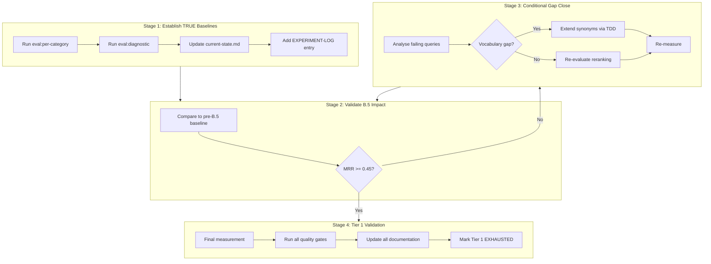

# Tier 1 Search Excellence Completion Plan

## Foundation Document Commitments

Before each stage, re-read and re-commit to:

- [rules.md](/.agent/directives-and-memory/rules.md) — TDD, quality gates, no type shortcuts
- [testing-strategy.md](/.agent/directives-and-memory/testing-strategy.md) — Test types and TDD at ALL levels
- [schema-first-execution.md](/.agent/directives-and-memory/schema-first-execution.md) — Generator-first architecture

**First Question** (apply before every change): "Could it be simpler without compromising quality?"**Meta Question** (apply before every stage): "Are we solving the right problem, at the right layer?"---

## Stage 1: Establish TRUE Baselines

### Goal

Measure current system performance against CORRECTED ground truth to establish trustworthy baseline metrics.

### Intended Impact

- Replace all "???" values in [current-state.md](/.agent/plans/semantic-search/current-state.md) with verified measurements
- Enable evidence-based decisions for all subsequent work
- Determine if previously accepted/rejected experiments need re-evaluation

### Acceptance Criteria

1. `pnpm eval:per-category` completes successfully with numeric MRR values for all 6 categories
2. `pnpm eval:diagnostic` completes successfully with per-pattern MRR breakdown
3. [current-state.md](/.agent/plans/semantic-search/current-state.md) updated with VERIFIED metrics (no "???" remaining)
4. Entry added to [EXPERIMENT-LOG.md](/.agent/evaluations/EXPERIMENT-LOG.md): "Ground Truth Correction Baseline — 2025-12-23"
5. Zero quality gate regressions

### Tasks

#### 1.1 Run Per-Category Evaluation

```bash
cd apps/oak-open-curriculum-semantic-search
pnpm eval:per-category
```

**Measures**: Lesson hard query MRR by category (naturalistic, misspelling, synonym, multi-concept, colloquial, intent-based)

#### 1.2 Run Diagnostic Evaluation

```bash
pnpm eval:diagnostic
```

**Measures**: 18 diagnostic queries with per-pattern MRR (single-word synonyms, phrase synonyms, concept+method, etc.)

#### 1.3 Document Results

Update all metrics tables in:

- [current-state.md](/.agent/plans/semantic-search/current-state.md) — Primary source of truth
- [part-1-search-excellence.md](/.agent/plans/semantic-search/part-1-search-excellence.md) — Stream B status

Add EXPERIMENT-LOG entry with:

- Timestamp
- All measured values
- Key insight: "First verified measurement with corrected ground truth"

---

## Stage 2: Validate B.5 Phrase Boosting Impact

### Goal

Measure the actual impact of B.5 phrase boosting (already implemented) against the TRUE baseline.

### Intended Impact

- Quantify whether phrase boosting improves synonym and multi-concept categories
- Validate or invalidate the architectural decision (ADR-084)
- Determine if Tier 1 exit criteria (MRR >= 0.45) is achievable

### Acceptance Criteria

1. Measured MRR delta between baseline and B.5-enabled system documented
2. Per-category impact quantified (especially synonym and multi-concept)
3. Decision recorded: B.5 VALIDATED (improvement) or B.5 NEEDS ITERATION
4. [part-1-search-excellence.md](/.agent/plans/semantic-search/part-1-search-excellence.md) B.5 status updated to "VALIDATED" or "NEEDS ITERATION"

### Tasks

#### 2.1 Compare Against Baseline

The baseline from Stage 1 IS the B.5-enabled measurement (phrase boosting is already in production code).**Analysis required**:

- Compare to pre-B.5 baseline (0.369 lesson hard MRR, 0.167 synonym, 0.083 multi-concept)
- Calculate actual delta

**Targets from [part-1-search-excellence.md](/.agent/plans/semantic-search/part-1-search-excellence.md)**:

- Synonym category: 0.167 -> Target >= 0.40
- Multi-concept category: 0.083 -> Target >= 0.25
- Overall Lesson Hard MRR: 0.369 -> Target >= 0.45

#### 2.2 Document B.5 Experiment Results

Add entry to [EXPERIMENT-LOG.md](/.agent/evaluations/EXPERIMENT-LOG.md):

- Before metrics (from previous session, invalid GT)
- After metrics (from Stage 1, valid GT)
- Decision: VALIDATED or NEEDS ITERATION
- Key insight

---

## Stage 3: Exhaust Tier 1 Approaches

**Status**: ✅ COMPLETE (2025-12-24)All standard Tier 1 approaches were systematically verified. Intent-based category received documented exception. See [Search Acceptance Criteria](/.agent/plans/semantic-search/search-acceptance-criteria.md) for full verification details.

### Goal

Systematically try all standard Tier 1 approaches until plateau is demonstrated. See [Search Acceptance Criteria](/.agent/plans/semantic-search/search-acceptance-criteria.md) for the full checklist.

### Intended Impact

- Close the gap to Tier 1 exit criteria
- Preserve fundamentals-first strategy (no AI until fundamentals complete)

### Acceptance Criteria

1. Root cause of remaining gap identified (specific failing queries analysed)
2. Minimum viable intervention designed (following First Question)
3. Intervention implemented using TDD
4. Quality gates pass
5. New MRR measurement taken

### Options (in priority order per ADR-082)

#### 3a. Extend Synonym Coverage

**If gap is vocabulary-related**:

- Analyse failing queries for missing synonyms
- Add synonyms to SDK following TDD pattern
- Run `pnpm type-gen && pnpm build`
- Re-measure

#### 3b. Re-evaluate Semantic Reranking

**If fundamentals are exhausted**:

- The -16.8% regression was measured against INVALID ground truth
- Re-run semantic reranking experiment against corrected ground truth
- Decision: ACCEPT (improvement) or CONFIRM REJECTION

**TDD approach**:

1. Write smoke test specifying expected behaviour FIRST
2. Enable/configure reranking
3. Measure impact
4. Document decision with evidence

---

## Stage 4: Tier 1 Exhaustion Validation

**Status**: ✅ COMPLETE (2025-12-24)

### Goal

Formally validate that Tier 1 is EXHAUSTED (not just target met) and prepare for Tier 2.

### Intended Impact

- Confirm all standard Tier 1 approaches have been tried
- Demonstrate plateau (≤5% improvement in 3 consecutive experiments)
- Enable transition to Tier 2 (Document Relationships)
- Document learnings for future subjects

### Acceptance Criteria

1. All Tier 1 checklist items completed (see [Search Acceptance Criteria](/.agent/plans/semantic-search/search-acceptance-criteria.md))
2. Plateau demonstrated: ≤5% improvement in 3 consecutive experiments
3. No category remains below critical threshold (< 0.25) without documented exception
4. Intent-based queries investigated and simple fixes applied
5. All quality gates pass
6. [current-state.md](/.agent/plans/semantic-search/current-state.md) Tier status updated to "Tier 1: EXHAUSTED"

### Tasks

#### 4.1 Final Measurement

```bash
cd apps/oak-open-curriculum-semantic-search
pnpm eval:per-category    # Final lesson hard MRR
pnpm eval:diagnostic      # Final diagnostic breakdown
```

#### 4.2 Run Full Quality Gate Suite

From repo root, one gate at a time:

```bash
pnpm type-gen
pnpm build
pnpm type-check
pnpm lint:fix
pnpm format:root
pnpm markdownlint:root
pnpm test
pnpm test:e2e
pnpm test:e2e:built
pnpm test:ui
pnpm smoke:dev:stub
```

**Analysis only after ALL gates complete** — look for fundamental architectural issues or improvement opportunities.

#### 4.3 Update Documentation

1. [current-state.md](/.agent/plans/semantic-search/current-state.md) — Final verified metrics
2. [part-1-search-excellence.md](/.agent/plans/semantic-search/part-1-search-excellence.md) — Stream B complete
3. [README.md](/.agent/plans/semantic-search/README.md) — Tier 1 status
4. [EXPERIMENT-LOG.md](/.agent/evaluations/EXPERIMENT-LOG.md) — Tier 1 completion entry

---

## Workflow Summary



---

## Key Files

| File | Purpose ||------|---------|| [current-state.md](/.agent/plans/semantic-search/current-state.md) | Primary metrics source of truth || [EXPERIMENT-LOG.md](/.agent/evaluations/EXPERIMENT-LOG.md) | Chronological experiment history || [part-1-search-excellence.md](/.agent/plans/semantic-search/part-1-search-excellence.md) | Stream B task tracking || [ground-truth-corrections.md](/.agent/evaluations/ground-truth-corrections.md) | Details of 63 slug corrections |---

## Quality Gate Discipline

After ANY code changes, run from repo root (one at a time):

```bash
pnpm type-gen          # Makes changes
pnpm build             # Makes changes
pnpm type-check
pnpm lint:fix          # Makes changes
pnpm format:root       # Makes changes
pnpm markdownlint:root # Makes changes
pnpm test
pnpm test:e2e
pnpm test:e2e:built
pnpm test:ui
pnpm smoke:dev:stub
```

---

## ✅ PLAN COMPLETE (2025-12-24)

All stages completed successfully:| Stage | Status | Key Outcome ||-------|--------|-------------|| Stage 1: TRUE Baselines | ✅ Complete | MRR 0.614 measured against corrected GT || Stage 2: B.5 Validation | ✅ Complete | B.5 phrase boosting verified working || Stage 3: Exhaust Tier 1 | ✅ Complete | All standard approaches verified || Stage 4: Tier 1 Validation | ✅ Complete | Tier 1 EXHAUSTED, Tier 2 ready |

### Key Findings

1. **Tier 1 is EXHAUSTED** — All standard approaches verified, no further Tier 1 experiments possible
2. **Intent-based exception** — 0.229 MRR requires Tier 4 (LLM/metadata), not solvable at Tier 1
3. **No critical vocabulary gaps** — Top 20 curriculum keywords all work
4. **UK/US variants** — ELSER handles automatically, no synonyms needed
5. **Quality gates** — All 11 gates pass

### Next Steps

Tier 2 (Document Relationships) is ready when prioritised. See:

- [Search Acceptance Criteria](/.agent/plans/semantic-search/search-acceptance-criteria.md)
