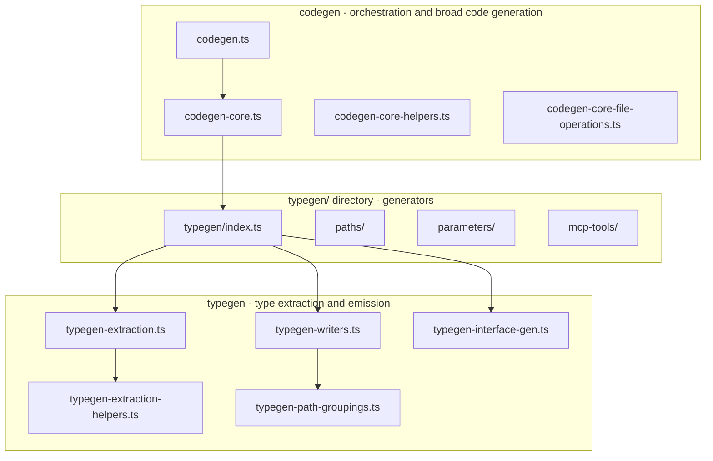

# Typegen vs Codegen Semantic Split

## Rationale

- **typegen** = modules that primarily extract and emit TypeScript types from the OpenAPI schema
- **codegen** = orchestration and modules that emit validators, MCP tools, fixtures, mappings, and other non-type artifacts

## Scope

**Revert to `typegen-*`** (5 source + 3 test files):

| Current                                   | Revert To                                 |
| ----------------------------------------- | ----------------------------------------- |
| `codegen-extraction.ts`                   | `typegen-extraction.ts`                   |
| `codegen-extraction-helpers.ts`           | `typegen-extraction-helpers.ts`           |
| `codegen-path-groupings.ts`               | `typegen-path-groupings.ts`               |
| `codegen-writers.ts`                      | `typegen-writers.ts`                      |
| `codegen-interface-gen.ts`                | `typegen-interface-gen.ts`                |
| `codegen-extraction.unit.test.ts`         | `typegen-extraction.unit.test.ts`         |
| `codegen-extraction-helpers.unit.test.ts` | `typegen-extraction-helpers.unit.test.ts` |
| `codegen-writers.unit.test.ts`            | `typegen-writers.unit.test.ts`            |

**Keep as `codegen-*`** (orchestration and broad code generation):

- `codegen.ts` (entry point)
- `codegen-core.ts`, `codegen-core-helpers.ts`, `codegen-core-file-operations.ts`
- `codegen-once.mock.ts`
- `codegen-core.unit.test.ts`, `codegen-core-file-operations.integration.test.ts`
- `e2e-tests/scripts/codegen-core.e2e.test.ts`

## Implementation Steps

### 1. Rename files via `git mv`

In [packages/sdks/oak-sdk-codegen/code-generation/](packages/sdks/oak-sdk-codegen/code-generation/):

```bash
git mv codegen-extraction.ts typegen-extraction.ts
git mv codegen-extraction-helpers.ts typegen-extraction-helpers.ts
git mv codegen-path-groupings.ts typegen-path-groupings.ts
git mv codegen-writers.ts typegen-writers.ts
git mv codegen-interface-gen.ts typegen-interface-gen.ts
git mv codegen-extraction.unit.test.ts typegen-extraction.unit.test.ts
git mv codegen-extraction-helpers.unit.test.ts typegen-extraction-helpers.unit.test.ts
git mv codegen-writers.unit.test.ts typegen-writers.unit.test.ts
```

### 2. Update imports and re-exports

**In [typegen/index.ts](packages/sdks/oak-sdk-codegen/code-generation/typegen/index.ts)** (lines 39-41):

```diff
- export { generatePathParametersInterface } from '../codegen-interface-gen.js';
- export { generateValidPathsByParameters } from '../codegen-writers.js';
- export { extractPathParameters } from '../codegen-extraction.js';
+ export { generatePathParametersInterface } from '../typegen-interface-gen.js';
+ export { generateValidPathsByParameters } from '../typegen-writers.js';
+ export { extractPathParameters } from '../typegen-extraction.js';
```

**In [typegen-extraction.ts](packages/sdks/oak-sdk-codegen/code-generation/typegen-extraction.ts)**:

```diff
- } from './codegen-extraction-helpers.js';
+ } from './typegen-extraction-helpers.js';
```

**In [typegen-extraction-helpers.ts](packages/sdks/oak-sdk-codegen/code-generation/typegen-extraction-helpers.ts)** (comment):

```diff
- * Helper functions for codegen-extraction to reduce complexity
+ * Helper functions for typegen-extraction to reduce complexity
```

**In [typegen-writers.ts*](packages/sdks/oak-sdk-codegen/code-generation/typegen-writers.ts)*:

```diff
- } from './codegen-path-groupings.js';
+ } from './typegen-path-groupings.js';
```

**In [typegen-extraction.unit.test.ts](packages/sdks/oak-sdk-codegen/code-generation/typegen-extraction.unit.test.ts)**:

```diff
- import { extractPathParameters } from './codegen-extraction.js';
+ import { extractPathParameters } from './typegen-extraction.js';
```

**In [typegen-extraction-helpers.unit.test.ts](packages/sdks/oak-sdk-codegen/code-generation/typegen-extraction-helpers.unit.test.ts)**:

```diff
- } from './codegen-extraction-helpers';
+ } from './typegen-extraction-helpers';
- describe('codegen-extraction-helpers', () => {
+ describe('typegen-extraction-helpers', () => {
```

**In [typegen-writers.unit.test.ts](packages/sdks/oak-sdk-codegen/code-generation/typegen-writers.unit.test.ts)**:

```diff
- import { generatePathGroupingsSection } from './codegen-writers';
+ import { generatePathGroupingsSection } from './typegen-writers';
```

### 3. Quality gates

```bash
pnpm sdk-codegen -- --ci
pnpm type-check
pnpm test
```

## Resulting Naming Convention



## Documentation

No non-archive documentation references the specific module names `typegen-extraction`, `typegen-writers`, etc. Archive files (e.g. `oak-curriculum-sdk-zod-validators-2025-08-12.md`) already use the `typegen-*` naming and require no changes.
