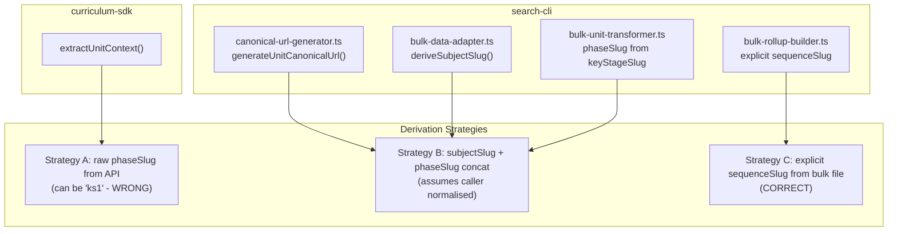

# Unified sequenceSlug Derivation and Follow-up Cleanup

## Context (from previous session)

Phases 1-5 of the canonical URL fixes are complete. The code reviewer identified a design concern: two code paths derive `sequenceSlug` differently, producing inconsistent URLs for the same content.

**Source plan**: [sitemap-driven-canonical-urls.plan.md](.agent/plans/sdk-and-mcp-enhancements/active/sitemap-driven-canonical-urls.plan.md)
**Previous Cursor plan**: [canonical_url_fixes_59203435.plan.md](.cursor/plans/canonical_url_fixes_59203435.plan.md)

---

## Bug: API path produces invalid sequence slugs

The test at `packages/sdks/oak-curriculum-sdk/src/response-augmentation.unit.test.ts:67` shows:

```56:73:packages/sdks/oak-curriculum-sdk/src/response-augmentation.unit.test.ts
        'https://www.thenational.academy/teachers/curriculum/maths-ks1/units',
      );
    });
// ...
        phaseSlug: 'ks1',
      };
      const result = augmentResponseWithCanonicalUrl(response, '/units/place-value', 'get');
      expect(result.canonicalUrl).toBe(
        'https://www.thenational.academy/teachers/curriculum/maths-ks1/units/place-value',
      );
```

`maths-ks1` is NOT a valid OWA sequence slug. The valid slug is `maths-primary`. This test encodes the bug.

**Root cause**: `extractUnitContext` in [response-augmentation.ts](packages/sdks/oak-curriculum-sdk/src/response-augmentation.ts) blindly concatenates `subjectSlug + '-' + phaseSlug` from the API response, where `phaseSlug` can be a key stage slug (`ks1`, `ks2`, `ks3`, `ks4`) rather than a phase name (`primary`, `secondary`).

The bulk path correctly maps key stages to phases:

```
const phaseSlug = keyStageSlug.includes('1') || keyStageSlug.includes('2') ? 'primary' : 'secondary';
```

---

## Current derivation landscape (5 callsites, 3 different strategies)



Additionally, `deriveSubjectSlug` exists in two places with different logic:

- [bulk-data-adapter.ts](apps/oak-search-cli/src/adapters/bulk-data-adapter.ts:84) — strips phase suffix; throws for exam-board sequences
- [hybrid-data-source.ts](apps/oak-search-cli/src/adapters/hybrid-data-source.ts:91) — falls back to `parts[0]` for exam-board sequences (correct)

---

## Solution: shared `normalisePhaseSlug` + `deriveSequenceSlug`

Create two pure functions in [oak-curriculum-sdk](packages/sdks/oak-curriculum-sdk/) (the domain SDK that both search-cli and MCP servers depend on):

- `**normalisePhaseSlug(phaseSlug: string): 'primary' | 'secondary'**` — maps `ks1`/`ks2` to `primary`, `ks3`/`ks4` to `secondary`, passes through `primary`/`secondary` as-is, throws for unrecognised values
- `**deriveSequenceSlug(subjectSlug: string, phaseSlug: string): string**` — normalises phase then concatenates

These are the forward-direction companions to `deriveSubjectSlugFromSequence` / `derivePhaseSlugFromSequence` currently in [slug-derivation.ts](apps/oak-search-cli/src/lib/indexing/slug-derivation.ts) (reverse direction). Phase 4 moves the reverse utilities into the same SDK module to create a single bidirectional slug derivation surface.

---

## Key files to change

**Create:**

- `packages/sdks/oak-curriculum-sdk/src/lib/sequence-slug-derivation.ts` — the shared utility
- `packages/sdks/oak-curriculum-sdk/src/lib/sequence-slug-derivation.unit.test.ts` — TDD tests

**Fix:**

- [response-augmentation.ts](packages/sdks/oak-curriculum-sdk/src/response-augmentation.ts) — `extractUnitContext` to use `deriveSequenceSlug`
- [response-augmentation.unit.test.ts](packages/sdks/oak-curriculum-sdk/src/response-augmentation.unit.test.ts) — fix `maths-ks1` assertions to `maths-primary`
- [canonical-url-generator.ts](apps/oak-search-cli/src/lib/indexing/canonical-url-generator.ts) — import shared utility
- [bulk-unit-transformer.ts](apps/oak-search-cli/src/adapters/bulk-unit-transformer.ts) — import shared utility
- [bulk-data-adapter.ts](apps/oak-search-cli/src/adapters/bulk-data-adapter.ts) — use shared utility or pass sequenceSlug directly

**Document:**

- [operations/ingestion/README.md](apps/oak-search-cli/operations/ingestion/README.md) — add `thread_url` cleanup procedure

**Clean up:**

- Widget test fixtures in `apps/oak-curriculum-mcp-streamable-http/tests/widget/` — remove stale `thread_url` values

---

## Phase structure (TDD at all levels, reviewers after each phase)

### Phase 0: Architecture review (Barney) — before coding

Invoke architecture-reviewer-barney with the full plan context to validate:

- Placement of `normalisePhaseSlug` / `deriveSequenceSlug` in curriculum-sdk (not sdk-codegen)
- Dependency direction: search-cli importing from curriculum-sdk for slug derivation
- Whether moving reverse-direction utilities (`deriveSubjectSlugFromSequence` / `derivePhaseSlugFromSequence`) to curriculum-sdk is the right boundary call, given they are currently search-cli-internal
- Any boundary or coupling risks from the consolidation

Act on Barney's findings before proceeding to Phase 1.

**Reviewers**: architecture-reviewer-barney

### Phase 1: Create shared derivation utility (TDD)

RED: Write tests for `normalisePhaseSlug` and `deriveSequenceSlug` covering:

- `ks1` to `primary`, `ks4` to `secondary`, passthrough of `primary`/`secondary`
- Fail-fast for unrecognised values like `'unknown'` or `'ks5'`
- Simple sequences: `('maths', 'ks1') => 'maths-primary'`
- Exam-board limitation documented but NOT handled (upstream API wish)

GREEN: Implement the pure functions. Export from curriculum-sdk barrel.

REFACTOR: TSDoc with examples, limitation note for exam-board sequences.

**Reviewers**: code-reviewer + test-reviewer

### Phase 2: Fix extractUnitContext bug (TDD)

RED: Update `response-augmentation.unit.test.ts` assertions:

- `maths-ks1` to `maths-primary` (line 56, 73)
- Verify `maths-primary` passthrough still works (line 292-303)

GREEN: Update `extractUnitContext` to call `deriveSequenceSlug` instead of raw concatenation.

REFACTOR: Remove inline derivation, import from shared utility.

**Reviewers**: code-reviewer + type-reviewer (type flow through `UnitContext`)

### Phase 3: Consolidate search-CLI derivation (TDD)

Update these callers to import `deriveSequenceSlug` from `@oaknational/curriculum-sdk`:

- `canonical-url-generator.ts` `generateUnitCanonicalUrl()` — replace inline `${subjectSlug}-${phaseSlug}`
- `bulk-unit-transformer.ts` — replace inline key-stage-to-phase mapping + concat
- `bulk-data-adapter.ts` — either use shared utility or pass `bulkFile.sequenceSlug` directly (preferred, since it's available)

Update tests to expect normalised phase slugs.

**Reviewers**: code-reviewer + architecture-reviewer-barney (boundary/dependency direction)

### Phase 4: Reverse direction consolidation (TDD)

Move `deriveSubjectSlugFromSequence` and `derivePhaseSlugFromSequence` from [slug-derivation.ts](apps/oak-search-cli/src/lib/indexing/slug-derivation.ts) to curriculum-sdk, alongside the forward-direction utilities from Phase 1.

- Create `packages/sdks/oak-curriculum-sdk/src/lib/sequence-slug-decomposition.ts` (or merge into `sequence-slug-derivation.ts`)
- Move the existing unit tests and update imports
- Fix the exam-board handling bug in `deriveSubjectSlugFromSequence`: currently returns the whole slug for `science-secondary-aqa` instead of `science`; the `hybrid-data-source.ts` version handles this correctly by falling back to `parts[0]`
- Update search-cli callers to import from `@oaknational/curriculum-sdk` instead of the local module
- Remove the now-empty `slug-derivation.ts` from search-cli (or leave as a re-export barrel if needed for transition)

**Reviewers**: code-reviewer + test-reviewer

### Phase 5: ES thread_url cleanup documentation

- Add a "Stale `thread_url` cleanup" section to [operations/ingestion/README.md](apps/oak-search-cli/operations/ingestion/README.md)
- Document: `pnpm es:ingest -- --index threads` re-indexes all threads (bulk mode), naturally omitting `thread_url`
- Note: existing documents retain `thread_url` until re-indexed; the field is optional so this is safe

**Reviewers**: docs-adr-reviewer

### Phase 6: Widget fixture cleanup and quality gate sweep

- Update widget test fixtures that still have `thread_url: 'https://...'` with dead URLs
- Verify `helpers.ts` `thread_url || ''` fallback works when field is absent
- Run full quality gates: `pnpm sdk-codegen && pnpm build && pnpm type-check && pnpm lint && pnpm test`

**Reviewers**: code-reviewer + architecture-reviewer-betty (final sweep)

---

## Reviewer invocation schedule

| Phase   | Reviewers                                          |
| ------- | -------------------------------------------------- |
| Phase 0 | architecture-reviewer-barney (upfront validation)  |
| Phase 1 | code-reviewer, test-reviewer                       |
| Phase 2 | code-reviewer, type-reviewer                       |
| Phase 3 | code-reviewer, architecture-reviewer-barney        |
| Phase 4 | code-reviewer, test-reviewer                       |
| Phase 5 | docs-adr-reviewer                                  |
| Phase 6 | code-reviewer, architecture-reviewer-betty (final) |

---

## What this does NOT cover (documented as future work)

- Routing search-CLI SDK imports through curriculum-sdk facade — tracked in [architectural-enforcement-adoption.plan.md](.agent/plans/agentic-engineering-enhancements/architectural-enforcement-adoption.plan.md) Phase 2
- Upstream API wishlist: expose `sequenceSlug` directly on unit responses
- Exam-board-aware derivation from API responses (blocked on upstream API)
