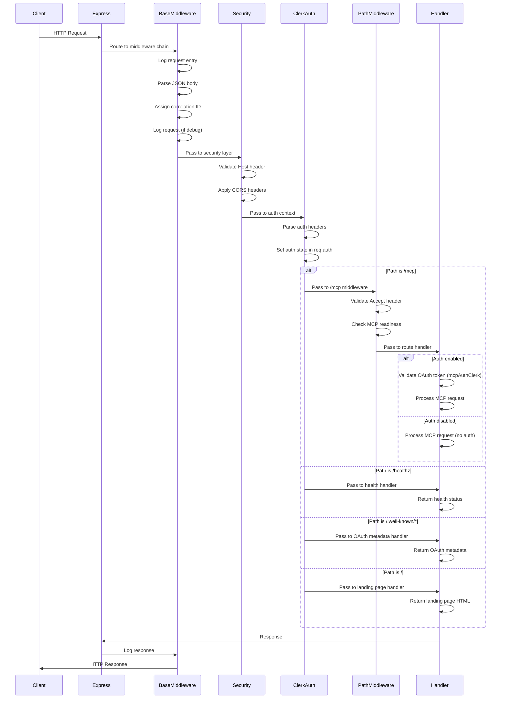
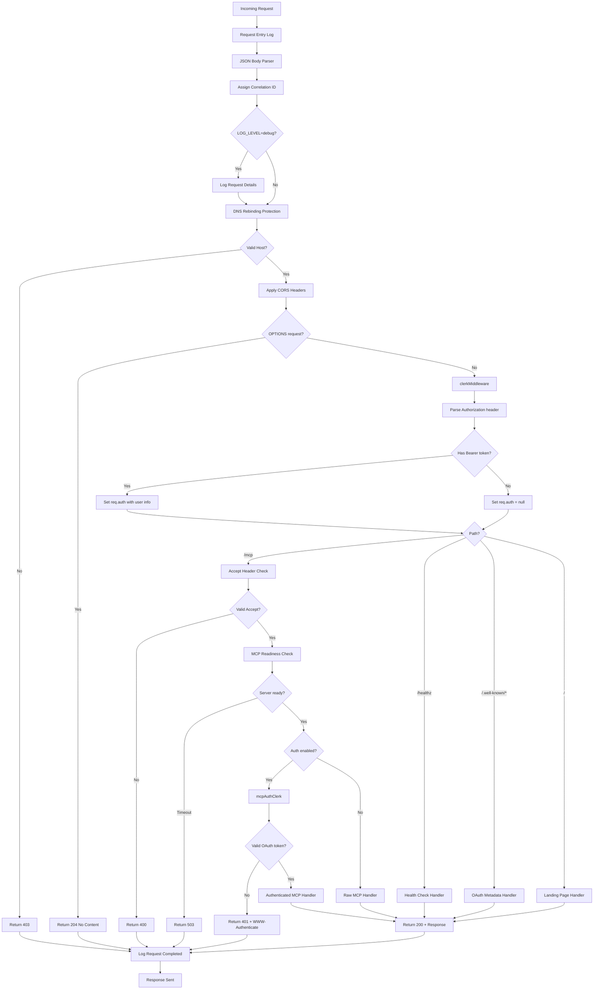

# Middleware Chain Documentation

## Overview

This document describes the complete middleware chain for the Oak Curriculum MCP Streamable HTTP server. Understanding the middleware execution order is critical for debugging authentication issues, request handling, and overall system behavior.

The middleware chain follows Express conventions where:

- **Registration order** determines the execution order
- Earlier middleware runs before later middleware
- Each middleware can modify the request/response or terminate the chain
- Path-specific middleware only runs for matching routes

## Critical Ordering Requirement

**IMPORTANT**: `clerkMiddleware()` MUST be registered globally BEFORE any path-specific middleware. This ensures Clerk's authentication context is available throughout the request lifecycle.

```text
✅ CORRECT:   app.use(clerkMiddleware()) → app.use('/mcp', ...) → app.post('/mcp', mcpAuthClerk, ...)
❌ INCORRECT: app.use('/mcp', clerkMiddleware()) → app.post('/mcp', mcpAuthClerk, ...)
```

## Middleware Execution Order

For any incoming HTTP request, middleware executes in this order:

```text
1. Request Entry Logging
2. JSON Body Parser (express.json())
3. Correlation ID Assignment
4. Request Logger (if LOG_LEVEL=debug)
5. Error Logger
6. DNS Rebinding Protection (Host header validation)
7. CORS (with WWW-Authenticate exposed in headers)
8. clerkMiddleware (global - provides auth context to ALL routes)
   ↓
   [For /mcp routes only:]
   9a. Accept Header Validation (must include text/event-stream + application/json)
   9b. MCP Readiness Check (waits up to 5s for server to be ready)
   ↓
   [For POST /mcp:]
   10a. mcpAuthClerk (OAuth token validation) OR bypass (if DANGEROUSLY_DISABLE_AUTH)
   10b. MCP Request Handler (streamableHttpHandlerClerk or raw handler)
   ↓
   [For GET /mcp:]
   10a. mcpAuthClerk (OAuth token validation) OR bypass (if DANGEROUSLY_DISABLE_AUTH)
   10b. MCP SSE Handler
   ↓
   [For GET /healthz:]
   9a. CORS preflight (corsMw)
   9b. Health Check Handler
   ↓
   [For GET /.well-known/oauth-protected-resource:]
   9a. Custom OAuth metadata handler (publicly accessible)
   ↓
   [For GET /.well-known/oauth-authorization-server:]
   9a. authServerMetadataHandlerClerk (publicly accessible)
   ↓
   [For GET /:]
   9a. Landing Page Handler
```

## Request Flow Diagrams

### Complete Request Lifecycle (Mermaid)



### Per-Route Middleware Stacks

#### POST /mcp (with auth enabled)

```text
Client Request
    ↓
[1] Request Entry Log
[2] JSON Body Parser
[3] Correlation ID
[4] Request Logger (debug)
[5] Error Logger
[6] DNS Rebinding Protection
[7] CORS
[8] clerkMiddleware (global)
    ↓ [path match: /mcp]
[9] Accept Header Validation
[10] MCP Readiness Check
    ↓
[11] mcpAuthClerk (OAuth validation)
[12] streamableHttpHandlerClerk
    ↓
Response
```

#### POST /mcp (with DANGEROUSLY_DISABLE_AUTH=true)

```text
Client Request
    ↓
[1] Request Entry Log
[2] JSON Body Parser
[3] Correlation ID
[4] Request Logger (debug)
[5] Error Logger
[6] DNS Rebinding Protection
[7] CORS
[8] (clerkMiddleware skipped)
    ↓ [path match: /mcp]
[9] Accept Header Validation
[10] MCP Readiness Check
    ↓
[11] Raw MCP Handler (no auth)
    ↓
Response
```

#### GET /healthz

```text
Client Request
    ↓
[1] Request Entry Log
[2] JSON Body Parser
[3] Correlation ID
[4] Request Logger (debug)
[5] Error Logger
[6] DNS Rebinding Protection
[7] CORS
[8] clerkMiddleware (global)
    ↓
[9] CORS preflight (corsMw)
[10] Health Check Handler
    ↓
Response (200 OK + JSON)
```

#### GET /.well-known/oauth-protected-resource

```text
Client Request
    ↓
[1] Request Entry Log
[2] JSON Body Parser
[3] Correlation ID
[4] Request Logger (debug)
[5] Error Logger
[6] DNS Rebinding Protection
[7] CORS
[8] clerkMiddleware (global)
    ↓
[9] Custom OAuth metadata handler
    ↓
Response (200 OK + OAuth metadata JSON)
```

**Note**: OAuth metadata endpoints are publicly accessible (no mcpAuthClerk middleware).

#### GET /

```text
Client Request
    ↓
[1] Request Entry Log
[2] JSON Body Parser
[3] Correlation ID
[4] Request Logger (debug)
[5] Error Logger
[6] DNS Rebinding Protection
[7] CORS
[8] clerkMiddleware (global)
    ↓
[9] Landing Page Handler
    ↓
Response (200 OK + HTML)
```

## Middleware Responsibilities

| Middleware                     | Layer    | Purpose                              | Terminates?      | Modifies            |
| ------------------------------ | -------- | ------------------------------------ | ---------------- | ------------------- |
| Request Entry Log              | Base     | Records incoming request             | No               | res.locals          |
| JSON Body Parser               | Base     | Parses JSON request bodies           | No               | req.body            |
| Correlation Middleware         | Base     | Assigns unique request ID            | No               | res.locals, headers |
| Request Logger                 | Base     | Logs request details (debug)         | No               | -                   |
| Error Logger                   | Base     | Logs errors with context             | No               | -                   |
| DNS Rebinding Protection       | Security | Validates Host header                | Yes (if invalid) | -                   |
| CORS                           | Security | Sets CORS headers, handles preflight | Yes (preflight)  | headers             |
| clerkMiddleware                | Auth     | Provides auth context                | No               | req.auth            |
| Accept Header Validation       | MCP      | Ensures correct Accept header        | Yes (if invalid) | -                   |
| MCP Readiness Check            | MCP      | Waits for server ready               | Yes (timeout)    | -                   |
| mcpAuthClerk                   | Auth     | Validates OAuth tokens               | Yes (if invalid) | req.auth            |
| Custom OAuth metadata handler  | OAuth    | Returns OAuth metadata with /mcp URI | Yes              | -                   |
| authServerMetadataHandlerClerk | OAuth    | Returns OAuth server metadata        | Yes              | -                   |
| streamableHttpHandlerClerk     | MCP      | Handles MCP requests                 | Yes              | -                   |
| Health Check Handler           | Health   | Returns health status                | Yes              | -                   |
| Landing Page Handler           | UI       | Returns landing page HTML            | Yes              | -                   |

**Terminates?** = Whether the middleware sends a response and ends the request lifecycle

## Authentication Flow (Detailed)



## Registration Order vs Execution Order

### Registration Order (in `src/application.ts`)

1. **Phase 1**: Base Middleware (`setupBaseMiddleware`)
   - Request entry logging
   - JSON body parser
   - Correlation middleware
   - Request logger (if debug)
   - Error logger

2. **Phase 2**: Security (`applySecurity`)
   - DNS rebinding protection
   - CORS middleware

3. **Phase 3**: Global Auth Context (`setupGlobalAuthContext`)
   - `clerkMiddleware` (registered globally for all routes)

4. **Phase 4**: Core Endpoints (`initializeCoreEndpoints`)
   - MCP server initialization
   - Health check handlers (`/healthz`)

5. **Phase 5**: Static Assets & Landing Page
   - Static file serving (`/public`)
   - Landing page handler (`/`)

6. **Phase 6**: Path-Specific /mcp Middleware
   - Accept header validation
   - MCP readiness check

7. **Phase 7**: Auth Routes (`setupAuthRoutes`)
   - OAuth metadata endpoints (`/.well-known/*`)
   - Protected MCP routes (`POST /mcp`, `GET /mcp` with `mcpAuthClerk`)

### Execution Order (at runtime)

Execution follows registration order, but path-specific middleware only runs for matching paths:

```text
Every request:
  → Base Middleware (phases 1-2)
  → clerkMiddleware (phase 3)

Then, depending on path:

  /mcp → Accept header check → MCP readiness → mcpAuthClerk → MCP handler
  /healthz → Health handler
  /.well-known/* → OAuth metadata handler
  / → Landing page handler
  /static/* → Static file handler
```

## Troubleshooting Common Issues

### Issue: 401 Unauthorized on /mcp

**Symptoms**: POST/GET to `/mcp` returns 401 with `WWW-Authenticate` header

**Possible Causes**:

1. **No Bearer token sent** - Client must include `Authorization: Bearer <token>` header
2. **Invalid/expired token** - Token validation failed in `mcpAuthClerk`
3. **Auth context not available** - `clerkMiddleware` not registered early enough
4. **Clerk keys misconfigured** - Check `CLERK_PUBLISHABLE_KEY` and `CLERK_SECRET_KEY`

**Debugging**:

```bash
# Check logs for clerkMiddleware and mcpAuthClerk execution
grep "clerkMiddleware" logs
grep "mcpAuthClerk" logs

# Verify auth context is set
# Look for "setupGlobalAuthContext" in bootstrap logs

# Test with auth disabled (dev only)
DANGEROUSLY_DISABLE_AUTH=true pnpm dev
```

### Issue: "Accept header must include text/event-stream"

**Symptoms**: 400 Bad Request on `/mcp`

**Cause**: Missing required `Accept` header

**Fix**: Client must send:

```http
Accept: application/json, text/event-stream
```

### Issue: "MCP server not ready"

**Symptoms**: 503 Service Unavailable on `/mcp`

**Cause**: MCP server failed to initialize within 5 seconds

**Debugging**:

```bash
# Check for initialization errors
grep "bootstrap.mcp.transport.connect" logs
grep "error" logs

# Verify server startup completed
grep "bootstrap.complete" logs
```

### Issue: CORS errors in browser

**Symptoms**: Browser blocks request with CORS policy error

**Possible Causes**:

1. **Origin not allowed** - Check `ALLOWED_ORIGINS` environment variable
2. **Preflight not handled** - CORS middleware should handle OPTIONS automatically
3. **WWW-Authenticate not exposed** - Must be in `Access-Control-Expose-Headers`

**Fix**:

```bash
# For development, allow all origins (insecure for production!)
ALLOWED_ORIGINS="*" pnpm dev

# For production, specify exact origins
ALLOWED_ORIGINS="https://app.example.com,https://admin.example.com"
```

### Issue: "Invalid Host header"

**Symptoms**: 403 Forbidden

**Cause**: DNS rebinding protection rejected the Host header

**Fix**:

```bash
# Add your host to allowed hosts
ALLOWED_HOSTS="localhost,127.0.0.1,your-domain.com" pnpm dev

# For Vercel deployment, hostname is auto-detected
```

### Issue: clerkMiddleware runs but auth context is null

**Symptoms**: Request reaches handler but `req.auth` is null/empty

**Possible Causes**:

1. **No token provided** - Expected for anonymous requests
2. **Token in wrong format** - Must be `Authorization: Bearer <token>`
3. **Clerk keys invalid** - Check environment variables

**Debugging**:

```bash
# Enable debug logging
LOG_LEVEL=debug pnpm dev

# Check for "clerkMiddleware" logs with auth state
grep "req.auth" logs

# Verify Clerk keys are set
echo $CLERK_PUBLISHABLE_KEY
echo $CLERK_SECRET_KEY
```

## References

- [Clerk Express Integration](https://clerk.com/docs/references/express/overview)
- [MCP Specification](https://spec.modelcontextprotocol.io/)
- [Express Middleware Guide](https://expressjs.com/en/guide/using-middleware.html)
- [OAuth 2.0 RFC](https://datatracker.ietf.org/doc/html/rfc6750)

## Related Documentation

- [deployment-architecture.md](./deployment-architecture.md) - High-level architecture overview
- [clerk-oauth-trace-instructions.md](./clerk-oauth-trace-instructions.md) - Tracing OAuth flows
- [headless-oauth-automation.md](./headless-oauth-automation.md) - Automated OAuth testing
- [vercel-environment-config.md](./vercel-environment-config.md) - Vercel deployment configuration

## Last Updated

**Date**: 2025-01-14
**Version**: 1.0.0
**Verified Against**: `src/application.ts`, `src/auth-routes.ts`, `src/app/bootstrap-helpers.ts`
