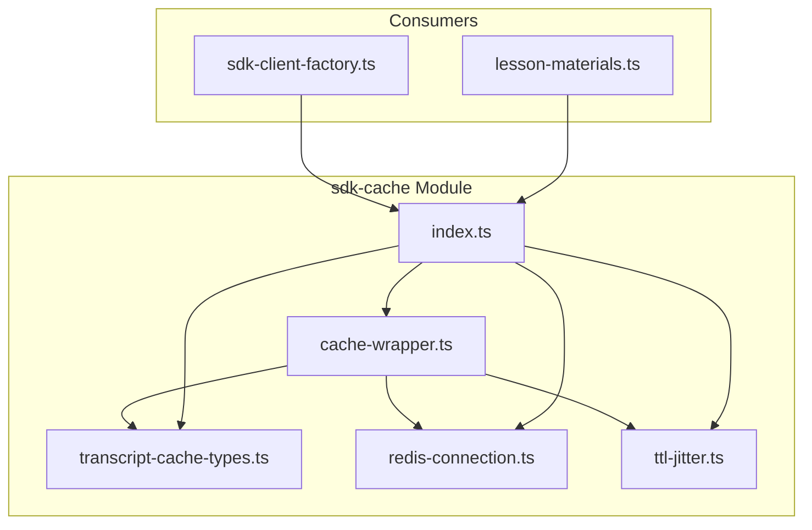
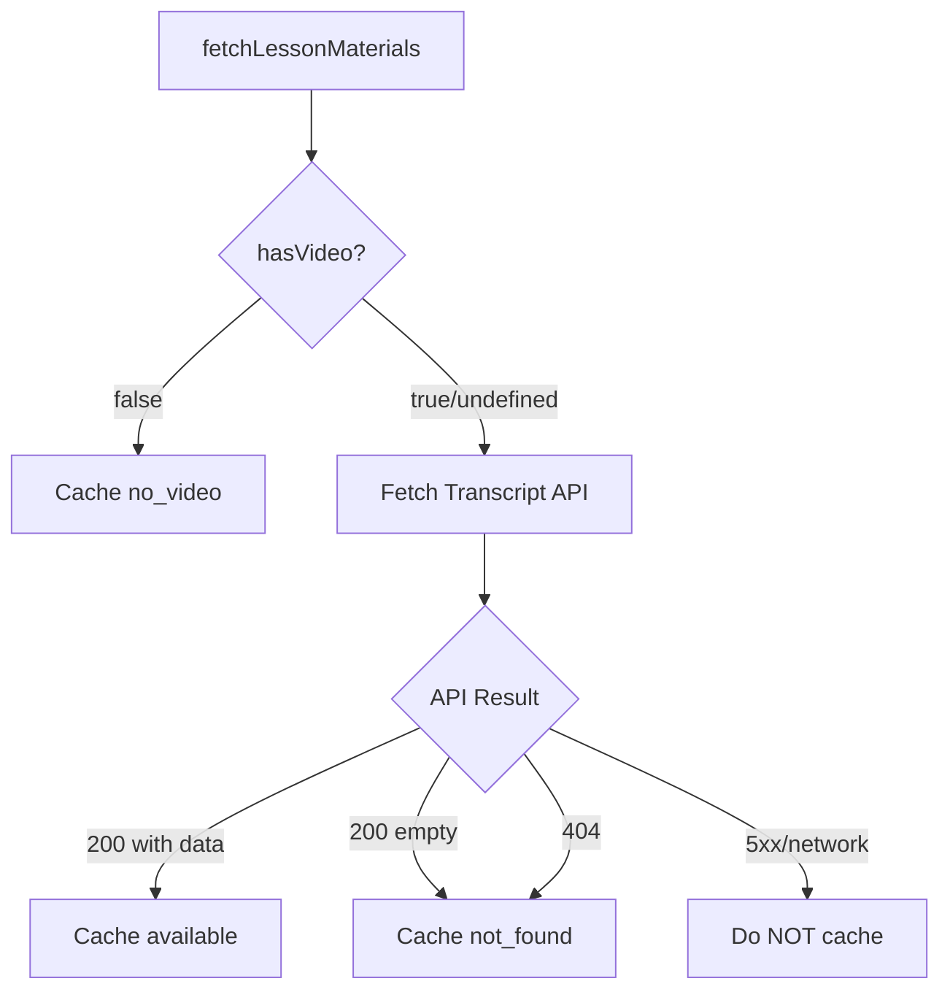

# SDK Cache Module

Redis caching utilities for Oak SDK responses, providing efficient caching with TTL jitter for stampede prevention and structured cache entries for observability.

## Architecture



## Module Structure

| File                        | Purpose                                                    |
| --------------------------- | ---------------------------------------------------------- |
| `index.ts`                  | Public exports for the module                              |
| `cache-wrapper.ts`          | `withCache`, `withCacheAndNegative` higher-order functions |
| `transcript-cache-types.ts` | Structured cache entry types for transcript availability   |
| `redis-connection.ts`       | Redis client creation and connection management            |
| `ttl-jitter.ts`             | TTL calculation with jitter for cache stampede prevention  |

## Key Concepts

### Cache Wrappers

The module provides two cache wrapper functions that add caching to Result-returning functions:

```typescript
// Basic caching - only caches successful results
const cachedFn = withCache(originalFn, ops, 'prefix', ttlDays, stats, validator, ttlCalc);

// With negative caching - also caches 404 responses
const cachedFn = withCacheAndNegative(
  originalFn,
  ops,
  'prefix',
  ttlDays,
  stats,
  validator,
  ignore404,
  ttlCalc,
);
```

### Transcript Cache Categorization

Transcript cache entries use structured metadata to distinguish WHY a transcript is unavailable:



**Status Values**:

| Status      | Meaning                   | When Used                                 |
| ----------- | ------------------------- | ----------------------------------------- |
| `available` | Transcript data exists    | API 200 with content                      |
| `no_video`  | Lesson has no video asset | `hasVideo === false` from assets endpoint |
| `not_found` | API 404 or empty response | TPC-blocked, missing, or empty transcript |

**Note**: Transient errors (5xx, network) are NOT cached to allow retry on next ingestion.

See [ADR-092: Transcript Cache Categorization Strategy](../../../../docs/architecture/architectural-decisions/092-transcript-cache-categorization.md) for full details.

### Cache Key Format

All cache keys follow this pattern:

```text
oak-sdk:v1:{resourceType}:{id}
```

Examples:

- `oak-sdk:v1:transcript:adding-fractions-lesson`
- `oak-sdk:v1:lesson-summary:adding-fractions-lesson`
- `oak-sdk:v1:unit-summary:fractions-unit`

The `v1` version allows cache invalidation on schema changes.

### TTL Strategy with Jitter

To prevent cache stampede (thundering herd), TTLs include random jitter:

```typescript
const ttl = calculateTtlWithJitter(baseTtlDays);
// Base 7 days with ±10% jitter = 6.3 to 7.7 days
```

This spreads cache expiration across time, preventing all entries from expiring simultaneously.

## Usage Examples

### Creating a Cached Client

```typescript
import { createRedisClient, withCache, CacheOperations } from './sdk-cache';

const redis = await createRedisClient();
const ops: CacheOperations = {
  get: (key) => redis.get(key),
  setex: (key, ttl, value) => redis.setex(key, ttl, value).then(() => {}),
};

const cachedGetSummary = withCache(
  getSummary,
  ops,
  'lesson-summary',
  7, // 7 days base TTL
  stats,
  isLessonSummary,
  calculateTtlWithJitter,
);
```

### Using Transcript Cache Types

```typescript
import {
  TranscriptCacheEntry,
  isTranscriptCacheEntry,
  serializeTranscriptCacheEntry,
  deserializeTranscriptCacheEntry,
} from './sdk-cache';

// Cache an available transcript
const entry: TranscriptCacheEntry = {
  status: 'available',
  transcript: "Welcome to today's lesson...",
  vtt: 'WEBVTT\n\n00:00:00.000 --> 00:00:05.000\n...',
};
await ops.setex(key, ttl, serializeTranscriptCacheEntry(entry));

// Read from cache (handles legacy format)
const cached = await ops.get(key);
const parsed = deserializeTranscriptCacheEntry(cached);
if (parsed && parsed.status === 'available') {
  return parsed.transcript;
}
```

## Dependency Injection

The `CacheOperations` interface enables testing without Redis:

```typescript
interface CacheOperations {
  readonly get: (key: string) => Promise<string | null>;
  readonly setex: (key: string, ttl: number, value: string) => Promise<void>;
}
```

In tests, provide a simple in-memory fake:

```typescript
const fakeCache = new Map<string, string>();
const testOps: CacheOperations = {
  get: async (key) => fakeCache.get(key) ?? null,
  setex: async (key, _ttl, value) => {
    fakeCache.set(key, value);
  },
};
```

See [ADR-078: Dependency Injection for Testability](../../../../docs/architecture/architectural-decisions/078-dependency-injection-for-testability.md).

## Migration Notes

### Legacy Format Migration

The cache previously used `__NOT_FOUND__` sentinel strings. A migration script converts these to the structured format:

```bash
# Dry run (preview changes)
npx tsx scripts/migrate-transcript-cache.ts

# Execute migration
npx tsx scripts/migrate-transcript-cache.ts --execute
```

The deserializer also handles legacy format for safety, interpreting `__NOT_FOUND__` as `{ status: 'not_found' }`.

## Related Documentation

- [ADR-092: Transcript Cache Categorization Strategy](../../../../docs/architecture/architectural-decisions/092-transcript-cache-categorization.md)
- [ADR-066: SDK Response Caching](../../../../docs/architecture/architectural-decisions/066-sdk-response-caching.md)
- [ADR-078: Dependency Injection for Testability](../../../../docs/architecture/architectural-decisions/078-dependency-injection-for-testability.md)
- [Adapters README](../README.md)
