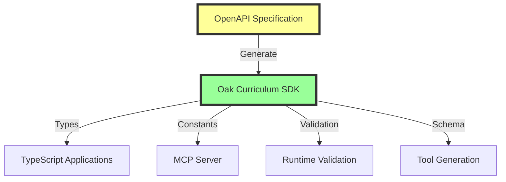

# ADR-030: SDK as Single Source of Truth

**Status**: Accepted  
**Date**: 2025-08-12  
**Decision Makers**: Development Team

## Context

In a system with multiple consumers of an API (SDK, MCP server, other clients), there's a risk of each consumer maintaining their own definitions of API contracts, leading to:

- Inconsistencies between implementations
- Maintenance burden across multiple codebases
- Drift between implementations over time
- Bugs from mismatched assumptions

## Problem Statement

How do we ensure all Oak Curriculum API consumers remain consistent with the actual API specification without duplicating effort?

## Decision

**The Oak Curriculum SDK will be the single source of truth for all API-related information.**

All other consumers (including the MCP server) must derive their API knowledge from the SDK, never from independent sources.

## Architecture



## Principles

### 1. Unidirectional Flow

```text
OpenAPI Spec → SDK → Consumers
```

Information flows in one direction only. Consumers never define API contracts.

### 2. SDK Responsibilities

The SDK is responsible for:

- **Type Generation**: All TypeScript types from OpenAPI
- **Constant Extraction**: KEY_STAGES, SUBJECTS, etc.
- **Validation Rules**: Runtime validation via Zod
- **Schema Access**: Exposing raw OpenAPI schema
- **Helper Functions**: Type guards, parsers, utilities

### 3. Consumer Responsibilities

Consumers (like MCP) are responsible for:

- **Business Logic**: How to use the API
- **User Experience**: How to present API data
- **Orchestration**: Combining multiple API calls
- **Metadata**: Human-friendly descriptions and examples

## Implementation Details

### SDK Exports Required

```typescript
// The SDK must export everything consumers need
export {
  // Generated types
  paths,
  components,
  operations,

  // Extracted constants
  KEY_STAGES,
  SUBJECTS,
  YEAR_GROUPS,

  // Validation
  validation: {
    validateRequest,
    validateResponse,
  },

  // Schema access
  schema,

  // Tool generation helpers
  toolGeneration: {
    PATH_OPERATIONS,
    PARAM_TYPE_MAP,
    parsePathTemplate,
  },

  // Type guards
  isKeyStage,
  isSubject,
  isValidPath,
};
```

### Consumer Usage Pattern

```typescript
// MCP server example
import { KEY_STAGES, validation, toolGeneration } from '@oaknational/curriculum-sdk';

// ONLY import from SDK, never define locally
const tools = toolGeneration.PATH_OPERATIONS.map((op) => ({
  name: generateName(op),
  validate: (args) => validation.validateRequest(op.path, op.method, args),
}));
```

## Consequences

### Positive

1. **Consistency**: All consumers use identical API definitions
2. **Maintainability**: Single place to update when API changes
3. **Reliability**: Reduced risk of implementation drift
4. **Efficiency**: No duplicate work across teams
5. **Quality**: Centralized testing and validation
6. **Automation**: Changes propagate automatically

### Negative

1. **Coupling**: All consumers tightly coupled to SDK
2. **Bottleneck**: SDK becomes critical dependency
3. **Versioning**: SDK changes affect all consumers
4. **Flexibility**: Consumers cannot override SDK decisions

### Risk Mitigation

1. **Coupling**: Use semantic versioning and careful deprecation
2. **Bottleneck**: Maintain high SDK quality and test coverage
3. **Versioning**: Use version ranges and compatibility testing
4. **Flexibility**: Provide extension points where needed

## Validation Criteria

This decision is successful when:

1. **Zero API Duplication**: No API definitions exist outside SDK
2. **Automatic Updates**: API changes flow through automatically
3. **Type Safety**: Full TypeScript coverage from SDK
4. **Runtime Safety**: Validation available for all operations
5. **Complete Coverage**: SDK exports everything consumers need

## Examples

### ✅ Correct: Import from SDK

```typescript
import { KEY_STAGES } from '@oaknational/curriculum-sdk';

function validateKeyStage(value: string) {
  return KEY_STAGES.includes(value);
}
```

### ❌ Wrong: Local Definition

```typescript
// NEVER DO THIS
const KEY_STAGES = ['ks1', 'ks2', 'ks3', 'ks4']; // Local definition

function validateKeyStage(value: string) {
  return KEY_STAGES.includes(value);
}
```

### ✅ Correct: Use SDK Validation

```typescript
import { validation } from '@oaknational/curriculum-sdk';

async function handleRequest(path: string, method: string, args: unknown) {
  const result = validation.validateRequest(path, method, args);
  if (!result.ok) {
    throw new Error(result.issues);
  }
  return executeRequest(result.value);
}
```

### ❌ Wrong: Custom Validation

```typescript
// NEVER DO THIS
function validateLesson(lesson: string) {
  if (!lesson.match(/^[a-z0-9-]+$/)) {
    // Custom validation
    throw new Error('Invalid lesson');
  }
}
```

## Migration Path

### Current State

- Some manual API definitions in MCP
- Duplicate validation logic
- Hardcoded constants

### Target State

- All API knowledge from SDK
- SDK validation everywhere
- Zero local API definitions

### Steps

1. Identify all local API definitions
2. Wait for SDK to export needed functionality
3. Replace local definitions with SDK imports
4. Remove all duplicate code
5. Verify automatic adaptation

## Alternatives Considered

### Alternative 1: Multiple Sources of Truth

- Each consumer maintains own definitions
- **Rejected**: High maintenance, consistency risk

### Alternative 2: Shared Configuration Files

- YAML/JSON files shared between projects
- **Rejected**: Still requires parsing and type generation

### Alternative 3: Monorepo with Shared Code

- Shared TypeScript code without SDK
- **Rejected**: SDK pattern is cleaner separation

## Related Documents

- [ADR-029: No Manual API Data Structures](029-no-manual-api-data.md)
- [Programmatic Tool Generation Architecture](../programmatic-tool-generation.md)
- [Phase 6 Implementation Plan](../../../.agent/plans/archive/completed/phase-6-oak-curriculum-api-implementation-plan.md)

## References

- [OpenAPI Specification](https://www.openapis.org/)
- [Oak Curriculum SDK](../../../packages/sdks/oak-curriculum-sdk/README.md)
- [MCP Server](../../../apps/oak-curriculum-mcp-streamable-http/README.md)
