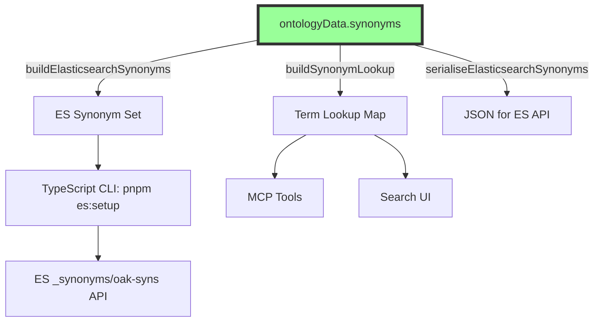

# ADR-063: SDK as Single Source of Truth for Domain Synonyms

**Status**: Accepted  
**Date**: 2025-12-04  
**Decision Makers**: Development Team  
**Extends**: [ADR-030: SDK as Single Source of Truth](030-sdk-single-source-truth.md)

## Context

The semantic search system requires domain-specific synonyms for curriculum terminology (e.g., "maths" ↔ "mathematics", "ks1" ↔ "key stage 1"). These synonyms are needed in multiple places:

- **Elasticsearch**: Synonym sets for query expansion (`oak-syns` synonym set)
- **MCP Tools**: Term normalisation for agent queries
- **Search App**: Display-name mapping and autocomplete

Previously, synonyms were maintained in a static `synonyms.json` file within the search app's `scripts/` directory, separate from other domain knowledge in the SDK. This created:

- Duplication risk between SDK's `ontologyData` and ES synonyms
- Maintenance burden across multiple codebases
- Inconsistency potential when curriculum terminology evolves

## Problem Statement

How do we ensure all consumers of curriculum synonyms remain consistent without duplicating definitions?

## Decision

**All domain synonyms are managed in the SDK's `ontologyData.synonyms` structure.**

The SDK exports utilities to transform these synonyms into formats needed by consumers:

```typescript
import {
  ontologyData, // Contains synonyms.* structures
  buildElasticsearchSynonyms, // Returns ES synonym set object
  buildSynonymLookup, // Returns term → canonical Map
  serialiseElasticsearchSynonyms, // Returns JSON string for ES API
} from '@oaknational/oak-curriculum-sdk/public/mcp-tools';
```

## Architecture



## Synonym Categories

The SDK manages synonyms in categorised groups:

| Category          | Example                                         |
| ----------------- | ----------------------------------------------- |
| `subjects`        | maths ↔ mathematics, dt ↔ design and technology |
| `keyStages`       | ks1 ↔ key stage 1, ks4 ↔ gcse                   |
| `geographyThemes` | climate change ↔ global warming                 |
| `historyTopics`   | ww1 ↔ world war 1 ↔ first world war             |
| `mathsConcepts`   | addition ↔ add ↔ plus ↔ sum                     |
| `englishConcepts` | punctuation ↔ grammar marks                     |
| `scienceConcepts` | photosynthesis ↔ plant energy process           |
| `generic`         | lesson ↔ teaching session                       |

## Implementation

### SDK Export (`synonym-export.ts`)

```typescript
export function buildElasticsearchSynonyms(): ElasticsearchSynonymSet {
  const entries: ElasticsearchSynonymEntry[] = [];

  for (const [canonical, alternatives] of Object.entries(ontologyData.synonyms.subjects)) {
    entries.push({
      id: `subject_${canonical}`,
      synonyms: [canonical, ...alternatives].join(', '),
    });
  }
  // ... repeat for each category

  return { synonyms_set: entries };
}
```

### Consumer Usage (Search App)

The search app consumes synonyms via a TypeScript CLI that directly calls the SDK:

```typescript
// src/lib/elasticsearch/setup/index.ts
import { buildElasticsearchSynonyms } from '@oaknational/oak-curriculum-sdk/public/mcp-tools';

async function createSynonymSet(client: Client): Promise<void> {
  const synonymSet = buildElasticsearchSynonyms();
  await client.synonyms.putSynonym({ id: 'oak-syns', synonyms_set: synonymSet.synonyms_set });
}
```

```bash
# CLI usage
pnpm es:setup  # Creates indexes and deploys synonyms
```

## Consequences

### Positive

1. **Single source of truth**: All synonym definitions in one place
2. **Automatic propagation**: SDK changes flow to all consumers
3. **Type safety**: TypeScript ensures synonym structure correctness
4. **Testability**: Synonyms can be unit tested in SDK
5. **Consistency**: Same synonyms used by ES, MCP, and UI

### Negative

1. **SDK dependency**: Consumers must import from SDK
2. **Runtime generation**: ES synonyms generated at setup time, not statically committed

### Migration Notes

The static `apps/oak-search-cli/scripts/synonyms.json` file was **deleted**. All synonyms now flow from SDK.

## Validation Criteria

This decision is successful when:

1. **Zero synonym duplication**: No synonym definitions exist outside SDK
2. **Automatic updates**: Adding synonyms to SDK automatically updates ES
3. **Type safety**: All synonym exports are fully typed
4. **All consumers aligned**: MCP, Search App, and ES use identical synonyms

## Synonym Mining Process

This section documents the methodology for identifying and adding new synonyms, demonstrated with Maths KS4 (see [F-001 experiment](../../.agent/evaluations/experiments/comprehensive-synonym-coverage.experiment.md)).

### Step 1: Identify Vocabulary Gaps

Run hard query baseline tests and analyse failures by category:

```bash
cd apps/oak-search-cli
pnpm vitest run -c vitest.smoke.config.ts hard-query-baseline
```

Look for queries where the expected result is not in the top 10, particularly:

- **Synonym failures**: Teacher language ("solving for x") vs curriculum terminology ("linear equations")
- **Colloquial failures**: Informal phrases ("sohcahtoa", "that thing with triangles")
- **Abbreviation failures**: Common acronyms not expanded

### Step 2: Mine Vocabulary from Bulk Download

Extract curriculum terminology from the bulk download data:

```bash
# Extract unique terms from lesson and unit data
jq '[.[] | .lessonTitle, .unitTitle, (.lessonKeywords // [])[] | .keyword] | unique' \
  maths-ks4.json > vocabulary.txt

# Look for patterns
grep -i "equation" vocabulary.txt
grep -i "trigonometry" vocabulary.txt
```

Cross-reference teacher query language (from failure analysis) with official curriculum terms.

### Step 3: Add Synonyms Using TDD

**RED**: Write failing smoke test first:

```typescript
// smoke-tests/synonym-coverage.smoke.test.ts
describe('Synonym Coverage', () => {
  it('finds linear equations for "solving for x"', async () => {
    const results = await searchLessons('solving for x');
    expect(results.slice(0, 3).map((r) => r.lesson_slug)).toContain(
      'solving-simple-linear-equations',
    );
  });
});
```

Run test — it MUST fail before synonyms exist.

**GREEN**: Add synonyms to SDK:

```typescript
// packages/sdks/oak-curriculum-sdk/src/mcp/synonyms/maths.ts
export const mathsSynonyms = {
  // ...existing synonyms
  'linear-equations': ['solving for x', 'find the unknown', 'solve for the variable'],
} as const;
```

Deploy and verify:

```bash
pnpm type-gen && pnpm build
cd apps/oak-search-cli
pnpm es:setup   # Deploys new synonyms to ES
pnpm vitest run -c vitest.smoke.config.ts synonym-coverage
```

Run test — it MUST pass.

### Step 4: Measure and Document

Re-run the hard query baseline and document improvement:

```bash
pnpm vitest run -c vitest.smoke.config.ts hard-query-baseline
```

Record before/after MRR in [EXPERIMENT-LOG.md](../../.agent/evaluations/EXPERIMENT-LOG.md).

### Subject Rollout Priority

| Subject   | Priority          | Rationale                                     |
| --------- | ----------------- | --------------------------------------------- |
| Maths     | ✅ Complete (KS4) | Highest complexity, validated approach        |
| Science   | High              | Rich vocabulary (biology, chemistry, physics) |
| English   | Medium            | Literature terminology, grammar terms         |
| History   | Medium            | Historical periods, events, figures           |
| Geography | Medium            | Physical/human geography terminology          |
| Others    | Low               | Apply pattern as needed                       |

### For Full Process Documentation

See [NEW-SUBJECT-GUIDE.md](../../apps/oak-search-cli/docs/NEW-SUBJECT-GUIDE.md) for the complete subject onboarding runbook.

---

## Future: Integration with Vocabulary Mining Pipeline

**Status**: 🔄 Planning (2025-12-24)

The `pnpm vocab-gen` pipeline (see [02b-vocabulary-mining.md](../../../.agent/plans/semantic-search/part-1-search-excellence/02b-vocabulary-mining.md)) will mine synonyms from bulk download data, specifically:

- **13,349 unique keywords with definitions** — Parse for "also known as" patterns
- **Cross-subject terms** — Identify vocabulary shared across subjects
- **UK/US variants** — Systematic extraction from definitions

### The Relationship Question

**How should mined synonyms relate to hand-curated synonyms?**

| Approach                                                | Pros                       | Cons                     |
| ------------------------------------------------------- | -------------------------- | ------------------------ |
| **A: Supplement** — Mined synonyms add to existing      | Preserves curation quality | Potential conflicts      |
| **B: Replace** — Mined synonyms replace existing        | Fully automated            | Loses curation quality   |
| **C: Tiered** — Human-curated overrides mined           | Best of both               | More complex merge logic |
| **D: Review workflow** — Mined → human review → curated | Highest quality            | Labour-intensive         |

### Proposed Architecture: Tiered with Confidence

```text
synonyms/
├── maths.ts              ← CURATED (priority: 100, immutable by vocab-gen)
├── science.ts            ← CURATED (priority: 100)
├── subjects.ts           ← CURATED (priority: 100)
├── ...
└── generated/            ← MINED (generated by vocab-gen, lower priority)
    ├── definition-synonyms.ts    ← From "also known as" parsing
    ├── cross-subject-terms.ts    ← Terms in 2+ subjects
    └── index.ts
```

### Merge Strategy

```typescript
// index.ts (updated)
export const synonymsData = {
  // Human-curated synonyms (priority: HIGH)
  subjects: subjectSynonyms,
  mathsConcepts: mathsSynonyms,
  // ...

  // Mined synonyms (priority: LOWER, supplements gaps)
  minedFromDefinitions: generatedDefinitionSynonyms,
  crossSubjectTerms: generatedCrossSubjectSynonyms,
} as const;
```

When building Elasticsearch synonyms:

1. **Human-curated synonyms always included**
2. **Mined synonyms included if no conflict with curated**
3. **Confidence threshold** can filter low-quality mined synonyms

### Open Questions

1. **Conflict resolution**: If mined synonym conflicts with curated, which wins?
   - Proposed: Curated always wins; log conflicts for review

2. **Regeneration safety**: How to prevent vocab-gen from overwriting curated files?
   - Proposed: Generated files in `synonyms/generated/`, never touch other files

3. **Promotion workflow**: How do high-value mined synonyms become curated?
   - Option A: Manual review and copy
   - Option B: Automated PR with review checklist
   - Option C: Confidence threshold triggers promotion

4. **Confidence scoring**: How to score mined synonym quality?
   - Signals: Definition clarity, extraction pattern, search test results

5. **Size limits**: 10x synonyms may exceed ES limits or slow queries
   - May need: Category-specific limits, top-N by confidence

### Decision Needed

Before implementing vocab-gen synonym generation, decide:

- [ ] Confirm tiered approach (curated + mined)
- [ ] Define confidence scoring method
- [ ] Define promotion workflow (or decide not to have one)
- [ ] Set synonym count targets per category

---

## Related Documents

- [ADR-030: SDK as Single Source of Truth](030-sdk-single-source-truth.md)
- [ADR-038: Compilation Time Revolution](038-compilation-time-revolution.md)
- [ADR-082: Fundamentals-First Search Strategy](082-fundamentals-first-search-strategy.md)
- [02b-vocabulary-mining.md](../../../.agent/plans/semantic-search/part-1-search-excellence/02b-vocabulary-mining.md) — Vocabulary mining pipeline
- Semantic search plans: `.agent/plans/semantic-search/`

## References

- `packages/sdks/oak-curriculum-sdk/src/mcp/ontology-data.ts` - Synonym definitions
- `packages/sdks/oak-curriculum-sdk/src/mcp/synonym-export.ts` - Export utilities
- `packages/sdks/oak-curriculum-sdk/src/mcp/synonyms/` - Curated synonym modules
- `apps/oak-search-cli/src/lib/elasticsearch/setup/index.ts` - ES setup CLI
