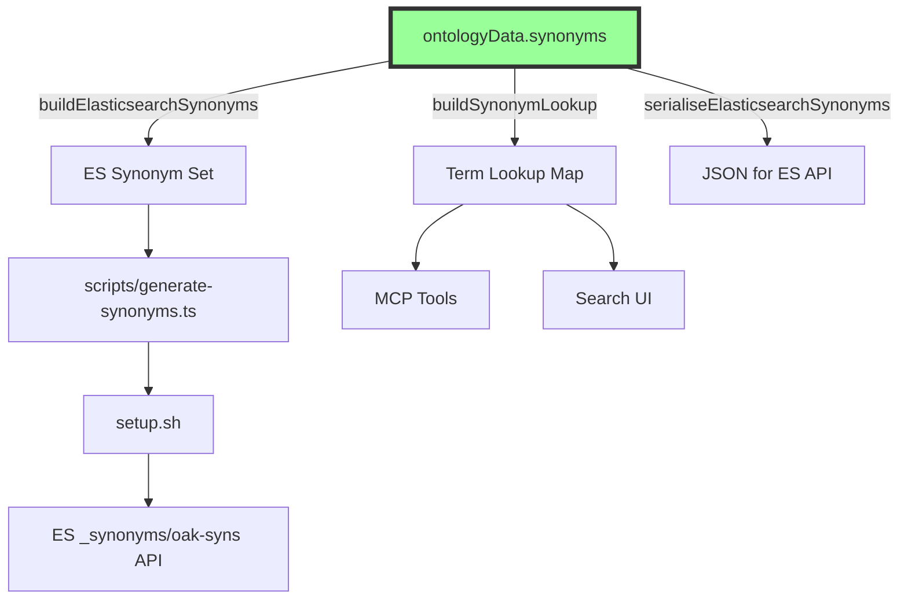

# ADR-063: SDK as Single Source of Truth for Domain Synonyms

**Status**: Accepted  
**Date**: 2025-12-04  
**Decision Makers**: Development Team  
**Extends**: [ADR-030: SDK as Single Source of Truth](030-sdk-single-source-truth.md)

## Context

The semantic search system requires domain-specific synonyms for curriculum terminology (e.g., "maths" ↔ "mathematics", "ks1" ↔ "key stage 1"). These synonyms are needed in multiple places:

- **Elasticsearch**: Synonym sets for query expansion (`oak-syns` synonym set)
- **MCP Tools**: Term normalisation for agent queries
- **Search App**: Display-name mapping and autocomplete

Previously, synonyms were maintained in a static `synonyms.json` file within the search app's `scripts/` directory, separate from other domain knowledge in the SDK. This created:

- Duplication risk between SDK's `ontologyData` and ES synonyms
- Maintenance burden across multiple codebases
- Inconsistency potential when curriculum terminology evolves

## Problem Statement

How do we ensure all consumers of curriculum synonyms remain consistent without duplicating definitions?

## Decision

**All domain synonyms are managed in the SDK's `ontologyData.synonyms` structure.**

The SDK exports utilities to transform these synonyms into formats needed by consumers:

```typescript
import {
  ontologyData, // Contains synonyms.* structures
  buildElasticsearchSynonyms, // Returns ES synonym set object
  buildSynonymLookup, // Returns term → canonical Map
  serialiseElasticsearchSynonyms, // Returns JSON string for ES API
} from '@oaknational/oak-curriculum-sdk/public/mcp-tools';
```

## Architecture



## Synonym Categories

The SDK manages synonyms in categorised groups:

| Category          | Example                                         |
| ----------------- | ----------------------------------------------- |
| `subjects`        | maths ↔ mathematics, dt ↔ design and technology |
| `keyStages`       | ks1 ↔ key stage 1, ks4 ↔ gcse                   |
| `geographyThemes` | climate change ↔ global warming                 |
| `historyTopics`   | ww1 ↔ world war 1 ↔ first world war             |
| `mathsConcepts`   | addition ↔ add ↔ plus ↔ sum                     |
| `englishConcepts` | punctuation ↔ grammar marks                     |
| `scienceConcepts` | photosynthesis ↔ plant energy process           |
| `generic`         | lesson ↔ teaching session                       |

## Implementation

### SDK Export (`synonym-export.ts`)

```typescript
export function buildElasticsearchSynonyms(): ElasticsearchSynonymSet {
  const entries: ElasticsearchSynonymEntry[] = [];

  for (const [canonical, alternatives] of Object.entries(ontologyData.synonyms.subjects)) {
    entries.push({
      id: `subject_${canonical}`,
      synonyms: [canonical, ...alternatives].join(', '),
    });
  }
  // ... repeat for each category

  return { synonyms_set: entries };
}
```

### Consumer Usage (Search App)

```bash
# scripts/generate-synonyms.ts
import { serialiseElasticsearchSynonyms } from '@oaknational/oak-curriculum-sdk/public/mcp-tools';
process.stdout.write(serialiseElasticsearchSynonyms());
```

```bash
# scripts/setup.sh
SYNONYMS_JSON=$(npx tsx "$SCRIPT_DIR/generate-synonyms.ts")
echo "$SYNONYMS_JSON" | curl -X PUT "${ES_URL}/_synonyms/oak-syns" -d @-
```

## Consequences

### Positive

1. **Single source of truth**: All synonym definitions in one place
2. **Automatic propagation**: SDK changes flow to all consumers
3. **Type safety**: TypeScript ensures synonym structure correctness
4. **Testability**: Synonyms can be unit tested in SDK
5. **Consistency**: Same synonyms used by ES, MCP, and UI

### Negative

1. **SDK dependency**: Consumers must import from SDK
2. **Runtime generation**: ES synonyms generated at setup time, not statically committed
3. **Build step**: Requires `tsx` to generate synonyms during setup

### Migration Notes

The static `apps/oak-open-curriculum-semantic-search/scripts/synonyms.json` file was **deleted**. All synonyms now flow from SDK.

## Validation Criteria

This decision is successful when:

1. **Zero synonym duplication**: No synonym definitions exist outside SDK
2. **Automatic updates**: Adding synonyms to SDK automatically updates ES
3. **Type safety**: All synonym exports are fully typed
4. **All consumers aligned**: MCP, Search App, and ES use identical synonyms

## Related Documents

- [ADR-030: SDK as Single Source of Truth](030-sdk-single-source-truth.md)
- [ADR-038: Compilation Time Revolution](038-compilation-time-revolution.md)
- Semantic search plans: `.agent/plans/semantic-search/`

## References

- `packages/sdks/oak-curriculum-sdk/src/mcp/ontology-data.ts` - Synonym definitions
- `packages/sdks/oak-curriculum-sdk/src/mcp/synonym-export.ts` - Export utilities
- `apps/oak-open-curriculum-semantic-search/scripts/generate-synonyms.ts` - Consumer script
