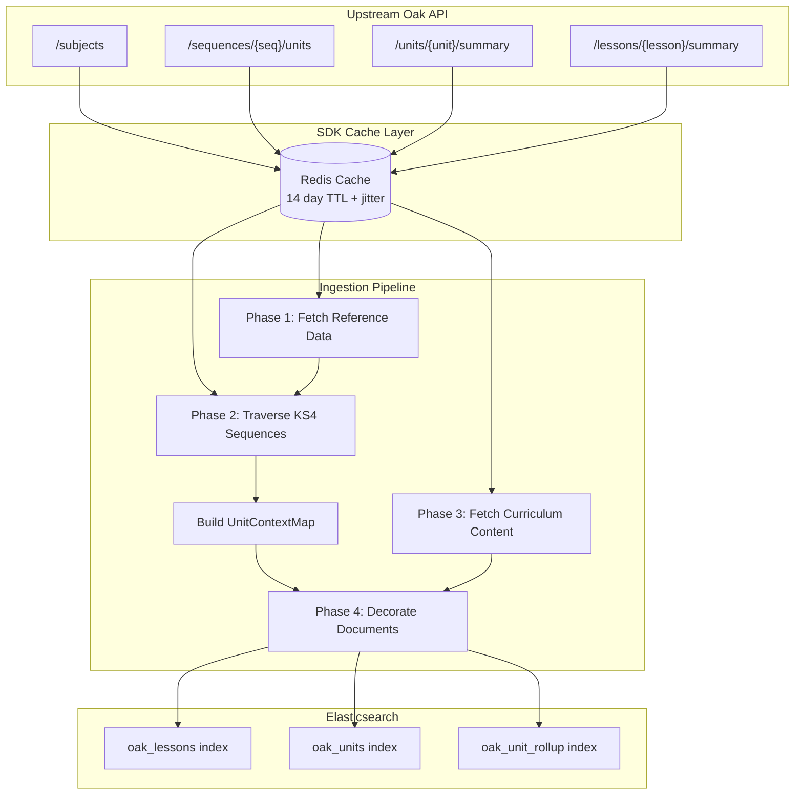
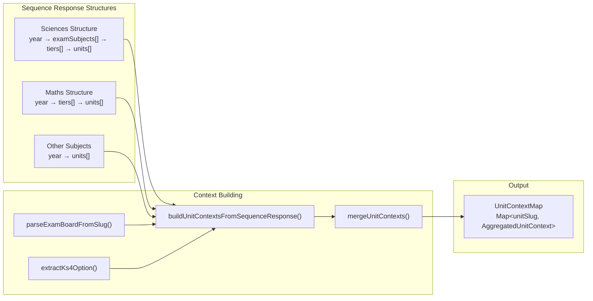
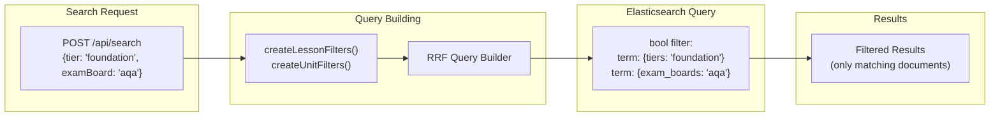

# ADR-080: KS4 Metadata Denormalisation Strategy

**Status**: Accepted  
**Date**: 2025-12-15 (Updated 2025-12-18 - tier metadata fix)  
**Decision Makers**: AI Platform Team  
**Related ADRs**: [ADR-066](066-sdk-response-caching.md), [ADR-067](067-sdk-generated-elasticsearch-mappings.md), [ADR-076](076-elser-only-embedding-strategy.md)

## Context

Teachers need to filter search results by KS4-specific attributes:

- **Tier**: Foundation or Higher (GCSE difficulty levels)
- **Exam Board**: AQA, Edexcel, OCR, Eduqas, etc.
- **Exam Subject**: Biology, Chemistry, Physics (for combined science)
- **KS4 Option**: Combined Science, Triple Science, etc.

The Oak Open Curriculum API exposes this data via **top-down traversal** (sequence → year → tier → units → lessons), not as flat fields on lesson/unit resources. This design reflects the underlying **many-to-many relationships**:

| Relationship         | Cardinality  | Example                                          |
| -------------------- | ------------ | ------------------------------------------------ |
| Lesson → Tiers       | Many-to-many | Same lesson appears in Foundation AND Higher     |
| Lesson → Exam Boards | Many-to-many | Same lesson appears in AQA AND Edexcel sequences |
| Lesson → Units       | Many-to-many | Same lesson can appear in multiple units         |
| Unit → Programmes    | Many-to-many | Same unit appears in multiple programme contexts |

**Bottom-up** queries ("What tier is this lesson?") have multiple valid answers.  
**Top-down** traversal ("Get Higher tier AQA lessons") follows a deterministic path.

### Problem

To enable filtering in Elasticsearch, we need flat fields on indexed documents. However:

1. The upstream API doesn't provide flat `tier`, `examBoard`, etc. fields on lessons/units
2. We cannot request upstream API changes in the short term
3. Many-to-many relationships mean flat fields must be **arrays**, not scalars

## Decision

**Denormalise KS4 metadata at ingest time** by:

1. **Traverse sequences** in addition to existing lesson/unit fetches
2. **Build lookup tables** mapping units → tiers, units → exam boards
3. **Decorate indexed documents** with arrays of applicable values
4. **Continue caching all SDK requests in Redis** (per ADR-066)

## Architecture

### Data Flow Overview



### UnitContextMap Building Process



### Filtering Architecture



## Filterable Fields

### KS4 Metadata Fields

All KS4 metadata is indexed as **arrays** to support many-to-many relationships:

| Field                 | Type     | Source                        | Purpose                     |
| --------------------- | -------- | ----------------------------- | --------------------------- |
| `tiers`               | string[] | Sequence traversal            | Filter by Foundation/Higher |
| `tier_titles`         | string[] | Sequence traversal            | Display titles              |
| `exam_boards`         | string[] | Parsed from sequence slug     | Filter by AQA/Edexcel/etc   |
| `exam_board_titles`   | string[] | Parsed from sequence slug     | Display titles              |
| `exam_subjects`       | string[] | Sequence traversal (sciences) | Filter by Biology/Chemistry |
| `exam_subject_titles` | string[] | Sequence traversal (sciences) | Display titles              |
| `ks4_options`         | string[] | `/subjects` endpoint          | Filter by programme pathway |
| `ks4_option_titles`   | string[] | `/subjects` endpoint          | Display titles              |

### Additional Filterable Fields

These fields are also available from the sequence response and are indexed:

| Field           | Type     | Source            | Purpose                     |
| --------------- | -------- | ----------------- | --------------------------- |
| `thread_slugs`  | string[] | Unit threads[]    | Filter by curriculum thread |
| `thread_titles` | string[] | Unit threads[]    | Display titles              |
| `categories`    | string[] | Unit categories[] | Filter by category          |

### Known Values

**Exam Boards** (parsed from sequence slugs):

- `aqa` - AQA
- `edexcel` - Edexcel
- `ocr` - OCR
- `eduqas` - Eduqas
- `edexcelb` - Edexcel B

**Tiers**:

- `foundation` - Foundation
- `higher` - Higher

## Index Schema

```typescript
interface LessonDocument {
  // ... existing fields ...

  // KS4 metadata (arrays for many-to-many)
  tiers: string[]; // e.g., ["foundation", "higher"]
  tier_titles: string[]; // e.g., ["Foundation", "Higher"]
  exam_boards: string[]; // e.g., ["aqa", "edexcel"]
  exam_board_titles: string[]; // e.g., ["AQA", "Edexcel"]
  exam_subjects: string[]; // e.g., ["biology", "chemistry"]
  exam_subject_titles: string[]; // e.g., ["Biology", "Chemistry"]
  ks4_options: string[]; // e.g., ["gcse-combined-science"]
  ks4_option_titles: string[]; // e.g., ["GCSE Combined Science"]
}

interface UnitDocument {
  // ... existing fields ...

  // Same KS4 metadata arrays
  tiers: string[];
  tier_titles: string[];
  exam_boards: string[];
  exam_board_titles: string[];
  exam_subjects: string[];
  exam_subject_titles: string[];
  ks4_options: string[];
  ks4_option_titles: string[];
}
```

## Ingestion Sequence

The denormalisation happens **in addition to** existing ingestion, not as a replacement:

```text
Phase 1: Fetch reference data (existing)
├── GET /subjects                    → Subject list
├── GET /subjects/{subject}          → Subject details
└── GET /threads                     → Thread list

Phase 2: Fetch sequence metadata (NEW)
├── For each subject with KS4 content:
│   └── GET /sequences/{sequence}/units?year=10
│       └── Build unit → tier/examBoard lookup
│   └── GET /sequences/{sequence}/units?year=11
│       └── Build unit → tier/examBoard lookup

Phase 3: Fetch curriculum content (existing)
├── GET /key-stages/{ks}/subjects/{subject}/units
├── GET /units/{unit}/summary
└── GET /lessons/{lesson}/summary

Phase 4: Decorate and index (ENHANCED)
├── For each unit:
│   └── Look up tiers/examBoards from Phase 2
│   └── Add arrays to unit document
├── For each lesson:
│   └── Inherit from parent unit(s)
│   └── Add arrays to lesson document
└── Index to Elasticsearch
```

## Elasticsearch Filtering

With arrays, ES uses "any match" semantics:

```json
{
  "query": {
    "bool": {
      "filter": [{ "term": { "tiers": "foundation" } }, { "term": { "exam_boards": "aqa" } }]
    }
  }
}
```

This matches lessons that appear in Foundation tier AND appear in AQA sequences.

For **exclusive** filtering ("Foundation only, not Higher"):

```json
{
  "bool": {
    "filter": [{ "term": { "tiers": "foundation" } }],
    "must_not": [{ "term": { "tiers": "higher" } }]
  }
}
```

## Implementation

### Key Files

| File                                             | Purpose                             |
| ------------------------------------------------ | ----------------------------------- |
| `src/lib/indexing/ks4-context-types.ts`          | Type definitions and type guards    |
| `src/lib/indexing/ks4-context-builder.ts`        | Sequence traversal and map building |
| `src/lib/indexing/document-transform-helpers.ts` | `extractKs4DocumentFields()`        |
| `type-gen/.../curriculum.ts`                     | Field definitions (schema source)   |

All files are in `apps/oak-open-curriculum-semantic-search/`.

### Key Functions

| Function                                  | Purpose                                 |
| ----------------------------------------- | --------------------------------------- |
| `parseExamBoardFromSlug()`                | Extracts exam board from sequence slug  |
| `buildUnitContextsFromSequenceResponse()` | Parses sequence response structure      |
| `buildKs4ContextMap()`                    | Orchestrates full map building          |
| `getKs4ContextForUnit()`                  | Retrieves aggregated context for a unit |
| `extractKs4DocumentFields()`              | Converts context to document fields     |

## Implementation Notes

### Critical: Process ALL Sequences (2025-12-18 Fix)

**Lesson learned**: Do NOT skip sequences based on exam board or ks4Options presence.

The original implementation had:

```typescript
// WRONG - skips Maths-style sequences
if (!isKs4Sequence(examBoard, ks4Option)) {
  return contextMap; // Early return
}
```

This caused `maths-secondary` to be skipped because:

- No exam board in slug (unlike `science-secondary-aqa`)
- `ks4Options: null` in subjects API response

But `maths-secondary` **DOES** contain tier data embedded in Year 10/11 entries. The fix is to process ALL sequences and let `buildUnitContextsFromSequenceResponse()` extract tiers wherever they exist:

```typescript
// CORRECT - process all sequences
async function processSequenceForKs4Context(...) {
  // No early return - process all sequences
  const response = await fetchSequenceUnits(sequence.sequenceSlug);
  const contexts = buildUnitContextsFromSequenceResponse(response, examBoard, ks4Option);
  // contexts will be empty for non-tiered years (correct behaviour)
  return mergeUnitContexts(contextMap, contexts);
}
```

**Result**: 251 Foundation lessons, 314 Higher lessons now correctly indexed for Maths KS4.

### Critical: Tier Is Many-to-Many (2025-12-20 Cleanup)

**Lesson learned**: Tier must be modelled as an ARRAY, not a scalar.

A lesson can appear in BOTH Foundation AND Higher tiers:

| Relationship   | Cardinality  | Example                                      |
| -------------- | ------------ | -------------------------------------------- |
| Lesson → Tiers | Many-to-many | Same lesson appears in Foundation AND Higher |

**Correct implementation** (already in place):

- `extractKs4DocumentFields()` returns `tiers: string[]` and `tier_titles: string[]`
- Data comes from `/sequences/{sequence}/units` via `buildKs4ContextMap()`

**Dead code removed** (2025-12-20):

- `programme-factor-extractors.ts` deleted - it tried to derive a SINGLE `tier` value from slug suffixes (never worked)
- The vestigial singular `tier` field in the schema should also be removed (cleanup pending)

## Rationale

### Why Denormalise vs Join at Query Time

Elasticsearch is not a relational database. Joins are:

1. **Not supported natively** in the way SQL databases support them
2. **Expensive** when simulated via application-side queries
3. **Incompatible with RRF** (Reciprocal Rank Fusion) scoring

Denormalisation at ingest time is the ES-native approach.

### Why Arrays vs Flat Fields

Arrays truthfully represent many-to-many relationships:

- A lesson in both Foundation AND Higher tiers: `tiers: ["foundation", "higher"]`
- Filtering for "foundation" matches this lesson (correct)
- Filtering for "foundation AND higher" also matches (correct)

Flat fields would force us to choose one value, losing information.

### Why Continue Caching

Sequence traversal adds API calls. With 10,000 req/hr rate limit:

- ~50 subjects × ~2 sequences avg × 2 years (10, 11) = ~200 additional calls per full ingest
- Caching prevents repeated calls during re-ingestion
- 14-day TTL with jitter prevents thundering herd

### Why NOT Wait for Upstream API Changes

1. Upstream changes have uncertain timeline
2. We can deliver value now with denormalisation
3. When upstream adds flat fields, we simplify—but the index schema stays the same

## Consequences

### Positive

- **Enables KS4 filtering** without upstream API changes
- **Truthful representation** of many-to-many relationships
- **ES-native** approach (denormalisation is idiomatic)
- **No breaking changes** to existing ingestion (additive)
- **Future-proof** (same schema works when upstream adds flat fields)

### Negative

- **Additional API calls** during ingestion (~200 per full ingest)
- **Complexity** in ingestion code (sequence traversal + lookup tables)
- **Data may be incomplete** if sequence data doesn't cover all units/lessons
- **Maintenance burden** (must keep parsing logic in sync with upstream patterns)

### Neutral

- **No runtime performance impact** (denormalisation happens at ingest time)
- **Index size increases slightly** (additional array fields)
- **Query patterns unchanged** (term filters work on arrays)

## Limitations

### Incomplete Coverage

Not all lessons/units can be associated with KS4 metadata:

1. **Lessons not in KS4 sequences**: Will have empty arrays (correct—they have no tier)
2. **Units that exist outside sequences**: May have incomplete metadata
3. **New content**: Requires re-ingestion to pick up sequence associations

### Filter Semantics

With arrays, `tier: "foundation"` matches lessons that **include** Foundation tier:

- A Foundation-only lesson: matches ✓
- A Foundation+Higher lesson: matches ✓ (may or may not be desired)

For **exclusive** filtering ("Foundation only, not Higher"), query must explicitly exclude.

## Related Documentation

- [Upstream API Wishlist](../../../.agent/plans/external/upstream-api-metadata-wishlist.md) - Request for flat fields
- [Phase 3 Plan](../../../.agent/plans/semantic-search/phase-3-multi-index-and-fields.md) - Implementation context
- [Semantic Search Prompt](../../../.agent/prompts/semantic-search/semantic-search.prompt.md) - Entry point for AI sessions
- [ADR-066: SDK Response Caching](066-sdk-response-caching.md) - Redis caching strategy
- [ADR-079: SDK Cache TTL Jitter](079-sdk-cache-ttl-jitter.md) - Cache TTL strategy

## References

- Elasticsearch: [Search multiple indices](https://www.elastic.co/guide/en/elasticsearch/reference/current/search-multiple-indices.html)
- Elasticsearch: [Term query on arrays](https://www.elastic.co/guide/en/elasticsearch/reference/current/query-dsl-term-query.html)
- Elasticsearch: [RRF (Reciprocal Rank Fusion)](https://www.elastic.co/guide/en/elasticsearch/reference/current/rrf.html)
- Oak API: [Sequences endpoint](https://open-api.thenational.academy/docs)
