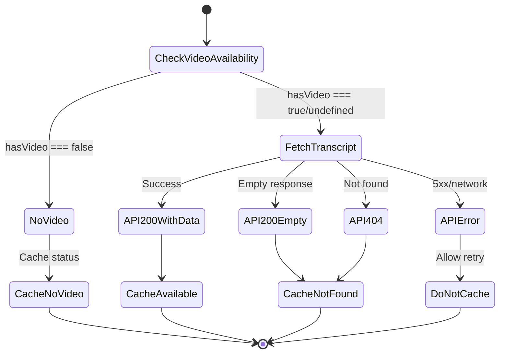

# ADR-092: Transcript Cache Categorization Strategy

**Status**: Accepted  
**Date**: 2025-12-30  
**Related**: ADR-091 (Video Availability Detection), ADR-066 (SDK Response Caching), ADR-078 (Dependency Injection)

## Context

After a week of ingestion attempts, we identified a critical observability gap: when transcripts are unavailable, we cannot distinguish **why**. All unavailable transcripts were cached using a simple `__NOT_FOUND__` sentinel value, making it impossible to answer:

- Did we skip the fetch because the lesson has no video?
- Did the API return 404 (TPC-blocked or genuinely missing)?
- Was this a transient error that should be retried?
- Did the API return an empty transcript (200 with no content)?

### The Problem

The existing cache used a single sentinel value for all "negative" cases:

```typescript
// Legacy approach - no distinction
const NOT_FOUND_SENTINEL = '__NOT_FOUND__';

// All these cases stored identically:
// 1. Lesson has no video asset → skipped fetch → cached as __NOT_FOUND__
// 2. API returned 404 → cached as __NOT_FOUND__
// 3. API returned 200 with empty string → cached as __NOT_FOUND__
```

This lack of categorization made debugging ingestion issues extremely difficult.

### Requirements

1. **Observability**: Know exactly why each transcript is unavailable
2. **Correctness**: Transient errors (5xx, network) must NOT be cached
3. **Backwards compatibility**: Migrate existing cache entries gracefully
4. **Simplicity**: Minimal status categories that cover all cases

## Decision

### Structured Cache Entries with 3 Statuses

Replace the single sentinel with a discriminated union:

```typescript
type TranscriptCacheStatus = 'available' | 'no_video' | 'not_found';

type TranscriptCacheEntry =
  | { readonly status: 'available'; readonly transcript: string; readonly vtt: string }
  | { readonly status: 'no_video' } // Confirmed no video asset
  | { readonly status: 'not_found' }; // API 404 or empty response
```

### Status Definitions

| Status            | When Used                                 | Cached? | Retry? |
| ----------------- | ----------------------------------------- | ------- | ------ |
| `available`       | API 200 with transcript data              | Yes     | No     |
| `no_video`        | `hasVideo === false` from assets endpoint | Yes     | No     |
| `not_found`       | API 404 OR API 200 with empty string      | Yes     | No     |
| (transient error) | API 5xx or network failure                | **No**  | Yes    |

### Cache Flow



### Design Decisions

| Decision                     | Choice           | Rationale                                                |
| ---------------------------- | ---------------- | -------------------------------------------------------- |
| Cache `no_video` explicitly? | Yes              | Observability — know we skipped due to no video asset    |
| Separate status for empty?   | No               | Treat as `not_found`; add to API wishlist as known issue |
| Cache transient errors?      | No               | Allow retry on next ingestion run                        |
| Migration approach?          | Dedicated script | Clean separation; no temporary code in ingest pipeline   |

## Rationale

### Why 3 Statuses (Not 4 or 5)?

We considered additional statuses:

- **`empty`**: For API 200 with empty transcript — Rejected as this is an upstream issue (should be 404). Treat same as `not_found` and document in API wishlist.
- **`error`**: For transient failures — Rejected because transient errors should NOT be cached at all.

Three statuses provide the right balance of observability and simplicity.

### Why Cache `no_video`?

Even though we could skip caching entirely when `hasVideo === false`, explicitly caching the status provides:

1. **Audit trail**: Can verify the video availability check worked correctly
2. **Consistency**: All transcript lookup results go through the same cache path
3. **Future flexibility**: Could add metadata (e.g., timestamp, source) later

### Why Not Cache Transient Errors?

Transient errors (5xx, network failures) indicate temporary problems. Caching them would:

1. Prevent retry on next ingestion run
2. Potentially persist bad state from a momentary outage
3. Require additional TTL logic for short-lived error entries

By not caching transient errors, we allow natural retry on the next ingestion attempt.

## Consequences

### Positive

- **Full observability**: Ingestion logs show exactly why each transcript is/isn't available
- **Debuggable**: Can query Redis to understand cache state
- **Correct retry behavior**: Transient errors are retried, permanent states are cached
- **Clean migration**: Dedicated script converts legacy format before ingestion
- **Type-safe**: Discriminated union ensures exhaustive handling

### Negative

- **Migration required**: Must run migration script before ingestion
- **Slightly larger cache entries**: JSON objects vs. simple strings
- **More complex parsing**: Need type guard to validate cached entries

### Neutral

- **Empty transcript issue documented**: Added to API wishlist for upstream fix
- **Backwards compatible reads**: Deserializer handles legacy `__NOT_FOUND__` format

## Implementation

### New Files

| File                                            | Purpose                                 |
| ----------------------------------------------- | --------------------------------------- |
| `sdk-cache/transcript-cache-types.ts`           | Type definitions, guards, serialization |
| `sdk-cache/transcript-cache-types.unit.test.ts` | Unit tests                              |
| `scripts/migrate-transcript-cache.ts`           | One-time migration script               |
| `sdk-cache/README.md`                           | Module documentation                    |

### Modified Files

| File                               | Changes                              |
| ---------------------------------- | ------------------------------------ |
| `sdk-cache/cache-wrapper.ts`       | Use new types for transcript caching |
| `lib/indexing/lesson-materials.ts` | Cache with structured metadata       |
| `sdk-cache/index.ts`               | Export new types                     |

### Migration Strategy

1. Run `migrate-transcript-cache.ts --execute` before ingestion
2. Script converts all `__NOT_FOUND__` values to `{"status":"not_found"}`
3. New ingestion writes use structured format
4. Legacy format support in deserializer for safety (belt and suspenders)

### Monitoring

Ingestion logs will show cache statistics:

```text
Cache statistics:
  available: 412
  no_video: 15
  not_found: 10
```

## Alternatives Considered

### Alternative 1: Keep Single Sentinel

Continue using `__NOT_FOUND__` for all negative cases.

**Rejected**: No observability; can't debug ingestion issues.

### Alternative 2: Multiple Sentinel Strings

Use different strings: `__NO_VIDEO__`, `__NOT_FOUND__`, `__EMPTY__`.

**Rejected**: Less type-safe than structured objects; harder to extend.

### Alternative 3: Metadata in Separate Keys

Store status in `transcript:{slug}:status` and data in `transcript:{slug}:data`.

**Rejected**: More Redis operations; atomicity concerns; unnecessary complexity.

## Related Documents

- [ADR-091: Video Availability Detection Strategy](./091-video-availability-detection-strategy.md)
- [ADR-066: SDK Response Caching](./066-sdk-response-caching.md)
- [Efficient API Traversal Plan](../../../.agent/plans/semantic-search/active/efficient-api-traversal.md)
- [API Wishlist: Empty Transcript Issue](../../../.agent/plans/external/ooc-api-wishlist/00-overview-and-known-issues.md)
