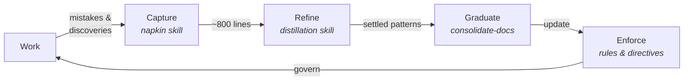
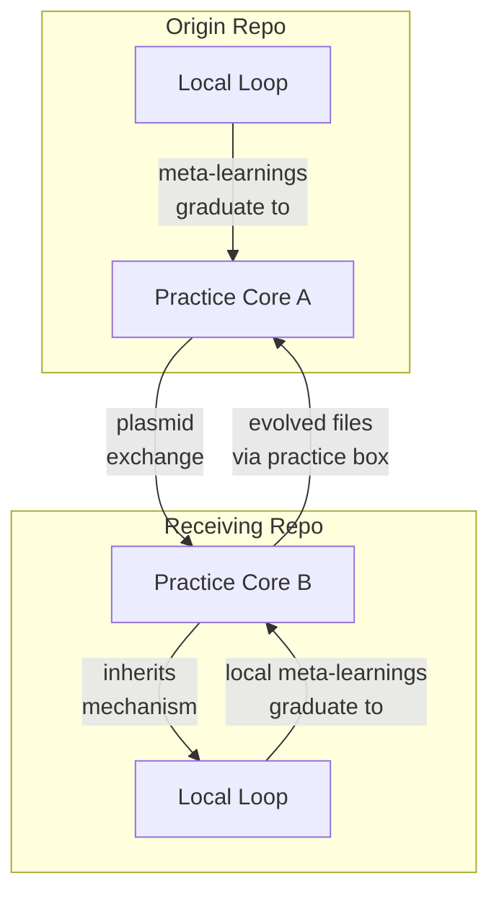

# ADR-131: Self-Reinforcing Improvement Loop

**Status**: Accepted
**Date**: 2026-03-08
**Related**: [ADR-119 (Agentic Engineering Practice)](119-agentic-engineering-practice.md), [ADR-124 (Practice Propagation Model)](124-practice-propagation-model.md), [ADR-127 (Documentation as Foundational Infrastructure)](127-documentation-as-foundational-infrastructure.md)

## Context

ADR-119 names the Practice and its recursive self-improvement property in
a single paragraph. ADR-124 specifies how the Practice travels between
repos. Neither records the specific mechanisms that form the improvement
loop, how those mechanisms interact, or the critical property that the
loop operates on itself — not just on the product code it governs.

The improvement loop emerged from concrete needs: the napkin prevented
repeated mistakes, distillation kept the napkin manageable,
consolidation graduated settled patterns to permanent documentation, and
plasmid exchange carried the entire mechanism to new repos. Each piece
was documented in its operational location (skills, commands,
practice-core), but the architectural decision to design a
self-referential system — where the loop that governs work also governs
its own evolution — was not recorded.

Understanding the loop as an architectural pattern matters for three
reasons:

1. **Maintenance**: Breaking any link degrades the system silently.
   Knowing the full circuit helps diagnose when the loop stops working.
2. **Evolution**: Improving the loop requires understanding how each
   mechanism feeds the next.
3. **Propagation**: The loop is self-replicating — a repo that receives
   the Practice inherits the mechanism, not just the current rules.

## Decision

### The Improvement Loop Is a Deliberate Architectural Pattern

The Practice contains a closed improvement loop with five stages. Each
stage is implemented by a specific mechanism and serves a progressively
broader audience.

### The Intra-Repo Loop

| Stage        | Mechanism                        | Trigger                   | Input                                          | Output                                               |
| ------------ | -------------------------------- | ------------------------- | ---------------------------------------------- | ---------------------------------------------------- |
| **Capture**  | Napkin skill                     | Always on (rule-enforced) | Mistakes, corrections, patterns from work      | `.agent/memory/napkin.md`                            |
| **Refine**   | Distillation skill               | Napkin exceeds ~800 lines | Napkin entries                                 | `distilled.md` + archived napkin                     |
| **Graduate** | `consolidate-docs` command       | End of significant work   | `distilled.md`, plan content, experience files | ADRs, governance docs, READMEs, TSDoc, code patterns |
| **Enforce**  | Always-applied rules, directives | Every agent interaction   | Principles, rules, distilled learnings         | Governed behaviour during work                       |
| **Apply**    | Agent work under governance      | Task assignment           | Rules + directives + distilled                 | Product code + new mistakes and discoveries          |

Each transition raises the bar. Not everything in the napkin survives
distillation, and not everything distilled graduates to permanent
documentation.

### Fitness Governors Prevent Unbounded Growth

Each stage has a governor that prevents the loop from moving
accumulation downstream rather than refining knowledge:

- **Napkin** → ~800 lines triggers distillation
- **Distilled** → target <200 lines; primary reduction is extraction to
  permanent docs
- **Permanent docs** → `fitness_ceiling` frontmatter with
  `split_strategy`; exceeding triggers splitting by responsibility
- **Practice-core** → trinity files carry their own ceilings; exceeding
  triggers tightening (same ideas, expressed more concisely)

### The Self-Referential Property

The loop does not merely improve product code. It improves itself:

- The **napkin** captures mistakes about the loop itself (e.g. "skipped
  consolidation and lost context" or "distillation missed a pattern
  because the napkin structure was unclear")
- **Distillation** can extract patterns about distillation (e.g.
  quality criteria for what survives refinement)
- **Consolidation** can graduate insights about consolidation to
  permanent documentation (e.g. this ADR)
- **Rules** can govern rule creation (e.g. "if a behaviour must be
  automatic, it needs a rule, not just a skill" — a rule about rules,
  recorded as a Learned Principle in `practice-lineage.md`)
- **Practice-core files** are subject to the same fitness functions
  they describe

This self-referential quality is what distinguishes the loop from a
linear pipeline. The system that produces the rules is itself subject
to the rules. Changes to the loop must clear the same bar as changes
to any other part of the Practice: validated by real work, prevents a
recurring mistake, and stable.

### The Inter-Repo Loop

The intra-repo loop is extended across repositories via plasmid
exchange (ADR-124). The mechanism:

1. Practice-core files travel to a new repo. The receiving repo
   inherits the knowledge flow mechanism — not just the current rules,
   but the system that produced them.
2. The new repo's local loop runs, shaped by different work and
   different mistakes. Local learnings may surface patterns the origin
   hadn't encountered.
3. Meta-learnings graduate to `practice-lineage.md` §Learned
   Principles — principles about the Practice itself.
4. The evolved practice-core files return to the origin repo via the
   practice box. `consolidate-docs` step 9 processes them: check
   provenance, compare across the full Practice system, apply the
   three-part bar, integrate or record as not applicable.

The inter-repo loop means that different contexts stress-test the
Practice in ways a single repo cannot. A short-lived POC discovers
that the minimum viable roster is three reviewers, not fourteen. A
production repo discovers that fitness functions need to extend beyond
the trinity files. These discoveries travel back as evolved
practice-core files.

### Interaction Points Between Mechanisms

The mechanisms do not operate in isolation. The specific interaction
points:

| From              | To                        | Interaction                                            |
| ----------------- | ------------------------- | ------------------------------------------------------ |
| Napkin            | Distilled                 | Distillation extracts high-signal content              |
| Distilled         | Permanent docs            | Consolidation graduates settled entries                |
| Distilled         | Practice-core             | Meta-principles graduate to Learned Principles         |
| Permanent docs    | Rules                     | Principles become enforceable rule extractions         |
| Rules             | Napkin                    | Governed work generates new learning                   |
| Practice box      | Practice-core             | Integration flow merges incoming material              |
| Practice-core     | Practice box (other repo) | Plasmid exchange carries evolved files                 |
| Experience files  | Distilled/permanent docs  | Consolidation extracts matured technical patterns      |
| Code patterns     | Work                      | Proven abstractions inform implementation              |
| Fitness functions | All stages                | Governors trigger distillation, graduation, tightening |

### Consolidate-Docs as the Hub

The `consolidate-docs` command is the primary interaction point where
multiple mechanisms converge:

1. **Graduation** (step 1, 3, 7): Moves settled knowledge from
   ephemeral to permanent locations
2. **Fitness checking** (step 8): Enforces governors at every stage
3. **Practice box integration** (step 9): Processes inter-repo
   learnings
4. **Code pattern extraction** (step 5): Identifies reusable
   abstractions
5. **Experience check** (step 4, 10): Bridges qualitative reflection
   and technical knowledge

Without consolidation, the loop stalls at the refinement stage —
distilled knowledge accumulates but never becomes permanent
documentation or evolves the Practice itself.

## Consequences

### Positive

- The loop is named and documented as a deliberate architectural
  pattern, making it easier to maintain and evolve
- Breaking changes to any mechanism can be assessed against the full
  circuit — the impact on upstream and downstream stages is visible
- The self-referential property is explicit: the system that produces
  rules is subject to those rules, preventing the loop from becoming
  exempt from its own governance
- The inter-repo dimension is traced end-to-end, from local learning
  through plasmid exchange to integration, clarifying how the Practice
  improves across contexts

### Negative

- Naming the loop risks treating it as more complex than it is — in
  practice, it is "write down mistakes, refine periodically,
  consolidate into docs, follow the docs"
- The inter-repo loop has been exercised in only one round-trip
  (oak-mcp-ecosystem → cloudinary-icon-ingest-poc →
  oak-mcp-ecosystem); the pattern is validated but not yet
  battle-tested at scale

### Neutral

- This ADR records and names what already exists. It does not change
  any mechanism, trigger, or threshold
- The operational detail remains in practice.md §The Knowledge Flow,
  the distillation skill, and the consolidate-docs command. This ADR
  records the architectural decision; those files remain the
  operational references
