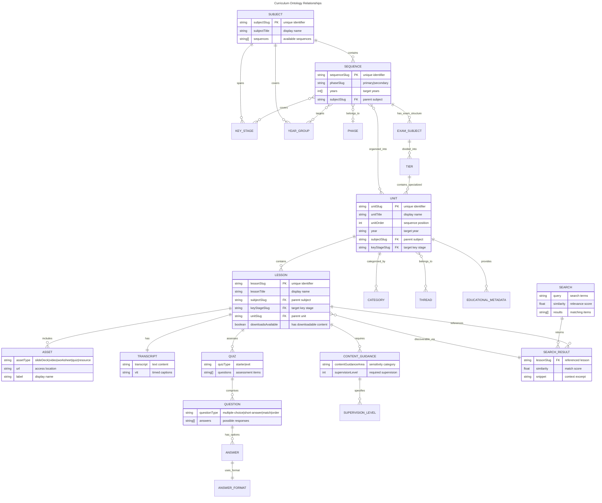

# Curriculum Ontology and Relationship to Model Context Protocol Tools

## Overview

This document defines an ontology for the Oak Curriculum data, derived from the OpenAPI schema at `packages/sdks/oak-curriculum-sdk/src/types/generated/api-schema/api-schema-sdk.json`. The ontology maps entities, relationships, and enumerations that form the foundation for curriculum data tools, guidance systems, and playbooks. It is not the definitive Oak Curriculum ontology, but rather a working document that will be refined over time.

## Schema Index

This section maps ontology nodes and edges to the SDK schema. Each entry is either explicit in the schema or an implied link with a specific schema reference.

- `SequenceUnitsResponseSchema`: Unit trees, unitOrder, categories[], threads[], KS4 examSubjects/tiers.
- `AllKeyStageAndSubjectUnitsResponseSchema`: Year groups with units and lessons; demonstrates `lessonOrder`.
- `KeyStageSubjectLessonsResponseSchema`: Units with nested lessons for a key stage and subject.
- `UnitSummaryResponseSchema`: Unit metadata, priorKnowledgeRequirements, nationalCurriculumContent, whyThisWhyNow, and `unitOptions` (alternatives).
- `LessonSummaryResponseSchema`: Keywords, keyLearningPoints, misconceptions, teacherTips, contentGuidance, supervisionLevel.
- `LessonSearchResponseSchema`: Lesson similarity, many-to-many lesson↔unit references, context slugs.
- `LessonAssetsResponseSchema` / `SubjectAssetsResponseSchema` / `SequenceAssetsResponseSchema`: Assets and attribution.
- `TranscriptResponseSchema`: Lesson transcript and VTT captions.
- `SearchTranscriptResponseSchema`: Transcript search results with snippet matching.
- `AllSubjectsResponseSchema` / `SubjectResponseSchema`: Subjects with sequences, coverage of key stages and years.
- `SubjectSequenceResponseSchema`: Sequence-level keyStages/years coverage and phase.
- `SubjectKeyStagesResponseSchema` / `SubjectYearsResponseSchema`: Coverage lists.
- `KeyStageResponseSchema`: Key stage slugs and titles.
- `AllThreadsResponseSchema` / `ThreadUnitsResponseSchema`: Threads and their units.
- `QuestionsForSequenceResponseSchema` / `QuestionsForKeyStageAndSubjectResponseSchema` / `QuestionForLessonsResponseSchema`: Quiz question sets scoped to sequence/subject/lesson.
- `RateLimitResponseSchema`: API rate limiting information (limit, remaining, reset).

## Entities and Definitions

### Core Curriculum Entities

Oak's curriculum is organized along three complementary dimensions:

1. **Programmes**: Teacher-facing navigation (what to teach when, in what context)
2. **Threads**: Conceptual progression (how ideas build over time)
3. **Sequences**: API data organization (efficient storage and retrieval)

**Note**: While sequences exist in the API as an organizational structure, they are not necessarily the canonical internal concept. Programmes and threads are the primary user-facing and pedagogical structures.

- **Programme**
  - Definition: A contextualized, user-facing curriculum pathway for a subject in a specific teaching context. Programmes are what teachers navigate by on the Oak Web Application. They represent "what to teach when" for a specific year/key stage/tier/exam board combination.
  - Key fields: `programmeSlug` (string - used in OWA URLs), `programmeTitle` (string), `keyStageSlug` (string), `tier` (object|null), `examBoard` (object|null), `examSubject` (string|null), `pathway` (string|null)
  - Programme factors (context filters):
    - **Key Stage**: `ks1`, `ks2`, `ks3`, `ks4` (all programmes)
    - **Tier**: `foundation`, `higher` (KS4 sciences only)
    - **Exam Subject**: `biology`, `chemistry`, `physics`, `combined-science` (KS4 sciences only)
    - **Exam Board**: `aqa`, `ocr`, `edexcel`, `eduqas`, `edexcelb` (KS4 subjects)
    - **Pathway**: `core`, `gcse` (some KS4 subjects like citizenship, computing, PE)
    - **Legacy Flag**: `-l` suffix in slug (marks older curriculum versions)
  - Examples:
    - `maths-primary-ks1` (Year 1-2 maths)
    - `biology-secondary-ks4-foundation-aqa` (Year 10-11 Foundation Biology for AQA exam board)
  - OWA URL pattern: `https://www.thenational.academy/teachers/programmes/{programmeSlug}`
  - Relationships: Programme → Units (contains); Programme → KeyStage (belongs_to); Programme → Subject (belongs_to)

- **Thread**
  - Definition: A cross-unit conceptual strand showing how specific concepts, skills, or themes develop over time—from early years through to GCSE. Threads provide the pedagogical coherence that makes Oak's curriculum progressive rather than just a collection of lessons.
  - **Critical insight**: Threads are programme-agnostic. A single thread can span multiple programmes, key stages, and years, showing how the same concept deepens across contexts.
  - Key fields: `threadSlug` (string), `threadTitle` (string)
  - Unit relationship: `unitOrder` (number) - units within a thread are ordered to show progression
  - Examples:
    - `number` (118 units spanning Reception → Year 11, from "Counting 0-10" to "Surds and standard form")
    - `bq01-biology-what-are-living-things-and-what-are-they-made-of` (32 units spanning KS1 → KS4, from "Naming animals" to "Eukaryotic and prokaryotic cells")
    - `developing-reading-preferences` (English progression strand across key stages)
  - Pedagogical purpose:
    - Shows **how ideas build** (not just what to teach)
    - Enables prerequisite identification
    - Supports cross-key-stage transitions
    - Makes curriculum progression explicit
  - Relationships: Thread → Units (spans, ordered); Thread → KeyStages (crosses); Thread → Programmes (independent of); Unit → Thread (belongs_to, with order)

- **Sequence**
  - Definition: An API organizational structure for curriculum data storage and retrieval. Sequences are a pragmatic grouping of units for data management purposes. They span multiple contexts and can generate multiple programme views.
  - **Note**: Sequences are primarily a technical/API concept rather than a canonical pedagogical concept. The canonical user-facing structures are programmes (navigation) and threads (progression).
  - Key fields: `sequenceSlug` (string), `years` (number[]), `keyStages` [{`keyStageTitle`, `keyStageSlug`}], `phaseSlug` (string), `phaseTitle` (string), `ks4Options` ({title, slug}|null)
  - Examples:
    - `maths-primary` (API structure spanning KS1 + KS2, generates multiple programme views)
    - `science-secondary-aqa` (API structure spanning KS3 + KS4, generates 8+ programme contexts for Years 10-11)
  - Relationships: Sequence → Units (organizes); Sequence → KeyStages (covers); Sequence → Years (covers); Sequence → Phase (belongs_to); Subject → Sequence (has); Sequence → Programmes (generates)

- **Subject**
  - Definition: An academic discipline (e.g., Maths).
  - Key fields: `subjectSlug` (string), `subjectTitle` (string)
  - Relationships: Subject → Sequences; Subject → KeyStages (coverage lists); Subject → Years (coverage lists)

- **Unit**
  - Definition: A themed set of Lessons forming a cohesive teaching block (typically 4-8 lessons). Units are the fundamental building blocks that appear in both programmes (navigation) and threads (progression).
  - **Key insight**: A single unit can appear in multiple contexts: multiple programmes (filtered by tier/exam board), multiple threads (showing different conceptual progressions), and may have variants (unitOptions).
  - Key fields: `unitSlug` (string), `unitTitle` (string), `unitOrder` (number - position within a thread)
  - Additional fields (where available): `year` (number|string), `yearSlug` (string), `phaseSlug` (string), `subjectSlug` (string), `keyStageSlug` (string), `notes` (string|nullable)
  - Educational metadata: `priorKnowledgeRequirements` (string[]), `nationalCurriculumContent` (string[]), `whyThisWhyNow` (string)
  - Relationships: Unit → Lessons (contains); Unit → Thread (belongs_to, with order); Unit → Categories (has); Unit → Programme (appears_in); Unit → Unit (alternatives via unitOptions)

- **Category**
  - Definition: A classification label for Units.
  - Fields: `categoryTitle` (string), `categorySlug` (string, optional)
  - Relationships: Unit → Category (has)

- **Lesson**
  - Definition: A single teaching session within a Unit.
  - Key fields: `lessonSlug` (string), `lessonTitle` (string), `subjectSlug` (string), `keyStageSlug` (string), `unitSlug` (string), `downloadsAvailable` (boolean)
  - Summary fields: `lessonKeywords` [{`keyword`, `description`}], `keyLearningPoints` [{`keyLearningPoint`}], `misconceptionsAndCommonMistakes` [{`misconception`, `response`}], `teacherTips` [{`teacherTip`}], `contentGuidance` (array|null), `supervisionLevel` (string|null)
  - Relationships: Unit → Lesson (has); Lesson → Assets (has); Lesson → Transcript (has)

### Content and Media Entities

- **Asset**
  - Definition: Downloadable or viewable resource, including `video`.
  - Fields: `type` (enum), `label` (string), `url` (string); attribution at lesson/subject/sequence scope
  - Relationships: Lesson → Asset (has)

- **Transcript**
  - Definition: Video transcript and captions timing.
  - Fields: `transcript` (string), `vtt` (string)
  - Relationships: Lesson → Transcript (has)

### Assessment Entities

- **Quiz**
  - Definition: A set of questions associated with a Lesson (starter/exit).
  - Types: `starterQuiz`, `exitQuiz`
  - Relationships: Lesson → Quiz (has); Quiz → Question (has)

- **Question**
  - Definition: A question within a Quiz.
  - Types (enums): `multiple-choice`, `short-answer`, `match`, `order`
  - Answer formats: `text`, `image`
  - Relationships: Quiz → Question (has)

- **Answer**
  - Definition: A response option for a Question, supporting distractor logic and rich media.
  - Types: `text` (content string), `image` (url, width, height, alt, attribution)
  - Fields: `distractor` (boolean: true=incorrect, false=correct), `content` (string or image object)
  - Relationships: Question → Answer (has)

### Search and Discovery Entities

- **SearchResult**
  - Definition: Search result entities for lessons and transcript content.
  - Types: `LessonSearchResult`, `TranscriptSearchResult`
  - Fields: `lessonTitle`, `lessonSlug`, `transcriptSnippet` (for transcript results)
  - Relationships: Search → Result (contains); Result → Lesson (references)

### Content Guidance Entities

- **ContentGuidance**
  - Definition: Content sensitivity classification system for lessons.
  - Types: `ContentGuidanceArea`, `SupervisionLevel`, `ContentGuidanceLabel`
  - Fields: `contentGuidanceArea` (string), `supervisionlevel_id` (number), `contentGuidanceLabel` (string), `contentGuidanceDescription` (string)
  - Relationships: Lesson → ContentGuidance (requires); ContentGuidance → SupervisionLevel (has)

- **EducationalMetadata**
  - Definition: Rich educational context and requirements for curriculum content.
  - Types: `PriorKnowledgeRequirement`, `NationalCurriculumContent`, `EducationalRationale`
  - Fields: `priorKnowledgeRequirements[]` (string[]), `nationalCurriculumContent[]` (string[]), `whyThisWhyNow` (string)
  - Relationships: Unit → EducationalMetadata (provides)

### Educational Structure Entities

- **KeyStage**
  - Definition: UK educational stage.
  - Fields: `keyStageSlug` (ks1|ks2|ks3|ks4), `keyStageTitle` (string) or as `slug`/`title`
  - Relationships: Subject → KeyStage (coverage); Sequence → KeyStage (covers)

- **Phase**
  - Definition: School phase grouping.
  - Fields: `phaseSlug` (primary|secondary), `phaseTitle` (string)
  - Relationships: Sequence → Phase (belongs_to)

- **YearGroup** (synonyms: Year)
  - Definition: Curriculum year grouping.
  - Fields: number 1–11 (and filter string `"1"…"11"`; special `"all-years"`)
  - Relationships: Subject → Years (coverage); Sequence → Years (covers); Unit → Year (belongs_to)

### KS4 Variants

- **ExamSubject**
  - Fields: `examSubjectTitle`, optional `examSubjectSlug`
  - Relationships: Sequence (KS4 contexts) → ExamSubject (has); ExamSubject → Tier (has)

- **Tier**
  - Fields: `tierTitle`, `tierSlug`
  - Relationships: ExamSubject → Tier (has); Tier → Units (has)

- **Unit options** (synonyms: Unit variant/Optionality)
  - Definition: Alternative Unit slugs within a Unit position or tiered variants.
  - Fields: `unitOptions` [{`unitTitle`, `unitSlug`}]
  - Relationships: Unit → Unit options (has)

## Enumerations and Constraints

- **KeyStageSlug**: `ks1` | `ks2` | `ks3` | `ks4`
- **AssetType**: `slideDeck` | `exitQuiz` | `exitQuizAnswers` | `starterQuiz` | `starterQuizAnswers` | `supplementaryResource` | `video` | `worksheet` | `worksheetAnswers`
- **QuestionType**: `multiple-choice` | `short-answer` | `match` | `order`
- **AnswerFormat**: `text` | `image`
- **Year filters**: `"1"`–`"11"`, `"all-years"` (string), plus numeric years in many responses
- **PhaseSlug**: `primary` | `secondary`
- **SubjectSlug**: `art` | `citizenship` | `computing` | `cooking-nutrition` | `design-technology` | `english` | `french` | `geography` | `german` | `history` | `maths` | `music` | `physical-education` | `religious-education` | `rshe-pshe` | `science` | `spanish`
- **SupervisionLevel**: Numeric levels (1-n) representing content sensitivity requirements
- **ContentGuidanceArea**: Categories of content requiring guidance (e.g., violence, language, sexual content)
- **Distractor**: `true` | `false` (true=incorrect answer, false=correct answer)

## Type Canonicalization Rules

### Year

- Observed types: number; string filters `"1"…"11"`; literal `"all-years"`.
- Canonical internal form: number 1–11, or `'ALL_YEARS'`.

### Unit.year (number|string)

- Canonical internal form: number (1–11) or `'ALL_YEARS'` as above.

### Nullable strings and arrays

- Canonical internal forms: `null` for absence; non-empty when present.

## Relationships

### Schema-Backed Relationships

#### Navigation & Organization (Teacher-Facing)

- Subject HAS_MANY Programme
- Programme BELONGS_TO Subject
- Programme BELONGS_TO KeyStage (specific)
- Programme HAS_MANY Unit (contextualized view)
- Unit APPEARS_IN_MANY Programme (filtered by context)
- Unit HAS_MANY Lesson
- Lesson BELONGS_TO Unit

#### Progression & Pedagogy (Conceptual)

- Thread HAS_MANY Unit (ordered by conceptual development)
- Unit IN_THREAD Thread (with unitOrder showing progression)
- Thread SPANS_MANY KeyStage (cross-stage progression)
- Thread SPANS_MANY Programme (programme-agnostic)
- Unit PROVIDES EducationalMetadata (priorKnowledgeRequirements, nationalCurriculumContent, whyThisWhyNow)

#### Data Organization (API Structure)

- Subject HAS_MANY Sequence (API storage structure)
- Sequence BELONGS_TO Subject
- Sequence HAS_MANY Unit (organizational grouping)
- Sequence BELONGS_TO Phase
- Sequence COVERS_MANY YearGroup
- Sequence COVERS_MANY KeyStage
- Sequence HAS_OPTIONAL Ks4Option
- Sequence GENERATES_MANY Programme (one sequence → multiple programme views)
- Sequence (KS4) HAS_MANY ExamSubject; ExamSubject HAS_MANY Tier; Tier HAS_MANY Unit

#### Content & Resources

- Unit HAS_MANY Category
- Unit BELONGS_TO KeyStage/Subject/Phase/YearGroup (via summary fields)
- Unit HAS_MANY Unit options (variants)
- Lesson HAS_MANY Asset
- Lesson HAS Transcript
- Lesson HAS_MANY Quiz; Quiz HAS_MANY Question
- Question HAS_MANY Answer (with distractor logic)
- Answer HAS Format (text | image)

#### Assessment & Guidance

- Lesson REQUIRES ContentGuidance; ContentGuidance HAS SupervisionLevel
- Search CONTAINS_MANY SearchResult; SearchResult REFERENCES Lesson
- Transcript SUPPORTS SearchResult (snippet matching)

### Relationship Diagram



### Functional Grouping

The diagram organizes entities into logical sections for clarity:

- **Educational Hierarchy**: Core curriculum structure (Subject → Sequence → Unit → Lesson)
- **Sequence Structure**: Organizational elements (Key Stages, Years, Phases)
- **Unit Organization**: Content classification and educational metadata
- **Content and Resources**: Learning materials, transcripts, and quizzes
- **KS4 Exam Structure**: Exam board and tier relationships
- **Assessment Structure**: Quiz → Question → Answer flow
- **Search and Discovery**: Search mechanisms and result handling
- **Content Guidance**: Supervision level classifications

## Concrete Examples

- **Sequence** (Subject Maths, KS3 Higher): Units → Sequences, Linear Graphs, Circles, Probability.
- **Thread** Geometry: Units → Angles & Shapes, Symmetry, 2D Shapes, Circles, Angles, Co-ordinates.
- **Unit** Circles: unitOptions → {Foundation/Core/Higher variants or KS4 tiers}; Lessons for variants include Parts of a circle; Circumference; Segments; Using π; Area.
- **Lesson** Area of a circle: Assets → Slides, Worksheets, Additional Resources, Videos, Sign Language Video; Quizzes → Starter, Exit; Questions include "Pi is approximately…" with distractor logic; ContentGuidance → ContentGuidanceArea (mathematical concepts), SupervisionLevel (basic); EducationalMetadata → PriorKnowledgeRequirements ("Understanding of basic shapes"), NationalCurriculumContent ("Calculate area of circles").

## Implied Relationships

- Lesson → Unit (via `unitSlug`; lessons can appear in multiple units in `LessonSearchResponseSchema.units`)
- Lesson → Subject (via `subjectSlug` in lesson summary/search)
- Lesson → KeyStage (via `keyStageSlug` in lesson summary/search)
- Unit → YearGroup (via `year`/`yearSlug`/`yearTitle` where present)
- Unit ↔ Unit (alternative-of via `unitOptions` indicating alternative unit choices)
- Sequence → Subject (inverse implied by `Subject.sequenceSlugs[].sequenceSlug`)
- Sequence → Lesson (transitive: Sequence → Units; `SequenceAssetsResponseSchema` enumerates lessons)
- Unit → Thread (via `unit.threads[]`; inverse of `ThreadUnitsResponseSchema`)
- Unit → Category (via `unit.categories[]`)
- Subject ↔ KeyStage (coverage lists in `SubjectResponseSchema` and `AllSubjectsResponseSchema`)
- Sequence (KS4) → ExamSubject → Tier → Unit (nested structures)
- Lesson → Quiz (via starter/exit quiz assets and QuestionsFor\* schemas)
- Asset → Lesson (assets keyed by lesson)
- Attribution → Lesson/Assets (via `attribution: string[]`)
- Search → Transcript (via `SearchTranscriptResponseSchema` with snippet matching)
- ContentGuidance → SupervisionLevel (via `supervisionlevel_id` in content guidance)
- ContentGuidanceArea → ContentGuidance (via `contentGuidanceArea` field)
- EducationalMetadata → Unit (via `UnitSummaryResponseSchema` rich metadata fields)
- Answer → Format (via answer format types in quiz structures)
- Distractor → Answer (via `distractor` boolean in answer objects)

## Implied Entities

- Quiz (starter/exit)
- Question (and answer options/format)
- Answer (quiz answer with distractor logic and rich media)
- SearchResult (lesson and transcript search results with snippet matching)
- ContentGuidance (content sensitivity classification with supervision levels)
- EducationalMetadata (prior knowledge requirements, national curriculum content, pedagogical rationale)
- Keyword, KeyLearningPoint, Misconception, TeacherTip (lesson summary sub-objects)
- Category (unit-level object without standalone endpoint)
- Phase (fields on sequence, no standalone endpoint)
- YearGroup (derived from numeric year and `yearSlug`/`yearTitle` aggregates)
- ExamBoard (nullable `examBoardTitle` in lesson search unit context)
- Licence/Attribution (arrays associated with assets and lessons)
- SupervisionLevel (numeric content sensitivity levels)
- ContentGuidanceArea (content sensitivity categories)
- Distractor (boolean correct/incorrect answer classification)

## Graph Extraction Opportunities

### Provenance/containment paths

- Subject → Sequence → Unit → Lesson → Asset/Transcript
- Schema refs:
  - `AllSubjectsResponseSchema.sequenceSlugs[]` (Subject → Sequence)
  - `SubjectSequenceResponseSchema` (Sequence coverage)
  - `AllKeyStageAndSubjectUnitsResponseSchema.units[]` and `KeyStageSubjectLessonsResponseSchema.lessons[]` (Sequence/Unit → Lesson)
  - `LessonAssetsResponseSchema.assets[]`, `TranscriptResponseSchema` (Lesson → Asset/Transcript)

### Assessment relationships

- Lesson → Quiz → Question
- Schema refs: `QuestionsForSequenceResponseSchema`, `QuestionsForKeyStageAndSubjectResponseSchema`, `QuestionForLessonsResponseSchema` (question sets scoped by lesson/sequence/subject); quiz types also implied by asset types `starterQuiz`, `exitQuiz` in `*AssetsResponseSchema`.

### Thread and category relationships

- Unit ↔ Thread; Unit ↔ Category
- Schema refs: `ThreadUnitsResponseSchema` (Thread → Units); unit objects embed `threads[]` and `categories[]` in `SequenceUnitsResponseSchema`.

### Coverage relationships

- Subject ↔ KeyStage, Subject ↔ YearGroup; Sequence ↔ KeyStage, Sequence ↔ YearGroup
- Schema refs: `AllSubjectsResponseSchema.keyStages[]`, `AllSubjectsResponseSchema.years[]`, `SubjectKeyStagesResponseSchema`, `SubjectYearsResponseSchema`; `SubjectSequenceResponseSchema.keyStages[]/years[]`.

### KS4 variant relationships

- Sequence → ExamSubject → Tier → Unit; Unit → unitOptions (alternative-of)
- Schema refs: `SequenceUnitsResponseSchema` (examSubjects/tiers/units branches), `UnitSummaryResponseSchema.unitOptions[]`.

### Ordering relationships

- Unit precedes via `unitOrder`; Lesson precedes via `lessonOrder` (where present)
- Schema refs: `SequenceUnitsResponseSchema.unitOrder`, `UnitSummaryResponseSchema` (notes/ordering), `AllKeyStageAndSubjectUnitsResponseSchema.units[].lessons[].lessonOrder` (example shows ordering)

### Search-derived associations

- Lesson ↔ Unit (many-to-many via `LessonSearchResponseSchema.units[]`)
- Similarity score (edge weight) via `LessonSearchResponseSchema.similarity`

### Tag/label relationships

- Lesson ↔ Keyword; Lesson ↔ ContentGuidanceArea; Lesson ↔ SupervisionLevel; Unit ↔ Category
- Schema refs: `LessonSummaryResponseSchema.lessonKeywords[]`, `contentGuidance`, `supervisionLevel`, and unit `categories[]` in `SequenceUnitsResponseSchema`.

### Attribution/licensing associations

- Lesson/Asset ↔ Attribution
- Schema refs: `LessonAssetsResponseSchema.attribution[]`, `SubjectAssetsResponseSchema.attribution[]`, `SequenceAssetsResponseSchema.attribution[]`.

### Resource-type taxonomies

- Asset type enum; Question type and answer format enums
- Schema refs: `*AssetsResponseSchema.assets[].type` enum, question `enum` types throughout question schemas.

### Search and discovery relationships

- Lesson ↔ Transcript (searchable content via `SearchTranscriptResponseSchema`)
- Search → Similarity (implicit similarity through search results)
- Content → Sensitivity (via content guidance classification system)

### Educational context relationships

- Unit → Requirements (prior knowledge and national curriculum alignment)
- Content → Rationale (pedagogical justification via `whyThisWhyNow`)
- Answer → Correctness (distractor logic for assessment validation)

## Information Sources and Separation

### Manual vs Automatically Derived

- **Automatically derived**: Entities, relationships, enums, and canonicalization rules extracted from the OpenAPI schema (`packages/sdks/oak-curriculum-sdk/schema-cache/api-schema-sdk.json`) and validated via type-gen.
- **Manually derived**: Ontological guidance (labels, examples, path recipes, presentation policies) authored in-repo (e.g., required headings, provenance notices, example graph paths).
- **Practice**: Keep authored guidance and ontology overlays in dedicated JSON/Markdown resources (guidance specs, ontology resources), clearly versioned; merge at tool runtime for agent consumption.

### Generic vs Oak-Specific

- **Generic** (MCP/server construction): Mechanisms to expose ontology metadata, add output annotations, implement `getOntology`, and provide static MCP resources.
- **Oak-specific**: The concrete entity/relationship set, schemaRefs, enums, and path recipes derived from the Oak Curriculum OpenAPI and guidance requirements (provenance, accessibility, headings).
- **Practice**: Structure packages so generic code paths and types are reusable; Oak-specific data lives under clearly named resources and schemas.

## Surfacing Ontology in MCP Tools

### Existing `oak.data.*` tools (metadata and outputs)

- **Metadata augmentation**:
  - `ontology`: { `nodesReturned`: ["Lesson","Unit"], `edgesImplied`: ["Unit-has-Lesson"], `schemaRefs`: ["KeyStageSubjectLessonsResponseSchema"], `provenanceRequired`: true }
  - `tags`: ["curriculum","ontology","provenance","lessons","units"]
  - `examples`: concise graph paths (e.g., Subject→Sequence→Unit→Lesson)
- **Output annotations** (additive, optional):
  - `_nodeId`: stable ID (e.g., `"Lesson:lessonSlug"`)
  - `_nodeType`: `"Lesson" | "Unit" | ...`
  - `_provenance`: { unitSlug, sequenceSlug, subjectSlug, keyStageSlug }
  - `_related`: [{ type: `"belongs_to"`, nodeType: `"Unit"`, nodeId: `"Unit:unitSlug"` }]
  - `_schemaRefs`: ["LessonSummaryResponseSchema"]
  - `_ontologyRefs`: ["oak:edges/Lesson-has-Asset"]

### Dedicated ontology tool: `oak.guidance.ontology.getOntology`

- **Request**:
  - `{ version?: "v1", filter?: { nodes?: string[], edges?: string[], subjectSlug?, keyStage?, year? }, format?: "json"|"jsonld"|"mermaid" }`
- **Response** (JSON primary):
  - `version`, `generatedAt`
  - `entities`: [{ id, label, definition, keyFields, schemaRefs }]
  - `relationships`: [{ id, source, target, type, cardinality, transitive, schemaRefs }]
  - `enums`: [{ id, values }]
  - `canonicalization`: [{ field, from, to }]
  - `schemaIndex`: [{ name, purpose, paths }]
  - `examples`: [{ name, path }]
- **Optional formats**:
  - `jsonld`: JSON-LD wrapper with `@context`/`@type`
  - `mermaid`: ER/text for human review
- **Static MCP resources** for quick access:
  - `mcp://oak/ontology/v1.json` (full), `mcp://oak/ontology/index.json` (toc), `mcp://oak/ontology/mermaid.md` (human)

### Minimal JSON examples

```json
{
  "entities": [
    {
      "id": "Lesson",
      "label": "Lesson",
      "definition": "A single teaching session within a unit.",
      "keyFields": ["lessonSlug"],
      "schemaRefs": ["LessonSummaryResponseSchema", "LessonSearchResponseSchema"]
    }
  ],
  "relationships": [
    {
      "id": "Unit-has-Lesson",
      "source": "Unit",
      "target": "Lesson",
      "type": "has",
      "cardinality": "1..n",
      "schemaRefs": ["KeyStageSubjectLessonsResponseSchema"]
    }
  ],
  "canonicalization": [
    { "field": "year", "from": ["\"1\"..\"11\"", "\"all-years\""], "to": "number|ALL_YEARS" }
  ]
}
```

### Tool metadata augmentation example

```json
{
  "name": "oak.data.getLessonsForUnit",
  "category": "data",
  "tags": ["curriculum", "lessons", "units", "ontology", "provenance"],
  "ontology": {
    "nodesReturned": ["Lesson"],
    "edgesImplied": ["Unit-has-Lesson"],
    "schemaRefs": ["KeyStageSubjectLessonsResponseSchema"]
  }
}
```

## Concepts Not Present in Current Schema

### Not-in-Schema Entities and Relationships

**Entities (absent from current SDK schema):**

- Age; Age appropriateness
- Specialist (specialist settings like PMLD, CLDD)
- National Curriculum (boolean flag)
- Nation (England, Wales, Scotland, Northern Ireland)
- Parent Subject / Child Subject (subject hierarchy)
- Programme factors as first-class entities (beyond fields present in sequences/KS4 variants)
- Unit Variant as a distinct persisted entity (beyond `unitOptions` and KS4 `tiers`)

**Relationships (not present in current SDK schema structures):**

- Subject PARENT_OF Subject (parent/child subject hierarchy)
- Programme FACTORED_BY Age/AgeAppropriateness/Specialist/NationalCurriculum/Nation (explicit factors)
- Programme ↔ Threads (explicit join table entity distinct from ThreadUnits linkage)
- UnitVariant ↔ Lessons (distinct linkage beyond unit→lessons filtered by tier/options)

**Note:** These items are recognized from the diagram/glossary references and are listed for future schema consideration. They are not added to the schema-backed ontology above but may be included as synonyms or mapped concepts where possible (e.g., Unit Variant → unitOptions, KS4 tiers).

## Surfacing Ontology in MCP Tools

### Existing `oak.data.*` tools (metadata and outputs)

- **Metadata augmentation**:
  - `ontology`: { `nodesReturned`: ["Lesson","Unit"], `edgesImplied`: ["Unit-has-Lesson"], `schemaRefs`: ["KeyStageSubjectLessonsResponseSchema"], `provenanceRequired`: true }
  - `tags`: ["curriculum","ontology","provenance","lessons","units"]
  - `examples`: concise graph paths (e.g., Subject→Sequence→Unit→Lesson)
- **Output annotations** (additive, optional):
  - `_nodeId`: stable ID (e.g., `"Lesson:lessonSlug"`)
  - `_nodeType`: `"Lesson" | "Unit" | ...`
  - `_provenance`: { unitSlug, sequenceSlug, subjectSlug, keyStageSlug }
  - `_related`: [{ type: `"belongs_to"`, nodeType: `"Unit"`, nodeId: `"Unit:unitSlug"` }]
  - `_schemaRefs`: ["LessonSummaryResponseSchema"]
  - `_ontologyRefs`: ["oak:edges/Lesson-has-Asset"]

### Dedicated ontology tool: `oak.guidance.ontology.getOntology`

- **Request**:
  - `{ version?: "v1", filter?: { nodes?: string[], edges?: string[], subjectSlug?, keyStage?, year? }, format?: "json"|"jsonld"|"mermaid" }`
- **Response** (JSON primary):
  - `version`, `generatedAt`
  - `entities`: [{ id, label, definition, keyFields, schemaRefs }]
  - `relationships`: [{ id, source, target, type, cardinality, transitive, schemaRefs }]
  - `enums`: [{ id, values }]
  - `canonicalization`: [{ field, from, to }]
  - `schemaIndex`: [{ name, purpose, paths }]
  - `examples`: [{ name, path }]
- **Optional formats**:
  - `jsonld`: JSON-LD wrapper with `@context`/`@type`
  - `mermaid`: ER/text for human review
- **Static MCP resources** for quick access:
  - `mcp://oak/ontology/v1.json` (full), `mcp://oak/ontology/index.json` (toc), `mcp://oak/ontology/mermaid.md` (human)

### Minimal JSON examples

```json
{
  "entities": [
    {
      "id": "Lesson",
      "label": "Lesson",
      "definition": "A single teaching session within a unit.",
      "keyFields": ["lessonSlug"],
      "schemaRefs": ["LessonSummaryResponseSchema", "LessonSearchResponseSchema"]
    }
  ],
  "relationships": [
    {
      "id": "Unit-has-Lesson",
      "source": "Unit",
      "target": "Lesson",
      "type": "has",
      "cardinality": "1..n",
      "schemaRefs": ["KeyStageSubjectLessonsResponseSchema"]
    }
  ],
  "canonicalization": [
    { "field": "year", "from": ["\"1\"..\"11\"", "\"all-years\""], "to": "number|ALL_YEARS" }
  ]
}
```

### Tool metadata augmentation example

```json
{
  "name": "oak.data.getLessonsForUnit",
  "category": "data",
  "tags": ["curriculum", "lessons", "units", "ontology", "provenance"],
  "ontology": {
    "nodesReturned": ["Lesson"],
    "edgesImplied": ["Unit-has-Lesson"],
    "schemaRefs": ["KeyStageSubjectLessonsResponseSchema"]
  }
}
```
