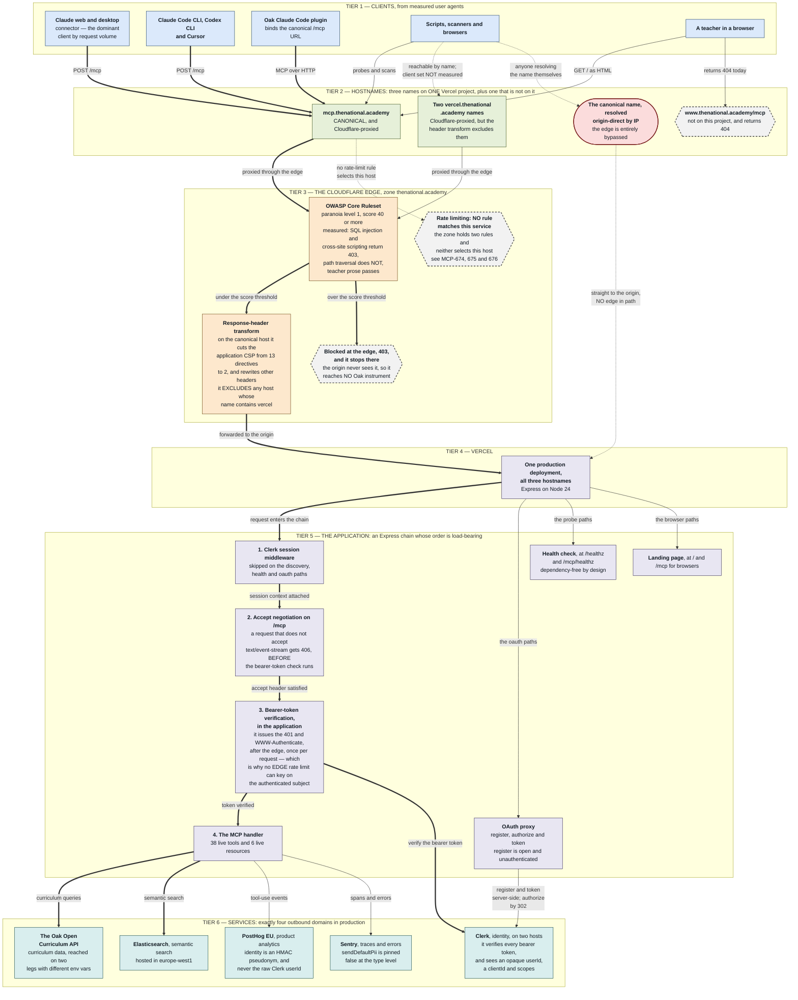
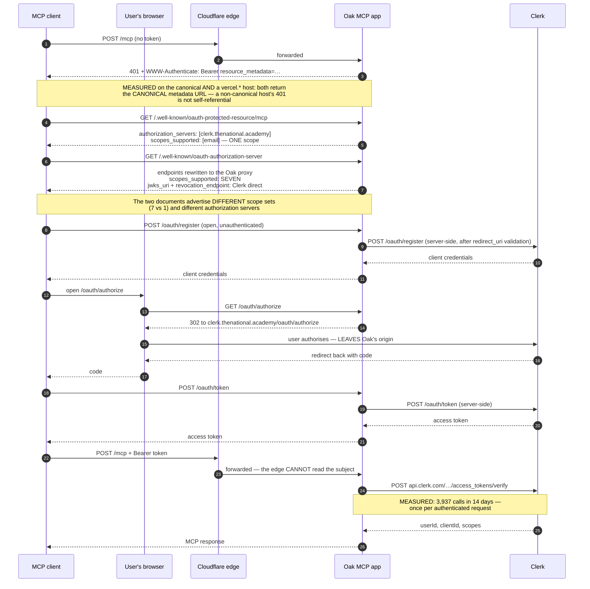

# MCP Runtime Topology

**Measured 2026-09-03** against production at app version `1.178.0`
(`origin/main` at `83611f5`). Every element below was probed, read from
source, or aggregated from production telemetry on that date. Anything not
measured is marked **inferred** and says why.

> **This document goes stale.** It describes a live estate, not a design. When
> a hostname, an edge rule, or a service binding changes, the diagram is wrong
> until someone re-measures it. Re-run the instruments in
> [How this was measured](#how-this-was-measured) rather than trusting the
> date. This is not hypothetical: one of the four hostnames measured on the
> first pass was removed hours later, on the day of writing, and the correction
> is recorded in
> [The detail the diagram compresses](#the-detail-the-diagram-compresses).

**The canonical client URL is `https://mcp.thenational.academy/mcp`** — owner
ruling of 2026-09-01, recorded in
[the production debugging runbook](../operations/production-debugging-runbook.md#production-endpoints-and-hosts),
which is the authority for that ruling and for the client-facing endpoint
list. This document is the wider topology behind it: every hostname that
answers, not only the one clients should use.

## Who this is for

- **A stakeholder** asking what the MCP service is, who reaches it, and what
  protects it — read [The whole system](#the-whole-system) and
  [What the diagram shows that a config file does not](#what-the-diagram-shows-that-a-config-file-does-not).
- **An engineer diagnosing an incident** — the request path is tiered, and
  each tier names the instrument that observes it. Start with
  [Where requests become invisible](#where-requests-become-invisible).
- **A reviewer judging an edge change** — the Cloudflare tier states what each
  ruleset actually does to this service's traffic, measured rather than
  configured. See [The edge, as it behaves](#the-edge-as-it-behaves).

## The whole system

The diagram below is the whole runtime in one picture: who calls, through
which hostname, past which edge controls, into the application, and out to
which services.

Read it top to bottom. Arrow shape carries meaning independently of colour:

| Arrow           | Meaning                                                                  |
| --------------- | ------------------------------------------------------------------------ |
| Thick (`===>`)  | The primary measured request path                                        |
| Solid (`--->`)  | A measured secondary path                                                |
| Dotted (`-.->`) | A path that bypasses a control, or one whose client set was not measured |

**Every arrow also carries a text label**, so the relationships are readable
without seeing the arrow at all. Node shape carries the two categories that
matter most, again independently of colour:

| Shape                  | Meaning                                                                |
| ---------------------- | ---------------------------------------------------------------------- |
| Rectangle              | An ordinary element of the request path                                |
| Stadium (rounded ends) | A path that reaches the origin with **no edge control in front of it** |
| Hexagon, dashed border | A **gap**: something absent, invisible, or not on this project         |

Node fill groups the tiers loosely, but do not rely on it: the fills differ by
hue rather than lightness, so they convey nothing in greyscale or to a reader
with reduced colour vision, and two of the classes (`gap`, and the
no-edge-control stadium) mark a property of the element rather than the tier
it sits in. **Every distinction in the diagram is also stated in the node's
own text** — that is the carrier to trust.

The diagram is large, and GitHub scales it down to the column width. Use the
expand control, or read
[The same picture in words](#the-same-picture-in-words), which carries the
whole of its argument.



### The same picture in words

For readers who cannot use the diagram, and as the check on it:

An MCP client — most often Claude web or desktop — opens an HTTP connection
to `mcp.thenational.academy` and POSTs to `/mcp`. That name is
Cloudflare-proxied, so the request first passes the zone's OWASP managed
ruleset. If its anomaly score crosses 40 the request is refused at the edge
with a 403 and never reaches Oak's origin. If it passes, Cloudflare rewrites
the response's security headers on the way back out — replacing the
application's own 13-directive Content-Security-Policy with a 2-directive
one — and forwards the request to Vercel.

Vercel routes all three of the service's hostnames to a single production
deployment. Inside it, Clerk session middleware runs first; then an
accept-header check refuses any request that does not accept
`text/event-stream` with a 406, and it does so before the bearer-token check,
so a request refused this way never reaches authorisation at all. Past that,
the app verifies the bearer token by calling Clerk's backend API itself. Only
then does the MCP handler run, serving 38 live tools that read curriculum data
from the Oak Open Curriculum API and run semantic search against
Elasticsearch in `europe-west1`. Tool-use events go to PostHog EU; spans and
errors go to Sentry.

One path reaches the same deployment without passing Cloudflare at all: the
canonical name resolved origin-direct to a Vercel IP by any client that
chooses to. On it the WAF is absent and the application's full CSP survives.
That one path is enough to settle the structural point, and it is the reason
this document draws it: **no Cloudflare control on this service is an
enforceable boundary**, because the origin answers requests that never passed
the edge, and any client can resolve the name for itself. The edge filters the
default path; it is not a wall around the origin. Until 2026-09-03 a second
such path existed — see
[the removed alias](#the-detail-the-diagram-compresses) below — and its
removal narrows the exposure without changing that conclusion.

### The detail the diagram compresses

Facts worth having in text, so that nothing measured lives only inside a
picture:

- **The canonical hostname resolves to Cloudflare anycast addresses**
  `104.18.6.160` and `104.18.7.160` — and so do both
  `*.vercel.thenational.academy` names, the same pair, which is the first-hand
  evidence that all three are proxied through the same edge. Behind it, the
  project-scoped Vercel target `4a80221ded84b150.vercel-dns-013.com` resolves
  to `64.239.123.193` and `64.239.109.193`, and either address serves a
  request carrying the canonical `Host` header. That is how the origin-direct
  path is exercised, and it is the first-hand evidence that the canonical name
  and this Vercel project are one deployment. The authoritative hostname list
  is the Vercel project API rather than DNS.
- **The deployment** is `poc-oak-open-curriculum-mcp`, Express on Node 24.x,
  reporting `x-app-version` on every hostname — `1.178.0` on the first pass,
  and `1.178.1` on the re-probes taken later the same day. All probes from
  this vantage point were served from `fra1` or `lhr1`.
- **A fourth hostname existed until 2026-09-03.**
  `curriculum-mcp-alpha.oaknational.dev` was a Cloudflare-DNS-only record in a
  different zone, resolving straight to Vercel with no edge in path. It was
  measured on this document's first pass — serving the application's full
  13-directive CSP, and letting every WAF payload through to the origin — and
  the owner removed both the DNS record and the Vercel project domain the same
  day. Re-probed after removal: `dig` returns `NOERROR` with no answer, from
  Cloudflare's own nameservers for the zone as well as from a public resolver;
  `curl` cannot resolve the host; and the Vercel project API no longer lists
  it. The two jobs it did as evidence now fall to instruments that still
  exist — the origin-direct-by-IP path for edge bypass, and the
  `*.vercel.thenational.academy` names for the CSP divergence — and both were
  re-measured rather than assumed. **No claim below depends on the alias.**
- **The Elasticsearch indices** reached in production are `oak_lessons`,
  `oak_unit_rollup`, `oak_threads` and `oak_sequence_facets`, on a cluster in
  `europe-west1` on GCP, over `@elastic/elasticsearch` with
  `ELASTICSEARCH_URL` and `ELASTICSEARCH_API_KEY`.
- **PostHog's host is pinned exactly** to `https://eu.i.posthog.com` — not
  merely defaulted — and a configuration naming any other host is refused.
- **Clerk is reached on two hosts, for different purposes.** `api.clerk.com`
  is the Backend API, bearing the secret key, and it is where each bearer
  token is verified (3,937 calls in 14 days) and where the Backend API JWKS is
  fetched. `clerk.thenational.academy` is the instance frontend API, and it
  serves the upstream authorization-server metadata and the public JWKS, and
  receives the proxied register and token calls.

## The edge, as it behaves

Configured state and observed state are different claims. This section states
the observed one, and says where the two diverge.

### What the WAF actually blocks

Measured 2026-09-03 by `curl` against `/mcp/healthz` with the payload in the
query string, on each path in turn. The right-hand column is the
origin-direct-by-IP path (`curl --resolve`), which replaced the removed
`oaknational.dev` alias as the bypass instrument and was re-measured after the
removal:

| Payload                            | Canonical host | `*.vercel.…` host | Origin-direct by IP |
| ---------------------------------- | -------------- | ----------------- | ------------------- |
| `' OR 1=1--`                       | **403**        | **403**           | 200                 |
| `UNION SELECT password FROM users` | **403**        | **403**           | 200                 |
| `<script>alert(1)</script>`        | **403**        | **403**           | 200                 |
| ``     | **403**        | **403**           | 200                 |
| `../../etc/passwd` (4 encodings)   | 200            | 200               | 200                 |
| `explain SQL injection to year 10` | 200            | 200               | 200                 |

Three things follow, and the last one corrects a belief held before this
measurement.

- **Teacher prose is not caught.** A legitimate curriculum query that names an
  attack technique passes. That was the design worry, and it is not happening.
- **The origin-direct path has no WAF at all.** Every payload reaches the
  origin, because the request never touches Cloudflare — `server: Vercel`, and
  no `cf-ray` on the response. The removed alias returned exactly these values
  for the same reason, so the column carries the same finding on an instrument
  that cannot be taken away by a DNS change.
- **Path traversal is not blocked**, in any of four encodings. This is
  consistent with the Terraform: the ruleset runs paranoia level 1 only, with
  levels 2, 3 and 4 explicitly disabled, and the local-file-inclusion rules
  that match `../../etc/passwd` sit above level 1. Whether that is the right
  posture for this service is a question for whoever owns the edge; it is
  recorded here because the earlier assessment stated the opposite.

### Block or challenge — a limit of this measurement

`Cloud-Config`'s `infrastructure/cloudflare/rulesets/firewall_managed_rules.tf`
runs the same OWASP ruleset twice, split by host, with a different action on
each side of the split: `block` where
`http.host eq "mcp.thenational.academy"`, and `managed_challenge` where
`http.host ne "mcp.thenational.academy"` — which is every other host in the
zone, the `*.vercel.thenational.academy` names included. The reasoning is
recorded in the file: a non-browser MCP client cannot solve an interactive
challenge, so the canonical host is configured to refuse cleanly instead.

**That difference could not be confirmed from outside.** All three hosts
tested return HTTP 403 carrying an identical Oak-authored "Access blocked"
page, and the page contains a `challenge-platform` reference on the canonical
host too — where the configured action is `block`. So the page is not a
discriminator, and neither is the status code.

The consequence matters, because it is the failure the host split exists to
prevent: if a client using a `*.vercel.thenational.academy` hostname crosses
the threshold, the configuration says it gets a challenge it cannot solve,
which presents as a hung connection rather than a refusal. **Confirming that
needs an instrument inside Cloudflare — the ruleset's own event log — not an
HTTP probe.**

### The CSP divergence, and what else the edge rewrites

`header_transforms.tf` scopes its rewrites to
`(.+\.|^)thenational\.academy`, excluding any host containing `labs`, any host
containing `vercel`, and `www` and `owa` by name. Measured against that:

| Header                      | Canonical (edge applies)          | `*.vercel.…` (proxied, transform excluded) | Origin-direct by IP (no edge at all) |
| --------------------------- | --------------------------------- | ------------------------------------------ | ------------------------------------ |
| `content-security-policy`   | 2 directives                      | **13 directives**                          | **13 directives**                    |
| `x-frame-options`           | `DENY`                            | `SAMEORIGIN`                               | `SAMEORIGIN`                         |
| `referrer-policy`           | `strict-origin-when-cross-origin` | `no-referrer`                              | `no-referrer`                        |
| `strict-transport-security` | adds `preload`                    | **also `preload`**                         | no `preload`                         |
| `permissions-policy`        | set by the edge                   | absent                                     | absent                               |

**The `strict-transport-security` row is why those two right-hand columns are
now shown apart, and it is a correction.** An earlier revision of this table
carried a single "app value" column measured on the `oaknational.dev` alias,
which served no `preload`. Re-measured 2026-09-03 on the two instruments that
survive the alias's removal: the `*.vercel.…` names **do** serve `preload`,
because they are Cloudflare-proxied and HSTS reaches them from the zone rather
than from the header transform that excludes them. Only the origin-direct
path, which touches no Cloudflare at all, serves the application's own
`preload`-free value. The alias could stand in for both columns because it was
both things at once — not header-transformed _and_ not behind an edge — and
that is exactly what made it a misleading single instrument. Everything else
in the two columns agrees.

The edge's CSP is `upgrade-insecure-requests; frame-ancestors 'self';`. The
application's is a full `default-src 'self'` policy. **The edge's version is
the weaker of the two**, and it is the one the canonical host serves. This is
not a covert change: the DNS record's own Terraform comment reasoned that the
app "sends its own CSP … so the zone-wide response-header transforms duplicate
rather than add to them." Measurement shows they replace rather than
duplicate.

The `*.vercel.thenational.academy` hostnames are the interesting case, and the
one a two-way "Cloudflare or not" split would hide: they **are**
Cloudflare-proxied — `server: cloudflare`, `cf-ray` present, same edge IPs —
and the WAF does fire on them, but the header transform's `vercel` exclusion
means they serve the application's own headers. Cloudflare-fronted and
header-transform-free at once.

That dual character is also what makes them the right instrument for the
comparison above, now that the alias is gone. Because the edge still fronts
them, they isolate the header transform from everything else Cloudflare does:
the _origin_ demonstrably sends a complete 13-directive policy, and the _edge_
demonstrably replaces it on the one host the transform selects. A host with no
edge in front of it could not prove that second half, because on it the
transform's absence and the edge's absence are the same fact.

### Rate limiting: no rule reaches this service

`rate_limits.tf` holds exactly two rules:

1. `(http.request.uri.path contains "api/downloads/") or (http.host eq "downloads-api.thenational.academy")`
2. `(http.host contains "curriculum-search-api")`

Neither expression selects `mcp.thenational.academy`, any
`*.vercel.thenational.academy` name, or `/mcp`. **There is no edge rate limit
on this service.** Vercel's platform-level DDoS mitigation is in path and is
real, but it is not a per-subject rate limit.

This is the measured fact behind
[ADR-219](./architectural-decisions/219-rate-limiting-is-an-edge-concern.md),
which records that "the edge owns volumetric control" and states its own
falsification condition — that the decision "is falsified the moment the edge
stops carrying the control." For Cloudflare, this measurement is that moment.
The cure is tracked as MCP-674, MCP-675 and MCP-676; MCP-675 is the one this
topology explains, and the next section says why.

### One caveat on all Terraform readings above

`firewall_managed_rules.tf` carries:

```hcl
lifecycle {
  ignore_changes = [
    rules[0],
  ]
}
```

The first rule — a placeholder `execute` with an empty expression — is
deliberately managed outside Terraform. **Dashboard changes to it would not
appear in the source read above, and are invisible to any reader of this
repository.** Treat the Terraform as authoritative for rules 2 and 3 and
silent about rule 1.

## Where requests become invisible

Three gaps, all structural rather than accidental, and all worth knowing
before reading a dashboard as evidence of absence.

- **A request blocked at the Cloudflare edge reaches no Oak instrument.** It
  produces no Sentry span, no PostHog event and no application log line,
  because the origin never sees it. The only record is inside Cloudflare. A
  spike in refused traffic is therefore invisible from Oak's side, and so is
  a legitimate client being refused.
- **The health check reports the process, not the system.** `/healthz` and
  `/mcp/healthz` are dependency-free by design — a comment in
  `health-endpoints.ts` explains the reasoning: a health check that fails when
  a downstream is slow turns every upstream wobble into a page. Both paths
  return 200 while Clerk, Elastic or the curriculum API could be failing.
- **The 406 fires before the bearer-token check.** A client that omits
  `accept: application/json, text/event-stream` gets 406 from
  `createEnsureMcpAcceptHeader` and never reaches the MCP authorisation
  layer, so **an auth probe without that header measures nothing**. Be
  precise about what "before auth" means here, because the response itself
  is precise: a 406 still carries `x-clerk-auth-status: signed-out`, because
  Clerk's session middleware is installed earlier in `createApp` and has
  already run. What the 406 precedes is the bearer-token check — the layer
  that issues `401` with `WWW-Authenticate` — and a 406 carries no
  `WWW-Authenticate` header at all. Relatedly, a non-existent path under
  `/mcp/` returns **406, not 404**, because the accept-header middleware
  matches the whole `/mcp` subtree, so "it is not a 404" is not evidence
  that a URL is valid.

## Authorisation, in sequence

Auth is the one part of this system that is temporal rather than
topological, so it gets its own view. The topology above shows _where_
verification happens; this shows _when_.



The last three steps are the whole of MCP-675's argument. **Verification
happens in the application, after the edge.** Cloudflare sees a bearer token
it does not validate and cannot attribute, so an edge rate limit can only key
on IP or colo — which is exactly what a shared corporate egress or a hosted
agent runtime defeats. A limit keyed on the authenticated subject can only be
enforced where the subject is known, and that is inside the app.

### The two discovery documents disagree

Both were fetched on 2026-09-03:

| Field                              | `/.well-known/oauth-authorization-server`                                                                 | `/.well-known/oauth-protected-resource/mcp` |
| ---------------------------------- | --------------------------------------------------------------------------------------------------------- | ------------------------------------------- |
| `issuer` / `authorization_servers` | `https://mcp.thenational.academy`                                                                         | `https://clerk.thenational.academy`         |
| `scopes_supported`                 | 7: `openid`, `profile`, `email`, `public_metadata`, `private_metadata`, `offline_access`, `user:org:read` | 1: `email`                                  |

Two further measured details from that exchange, so they are not trapped in
the diagram. First, **a non-canonical hostname returns the canonical host's
metadata URL** in `WWW-Authenticate` — re-measured 2026-09-03 against
`poc-oak-open-curriculum-mcp.vercel.thenational.academy`, whose 401 is not
self-referential: it hands the client back to `mcp.thenational.academy`. The
removed alias behaved the same way. Second, the rewritten AS
document repoints only the endpoints the proxy serves: `jwks_uri` and
`revocation_endpoint` still name `clerk.thenational.academy` directly, so key
fetching and revocation do not pass through Oak at all. No code path in this
repository calls the advertised `revocation_endpoint`, `introspection_endpoint`
or `userinfo_endpoint`.

The AS document is the Oak proxy's rewrite of Clerk's own metadata
(ADR-115) — four endpoint fields repointed at the proxy, capability fields
passed through unchanged, which is why the seven scopes are Clerk's rather
than Oak's. The PRM advertises the single scope this resource asks for. Both
are legitimate; the divergence is recorded because a reader comparing them
will otherwise assume one is wrong.

`/oauth/register` is **open and unauthenticated** by design — dynamic client
registration is how an MCP client with no prior relationship to Oak obtains
credentials. It forwards server-side to Clerk after validating the requested
`redirect_uri`.

## What the diagram shows that a config file does not

### The tool and resource counts have a source — recompute, do not trust

The 38 live tools and 6 live resources on the diagram are **37 live universal
tools of 40 declared** (the three dormant rows are `get-eef-evidence`,
`user-search` and `user-search-query`), plus **one live app-local tool**
(`oak-under-the-hood`), and **6 live resource rows of 10**. They are one
reading of
`apps/oak-curriculum-mcp-streamable-http/src/served-surface/served-surface.ts`,
the declarative allowlist that is the single point of control for what this
app serves. That file is the authority and it moves with the code; the
numbers here do not. Recompute from it rather than citing this page, in the
spirit of [ADR-217](./architectural-decisions/217-server-rendered-html-in-the-mcp-app.md)
§4, which requires the served _page_ to derive its counts at render time for
exactly this reason. Which resources are reachable without auth is a separate
classification, settled by
[ADR-205](./architectural-decisions/205-public-resource-classification-pattern.md)
and [ADR-057](./architectural-decisions/057-selective-auth-public-resources.md).

### Privacy posture: a strength, measured

The application never reads the user's email address. Verified at the type
level, not by inspection of behaviour:
`src/auth/mcp-auth/auth-info-schema.ts` defines the whole auth context as

```ts
z.object({
  token: z.string(),
  clientId: z.string(),
  scopes: z.array(z.string()),
  expiresAt: z.number().optional(),
  resource: z.instanceof(URL).optional(),
  extra: z.record(z.string(), z.unknown()).optional(),
}).strict();
```

**Be precise about what `.strict()` buys, because it is narrower than it
looks.** It closes the **top-level** field set: an SDK version that added a
new top-level field would fail the parse. It does **not** close `extra`,
which is `z.record(z.string(), z.unknown())` — and the sibling
`authInfoExtraSchema` that reads it is deliberately `.loose()`, its own TSDoc
saying it exists to preserve unknown properties rather than reject them. A
future claim arriving _inside_ `extra` would therefore parse cleanly, and the
strictness tripwire would not fire on it.

What holds the line today is the producer as much as the schema:
`@clerk/mcp-tools` returns exactly `{ token, scopes, clientId, extra: { userId } }`,
so no email claim is available to read. The only identity the app derives is
`extra.userId` — an opaque Clerk identifier — via `verifiedUserIdFrom`, and a
repository-wide search finds no read of an email claim on any code path. The
bearer token itself is held in-process on `req.auth` and is never
serialised.

Three further controls, each verified in source rather than assumed:

- **PostHog never receives the Clerk user id.**
  [ADR-218](./architectural-decisions/218-posthog-mcp-analytics-identity-session-and-privacy.md)
  is the canonical home for this boundary and governs it; what follows is the
  measurement, not a second statement of the policy. The distinct ID is an
  HMAC-SHA256 pseudonym, domain-separated over
  `['oak-mcp-analytics', 'posthog', 'actor-pseudonym', 'v1', environment, keyId, principal]`
  and keyed from the deployment keyring
  (`packages/libs/posthog-node/src/actor-pseudonym.ts`). The event property
  set carries no tool arguments, no tool results, no IP and no raw user id;
  a capture with no verified actor is dropped rather than sent anonymously.
- **Sentry's `sendDefaultPii` is pinned `false` at the type level.**
  `packages/libs/sentry-node/src/types.ts` declares
  `readonly sendDefaultPii: false` on all three config shapes, so any other
  value is a compile error — and an operator setting
  `SENTRY_SEND_DEFAULT_PII=true` is refused at runtime with a
  `send_default_pii_forbidden` config error. That pin is a repository
  guarantee. **The onward consequence is weaker and should not be read as
  one:** Sentry's MCP integration _defaults_ `recordInputs` and
  `recordOutputs` to `sendDefaultPii`, so MCP tool inputs and outputs are not
  recorded today — but that is vendor-documented default behaviour, and
  `wrapMcpServerWithSentry(server)` is called with no options object, so a
  future second argument could set them without touching the pinned flag.
- **Outbound requests carry no trace headers.** `tracePropagationTargets` is
  an empty frozen array, so Oak's trace context is not propagated to Clerk,
  Elastic, PostHog or the curriculum API.
- **Sensitive request headers are redacted before they leave the process** —
  `authorization`, `cookie`, `x-api-key` and any header whose name contains
  `token` fully; the client-IP family partially. The principle is
  [ADR-160](./architectural-decisions/160-non-bypassable-redaction-barrier-as-principle.md),
  which owns it.

This is worth stating on a topology diagram because a diagram that shows only
risks misinforms. The PRM asks for the `email` scope, and the app still does
not read the claim.

### Two curriculum-API legs, configured by different variables

The app reaches `open-api.thenational.academy` on two independent paths, and
they do not share configuration:

| Leg                                               | What it serves                                                                                                                        | Base URL from                                                 |
| ------------------------------------------------- | ------------------------------------------------------------------------------------------------------------------------------------- | ------------------------------------------------------------- |
| MCP tool calls, via `@oaknational/curriculum-sdk` | The curriculum-API-backed tools — not the whole tool surface, since `search`, `fetch` and the graph tools reach Elasticsearch instead | `OAK_API_URL`, read directly off `process.env` inside the SDK |
| The asset-download proxy                          | `/assets/download/:lesson/:type`                                                                                                      | `OAK_API_BASE_URL`, declared in the app's own env schema      |

`OAK_API_URL` **is not declared or validated in the application's env
schema** — it appears only in `turbo.json`'s `globalEnv`, the SDK's own
config, and documentation. That much is measured from source. Whether it is
**set in the deployed environment is NOT measured**: nothing in this
repository can see Vercel's environment, and telemetry cannot discriminate,
because the SDK's hard-coded fallback and any override pointing at a
`thenational.academy` host both land in the same `*.thenational.academy`
bucket in the table above. Settling it needs the Vercel environment API.

The consequence is worth knowing before anyone repoints this service at a
staging API: **setting `OAK_API_BASE_URL` moves only the asset proxy.** Tool
calls would follow `OAK_API_URL`, in an environment the application does not
validate. Both legs authenticate with a `Bearer` token from `OAK_API_KEY`.

### Preview and production reach different Clerk instances

Production calls only `clerk.thenational.academy` and `api.clerk.com`. The
development Clerk instance `native-hippo-15.clerk.accounts.dev` appears in
740 spans over 14 days — **all of them from the `preview` (733) and
`development` (7) environments, none from production**. This was checked
specifically because a development identity provider in a production path
would be a serious finding; it is not one.

### Exactly four outbound domains in production

Aggregated from `span.op:http.client environment:production`, 14 days to
2026-09-03:

| Domain                  | Spans | What for                                 |
| ----------------------- | ----- | ---------------------------------------- |
| `*.clerk.com`           | 3,947 | Token verification, JWKS                 |
| `*.thenational.academy` | 2,171 | Clerk FAPI + the Oak Open Curriculum API |
| `*.posthog.com`         | 2,045 | Product analytics                        |
| `*.elastic.cloud`       | 208   | Semantic search                          |

Sentry does not appear: its SDK excludes its own transport from tracing. Its
presence is established from the code and from the fact that these spans
exist at all.

Two things sit outside that table and are not server egress:

- **Google Fonts.** The MCP widget's stylesheet imports Lexend from
  `fonts.googleapis.com`, and the widget resource declares
  `resourceDomains: ['https://fonts.googleapis.com', 'https://fonts.gstatic.com']`
  to the host. That fetch is made by the client rendering the widget, never
  by Oak's server. The landing page itself fetches nothing external — its CSP
  is same-origin throughout and design-system assets are copied in at build
  time.
- **Sentry release and source-map upload**, which happens in the build, using
  `SENTRY_AUTH_TOKEN`. It is not a runtime dependency.

### The client set is measured, not assumed

The 25 most frequent user agents over 14 days are dominated by `Claude-User`
(2,512), then `node` (1,417), `curl` (511 across two versions),
`codex-mcp-client` (944 across eight versions), `claude-code` (106 across
three build flavours) and `Cursor/3.18.9` (30). Two scanner families
(`Detectify`, `Bytespider`) account for 250.

**No ChatGPT user agent appears in this window.** That is an absence in a
14-day sample, not proof that the client cannot connect.

## How this was measured

Every claim above traces to one of these, run on 2026-09-03 unless stated:

| Instrument                                                  | What it established                                                                                                                                                                                      |
| ----------------------------------------------------------- | -------------------------------------------------------------------------------------------------------------------------------------------------------------------------------------------------------- |
| `dig +short <host> A` / `CNAME`, and `dig @<zone NS>`       | Hostname resolution: that the canonical and both `*.vercel.…` names share one pair of Cloudflare anycast addresses, and — against the zone's own nameservers — that the removed alias no longer resolves |
| `curl -sS -D -` per host                                    | Headers, status codes, CSP directive counts, `x-app-version`, `server`, `cf-ray`                                                                                                                         |
| `curl --resolve <name>:443:<vercel-ip>`                     | That the canonical name is reachable origin-direct, bypassing the edge                                                                                                                                   |
| `curl --resolve` with a bogus Host                          | That the origin refuses unknown hosts at TLS — it is not an open proxy                                                                                                                                   |
| `curl` with payloads in the query string                    | Actual WAF behaviour per host and per payload class                                                                                                                                                      |
| `curl -X POST` with and without the SSE `accept` header     | That content negotiation refuses at 406 before the bearer-token check — and, by comparing which headers each response carries, that Clerk's session middleware has nonetheless already run               |
| Vercel project API (`get_project`)                          | The authoritative list of three hostnames on one project, the live production deployment, and — re-queried after the DNS change — that the removed alias is off the project too                          |
| Sentry span aggregation (`spans` dataset, 14d)              | Client user agents, outbound domains, per-environment Clerk bindings, request volumes                                                                                                                    |
| Source read: `Cloud-Config` `infrastructure/cloudflare/`    | WAF rules, header transforms, rate limits, the proxied DNS record and its reasoning                                                                                                                      |
| Source read: `apps/oak-curriculum-mcp-streamable-http/src/` | Middleware order, route registrations, the auth context schema, the OAuth proxy's upstream targets, the served-surface allowlist                                                                         |
| `gh pr view 4454 --repo oaknational/Oak-Web-Application`    | That the OWA `/mcp` landing page is open and unmerged, so `www/mcp` is still 404                                                                                                                         |

### What is inferred rather than measured

Stated plainly, because an unmarked inference on a topology diagram is worse
than a gap:

- **The `block` versus `managed_challenge` distinction** between the canonical
  host and every other host in the zone. Read from Terraform; not
  distinguishable by external probe. See
  [Block or challenge](#block-or-challenge--a-limit-of-this-measurement).
- **The deployment's region set.** Probes from this vantage point were served
  by `fra1` on the first pass and `lhr1` on the re-probes later the same day,
  and the region list is a Vercel project setting that does not appear in this
  repository. Seeing two colos proves the set is larger than one; it still
  cannot enumerate it, because one vantage point cannot measure a region set.
- **Who uses the two `*.vercel.thenational.academy` names**, and who resolves
  the canonical name origin-direct. Telemetry aggregates across hostnames, so
  neither client set was isolated. The diagram labels both of those paths
  "client set NOT measured" for exactly this reason. The same gap applied to
  the removed alias, which is why its removal cannot be reported here as
  having broken nothing — no instrument in this estate could see who was
  using it.
- **Rule 1 of the managed-rules ruleset**, which `lifecycle.ignore_changes`
  places outside Terraform's view.
- **Whether `OAK_API_URL` is set in the deployed environment.** Source shows
  it undeclared in the application's env schema; the deployed value is
  visible only through the Vercel environment API, which was not consulted.
- **Whether any other name on this Vercel project can appear without
  appearing here.** The project API is authoritative for the hostname list at
  the moment it is queried, and the alias's removal showed that list and DNS
  can disagree for a window: DNS had already stopped resolving while the
  project API still carried the domain. Either surface alone can therefore be
  briefly wrong, in either direction, and only agreement between them is
  evidence.

## How fast each claim decays

One date at the top of this document is a compromise, and
[ADR-223](./architectural-decisions/223-perishable-claims-carry-risk-based-freshness-metadata.md)
names the reason: a document decays at the rate of its most volatile claim,
which masks which claim actually needs the re-check. This surface is not
registered under ADR-223 today, so nothing is out of compliance — but it is an
obvious candidate, and registering it is the right follow-on. Until then, this
table is the manual version.

| Claim class                                                  | Decays                                                                                                              | Re-check when                                                                                                                                          |
| ------------------------------------------------------------ | ------------------------------------------------------------------------------------------------------------------- | ------------------------------------------------------------------------------------------------------------------------------------------------------ |
| Cloudflare anycast A records                                 | Days                                                                                                                | Never rely on them; re-resolve                                                                                                                         |
| `x-app-version`, and the `origin/main` sha                   | Every release                                                                                                       | Always; treat the stated version as "as at" only                                                                                                       |
| The 14-day span counts and the user-agent set                | Continuously — it is a rolling window                                                                               | Any time the client mix matters                                                                                                                        |
| Served-surface tool and resource counts                      | Every merge that touches the allowlist                                                                              | Recompute from `served-surface.ts`                                                                                                                     |
| Cloudflare rules: WAF, header transform, rate limits         | Weeks — and rule 1 is invisible to Terraform by construction                                                        | Any edge change, any security review                                                                                                                   |
| Hostname set and which are proxied                           | On a DNS or Vercel domain change — **demonstrated: a host was removed hours after this document first measured it** | Any host addition **or removal**, and before publicity. Check DNS and the Vercel project API together; they disagreed for a window during that removal |
| The measured WAF behaviour per payload class                 | On any paranoia-level or threshold change                                                                           | With the rules above                                                                                                                                   |
| Code-derived claims: middleware order, auth schema, PII pins | On the commits that touch them                                                                                      | When the cited file changes                                                                                                                            |
| `www.thenational.academy/mcp` returning 404                  | When OWA pull request 4454 merges                                                                                   | Watch that pull request                                                                                                                                |

## Related decisions

- [ADR-052: OAuth 2.1 for MCP HTTP authentication](./architectural-decisions/052-oauth-2.1-for-mcp-http-authentication.md)
- [ADR-053: Clerk as identity provider](./architectural-decisions/053-clerk-as-identity-provider.md)
- [ADR-056: Conditional Clerk middleware for discovery](./architectural-decisions/056-conditional-clerk-middleware-for-discovery.md)
  — **superseded by ADR-113**; listed because it is where the discovery-path
  skip originates
- [ADR-113: MCP-spec-compliant auth for all methods](./architectural-decisions/113-mcp-spec-compliant-auth-for-all-methods.md)
- [ADR-115: Proxy the OAuth AS](./architectural-decisions/115-proxy-oauth-as-for-cursor.md)
- [ADR-122: Permissive CORS for OAuth-protected MCP](./architectural-decisions/122-permissive-cors-for-oauth-protected-mcp.md)
- [ADR-162: Observability first](./architectural-decisions/162-observability-first.md)
- [ADR-219: Rate limiting is an edge concern](./architectural-decisions/219-rate-limiting-is-an-edge-concern.md)
  — and the measurement above, which meets its falsification condition **for
  the Cloudflare leg only**: no Cloudflare rule selects this service's
  traffic. ADR-219 names "Cloudflare and Vercel", and the Vercel leg is
  unmeasured here.
- [ADR-223: Perishable claims carry risk-based freshness metadata](./architectural-decisions/223-perishable-claims-carry-risk-based-freshness-metadata.md)
  — the shape this document should eventually take; see
  [How fast each claim decays](#how-fast-each-claim-decays)
