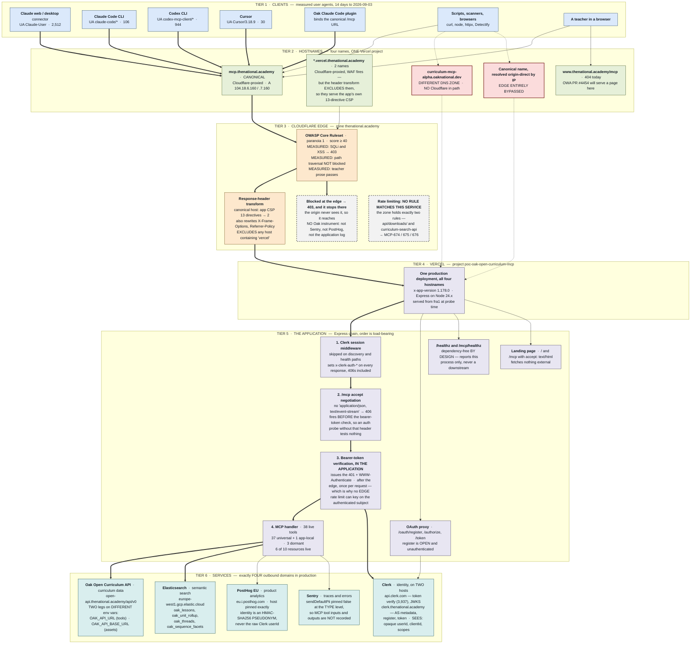
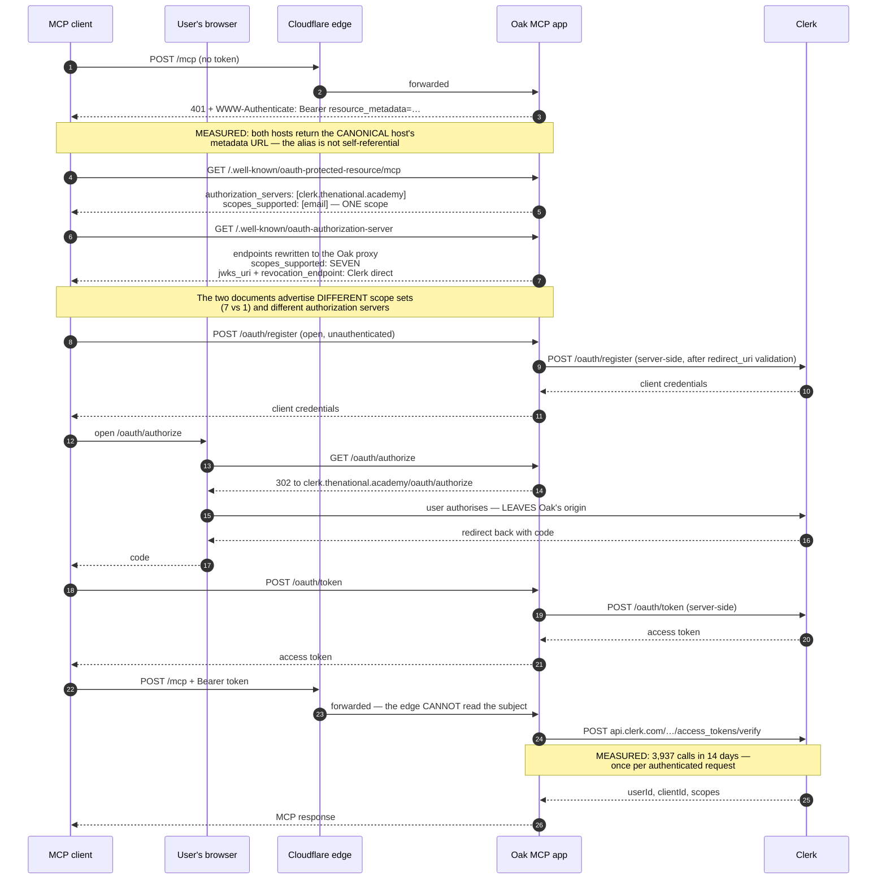

# MCP Runtime Topology

**Measured 2026-09-03** against production at app version `1.178.0`
(`origin/main` at `83611f5`). Every element below was probed, read from
source, or aggregated from production telemetry on that date. Anything not
measured is marked **inferred** and says why.

> **This document goes stale.** It describes a live estate, not a design. When
> a hostname, an edge rule, or a service binding changes, the diagram is wrong
> until someone re-measures it. Re-run the instruments in
> [How this was measured](#how-this-was-measured) rather than trusting the
> date.

## Who this is for

- **A stakeholder** asking what the MCP service is, who reaches it, and what
  protects it — read [The whole system](#the-whole-system) and
  [What the diagram shows that a config file does not](#what-the-diagram-shows-that-a-config-file-does-not).
- **An engineer diagnosing an incident** — the request path is tiered, and
  each tier names the instrument that observes it. Start with
  [Where requests become invisible](#where-requests-become-invisible).
- **A reviewer judging an edge change** — the Cloudflare tier states what each
  ruleset actually does to this service's traffic, measured rather than
  configured. See [The edge, as it behaves](#the-edge-as-it-behaves).

## The whole system

The diagram below is the whole runtime in one picture: who calls, through
which hostname, past which edge controls, into the application, and out to
which services.

Read it top to bottom. Arrow shape carries meaning independently of colour:

| Arrow           | Meaning                                                               |
| --------------- | --------------------------------------------------------------------- |
| Thick (`===>`)  | The primary measured request path                                     |
| Solid (`--->`)  | A measured secondary path                                             |
| Dotted (`-.->`) | A path that bypasses a control, or an edge that could not be measured |

Node fill repeats the same information for sighted readers and is never the
only carrier of it: every distinction in the diagram is also stated in the
node's own text.



### The same picture in words

For readers who cannot use the diagram, and as the check on it:

An MCP client — most often Claude web or desktop — opens an HTTP connection
to `mcp.thenational.academy` and POSTs to `/mcp`. That name is
Cloudflare-proxied, so the request first passes the zone's OWASP managed
ruleset. If its anomaly score crosses 40 the request is refused at the edge
with a 403 and never reaches Oak's origin. If it passes, Cloudflare rewrites
the response's security headers on the way back out — replacing the
application's own 13-directive Content-Security-Policy with a 2-directive
one — and forwards the request to Vercel.

Vercel routes all four of the service's hostnames to a single production
deployment. Inside it, Clerk session middleware runs first; then an
accept-header check refuses any request that does not accept
`text/event-stream` with a 406, and it does so before the bearer-token check,
so a request refused this way never reaches authorisation at all. Past that,
the app verifies the bearer token by calling Clerk's backend API itself. Only
then does the MCP handler run, serving 38 live tools that read curriculum data
from the Oak Open Curriculum API and run semantic search against
Elasticsearch in `europe-west1`. Tool-use events go to PostHog EU; spans and
errors go to Sentry.

Two paths reach the same deployment without passing Cloudflare at all: the
`curriculum-mcp-alpha.oaknational.dev` alias, which lives in a different DNS
zone and resolves straight to Vercel, and the canonical name resolved
origin-direct to a Vercel IP by any client that chooses to. On both, the WAF
is absent and the application's full CSP survives.

## The edge, as it behaves

Configured state and observed state are different claims. This section states
the observed one, and says where the two diverge.

### What the WAF actually blocks

Measured 2026-09-03 by `curl` against `/mcp/healthz` with the payload in the
query string, on each host in turn:

| Payload                            | Canonical host | `*.vercel.…` host | `oaknational.dev` alias |
| ---------------------------------- | -------------- | ----------------- | ----------------------- |
| `' OR 1=1--`                       | **403**        | **403**           | 200                     |
| `UNION SELECT password FROM users` | **403**        | **403**           | 200                     |
| `<script>alert(1)</script>`        | **403**        | **403**           | 200                     |
| ``     | **403**        | **403**           | 200                     |
| `../../etc/passwd` (4 encodings)   | 200            | 200               | 200                     |
| `explain SQL injection to year 10` | 200            | 200               | 200                     |

Three things follow, and the last one corrects a belief held before this
measurement.

- **Teacher prose is not caught.** A legitimate curriculum query that names an
  attack technique passes. That was the design worry, and it is not happening.
- **The alias has no WAF at all.** Every payload reaches the origin.
- **Path traversal is not blocked**, in any of four encodings. This is
  consistent with the Terraform: the ruleset runs paranoia level 1 only, with
  levels 2, 3 and 4 explicitly disabled, and the local-file-inclusion rules
  that match `../../etc/passwd` sit above level 1. Whether that is the right
  posture for this service is a question for whoever owns the edge; it is
  recorded here because the earlier assessment stated the opposite.

### Block or challenge — a limit of this measurement

`Cloud-Config`'s `infrastructure/cloudflare/rulesets/firewall_managed_rules.tf`
runs the same OWASP ruleset twice, split by host, with a different action on
each side of the split: `block` where
`http.host eq "mcp.thenational.academy"`, and `managed_challenge` where
`http.host ne "mcp.thenational.academy"` — which is every other host in the
zone, the `*.vercel.thenational.academy` names included. The reasoning is
recorded in the file: a non-browser MCP client cannot solve an interactive
challenge, so the canonical host is configured to refuse cleanly instead.

**That difference could not be confirmed from outside.** All three hosts
tested return HTTP 403 carrying an identical Oak-authored "Access blocked"
page, and the page contains a `challenge-platform` reference on the canonical
host too — where the configured action is `block`. So the page is not a
discriminator, and neither is the status code.

The consequence matters, because it is the failure the host split exists to
prevent: if a client using a `*.vercel.thenational.academy` hostname crosses
the threshold, the configuration says it gets a challenge it cannot solve,
which presents as a hung connection rather than a refusal. **Confirming that
needs an instrument inside Cloudflare — the ruleset's own event log — not an
HTTP probe.**

### The CSP divergence, and what else the edge rewrites

`header_transforms.tf` scopes its rewrites to
`(.+\.|^)thenational\.academy`, excluding any host containing `labs`, any host
containing `vercel`, and `www` and `owa` by name. Measured against that:

| Header                      | Canonical (edge applies)          | Alias and `vercel.*` (app value) |
| --------------------------- | --------------------------------- | -------------------------------- |
| `content-security-policy`   | 2 directives                      | **13 directives**                |
| `x-frame-options`           | `DENY`                            | `SAMEORIGIN`                     |
| `referrer-policy`           | `strict-origin-when-cross-origin` | `no-referrer`                    |
| `strict-transport-security` | adds `preload`                    | no `preload`                     |
| `permissions-policy`        | set by the edge                   | absent                           |

The edge's CSP is `upgrade-insecure-requests; frame-ancestors 'self';`. The
application's is a full `default-src 'self'` policy. **The edge's version is
the weaker of the two**, and it is the one the canonical host serves. This is
not a covert change: the DNS record's own Terraform comment reasoned that the
app "sends its own CSP … so the zone-wide response-header transforms duplicate
rather than add to them." Measurement shows they replace rather than
duplicate.

The `*.vercel.thenational.academy` hostnames are the interesting case, and the
one a two-way "Cloudflare or not" split would hide: they **are**
Cloudflare-proxied — `server: cloudflare`, `cf-ray` present, same edge IPs —
and the WAF does fire on them, but the header transform's `vercel` exclusion
means they serve the application's own headers. Cloudflare-fronted and
header-transform-free at once.

### Rate limiting: no rule reaches this service

`rate_limits.tf` holds exactly two rules:

1. `(http.request.uri.path contains "api/downloads/") or (http.host eq "downloads-api.thenational.academy")`
2. `(http.host contains "curriculum-search-api")`

Neither expression selects `mcp.thenational.academy`, any
`*.vercel.thenational.academy` name, or `/mcp`. **There is no edge rate limit
on this service.** Vercel's platform-level DDoS mitigation is in path and is
real, but it is not a per-subject rate limit.

This is the measured fact behind
[ADR-219](./architectural-decisions/219-rate-limiting-is-an-edge-concern.md),
which records that "the edge owns volumetric control" and states its own
falsification condition — that the decision "is falsified the moment the edge
stops carrying the control." For Cloudflare, this measurement is that moment.
The cure is tracked as MCP-674, MCP-675 and MCP-676; MCP-675 is the one this
topology explains, and the next section says why.

### One caveat on all Terraform readings above

`firewall_managed_rules.tf` carries:

```hcl
lifecycle {
  ignore_changes = [
    rules[0],
  ]
}
```

The first rule — a placeholder `execute` with an empty expression — is
deliberately managed outside Terraform. **Dashboard changes to it would not
appear in the source read above, and are invisible to any reader of this
repository.** Treat the Terraform as authoritative for rules 2 and 3 and
silent about rule 1.

## Where requests become invisible

Three gaps, all structural rather than accidental, and all worth knowing
before reading a dashboard as evidence of absence.

- **A request blocked at the Cloudflare edge reaches no Oak instrument.** It
  produces no Sentry span, no PostHog event and no application log line,
  because the origin never sees it. The only record is inside Cloudflare. A
  spike in refused traffic is therefore invisible from Oak's side, and so is
  a legitimate client being refused.
- **The health check reports the process, not the system.** `/healthz` and
  `/mcp/healthz` are dependency-free by design — a comment in
  `health-endpoints.ts` explains the reasoning: a health check that fails when
  a downstream is slow turns every upstream wobble into a page. Both paths
  return 200 while Clerk, Elastic or the curriculum API could be failing.
- **The 406 fires before the bearer-token check.** A client that omits
  `accept: application/json, text/event-stream` gets 406 from
  `createEnsureMcpAcceptHeader` and never reaches the MCP authorisation
  layer, so **an auth probe without that header measures nothing**. Be
  precise about what "before auth" means here, because the response itself
  is precise: a 406 still carries `x-clerk-auth-status: signed-out`, because
  Clerk's session middleware is installed earlier in `createApp` and has
  already run. What the 406 precedes is the bearer-token check — the layer
  that issues `401` with `WWW-Authenticate` — and a 406 carries no
  `WWW-Authenticate` header at all. Relatedly, a non-existent path under
  `/mcp/` returns **406, not 404**, because the accept-header middleware
  matches the whole `/mcp` subtree, so "it is not a 404" is not evidence
  that a URL is valid.

## Authorisation, in sequence

Auth is the one part of this system that is temporal rather than
topological, so it gets its own view. The topology above shows _where_
verification happens; this shows _when_.



The last three steps are the whole of MCP-675's argument. **Verification
happens in the application, after the edge.** Cloudflare sees a bearer token
it does not validate and cannot attribute, so an edge rate limit can only key
on IP or colo — which is exactly what a shared corporate egress or a hosted
agent runtime defeats. A limit keyed on the authenticated subject can only be
enforced where the subject is known, and that is inside the app.

### The two discovery documents disagree

Both were fetched on 2026-09-03:

| Field                              | `/.well-known/oauth-authorization-server`                                                                 | `/.well-known/oauth-protected-resource/mcp` |
| ---------------------------------- | --------------------------------------------------------------------------------------------------------- | ------------------------------------------- |
| `issuer` / `authorization_servers` | `https://mcp.thenational.academy`                                                                         | `https://clerk.thenational.academy`         |
| `scopes_supported`                 | 7: `openid`, `profile`, `email`, `public_metadata`, `private_metadata`, `offline_access`, `user:org:read` | 1: `email`                                  |

The AS document is the Oak proxy's rewrite of Clerk's own metadata
(ADR-115) — four endpoint fields repointed at the proxy, capability fields
passed through unchanged, which is why the seven scopes are Clerk's rather
than Oak's. The PRM advertises the single scope this resource asks for. Both
are legitimate; the divergence is recorded because a reader comparing them
will otherwise assume one is wrong.

`/oauth/register` is **open and unauthenticated** by design — dynamic client
registration is how an MCP client with no prior relationship to Oak obtains
credentials. It forwards server-side to Clerk after validating the requested
`redirect_uri`.

## What the diagram shows that a config file does not

### Privacy posture: a strength, measured

The application never reads the user's email address. Verified at the type
level, not by inspection of behaviour:
`src/auth/mcp-auth/auth-info-schema.ts` defines the whole auth context as

```ts
z.object({
  token: z.string(),
  clientId: z.string(),
  scopes: z.array(z.string()),
  expiresAt: z.number().optional(),
  resource: z.instanceof(URL).optional(),
  extra: z.record(z.string(), z.unknown()).optional(),
}).strict();
```

`.strict()` means an SDK version that added an email field would fail the
parse rather than silently widen what Oak holds. The upstream producer closes
the set at the same three fields: `@clerk/mcp-tools` returns exactly
`{ token, scopes, clientId, extra: { userId } }`, so there is no email claim
available to read even if something wanted it. The only identity the app
derives is `extra.userId` — an opaque Clerk identifier — via
`verifiedUserIdFrom`. The bearer token itself is held in-process on
`req.auth` and is never serialised.

Three further controls, each verified in source rather than assumed:

- **PostHog never receives the Clerk user id.** The distinct ID is an
  HMAC-SHA256 pseudonym, domain-separated over
  `['oak-mcp-analytics', 'posthog', 'actor-pseudonym', 'v1', environment, keyId, principal]`
  and keyed from the deployment keyring
  (`packages/libs/posthog-node/src/actor-pseudonym.ts`). The event property
  set carries no tool arguments, no tool results, no IP and no raw user id;
  a capture with no verified actor is dropped rather than sent anonymously.
- **Sentry's `sendDefaultPii` is pinned `false` at the type level.**
  `packages/libs/sentry-node/src/types.ts` declares
  `readonly sendDefaultPii: false` on all three config shapes, so any other
  value is a compile error — and an operator setting
  `SENTRY_SEND_DEFAULT_PII=true` is refused at runtime with a
  `send_default_pii_forbidden` config error. Because the Sentry MCP
  integration derives `recordInputs` and `recordOutputs` from that flag,
  **MCP tool inputs and outputs are not recorded** as a consequence rather
  than as a separate setting.
- **Outbound requests carry no trace headers.** `tracePropagationTargets` is
  an empty frozen array, so Oak's trace context is not propagated to Clerk,
  Elastic, PostHog or the curriculum API.

This is worth stating on a topology diagram because a diagram that shows only
risks misinforms. The PRM asks for the `email` scope, and the app still does
not read the claim.

### Two curriculum-API legs, configured by different variables

The app reaches `open-api.thenational.academy` on two independent paths, and
they do not share configuration:

| Leg                                               | What it serves                   | Base URL from                                                 |
| ------------------------------------------------- | -------------------------------- | ------------------------------------------------------------- |
| MCP tool calls, via `@oaknational/curriculum-sdk` | The 37 universal tools           | `OAK_API_URL`, read directly off `process.env` inside the SDK |
| The asset-download proxy                          | `/assets/download/:lesson/:type` | `OAK_API_BASE_URL`, declared in the app's own env schema      |

`OAK_API_URL` **is not declared or validated in the application's env
schema** — it appears only in `turbo.json`'s `globalEnv`, the SDK's own
config, and docs. In the deployed app it is unset, so the SDK falls back to
its hard-coded `https://open-api.thenational.academy/api/v0/`.

The consequence is worth knowing before anyone repoints this service at a
staging API: **setting `OAK_API_BASE_URL` moves only the asset proxy.** Tool
calls would keep hitting production until `OAK_API_URL` is set too, in an
environment the app does not validate. Both legs authenticate with a
`Bearer` token from `OAK_API_KEY`.

### Preview and production reach different Clerk instances

Production calls only `clerk.thenational.academy` and `api.clerk.com`. The
development Clerk instance `native-hippo-15.clerk.accounts.dev` appears in
740 spans over 14 days — **all of them from the `preview` (733) and
`development` (7) environments, none from production**. This was checked
specifically because a development identity provider in a production path
would be a serious finding; it is not one.

### Exactly four outbound domains in production

Aggregated from `span.op:http.client environment:production`, 14 days to
2026-09-03:

| Domain                  | Spans | What for                                 |
| ----------------------- | ----- | ---------------------------------------- |
| `*.clerk.com`           | 3,947 | Token verification, JWKS                 |
| `*.thenational.academy` | 2,171 | Clerk FAPI + the Oak Open Curriculum API |
| `*.posthog.com`         | 2,045 | Product analytics                        |
| `*.elastic.cloud`       | 208   | Semantic search                          |

Sentry does not appear: its SDK excludes its own transport from tracing. Its
presence is established from the code and from the fact that these spans
exist at all.

Two things sit outside that table and are not server egress:

- **Google Fonts.** The MCP widget's stylesheet imports Lexend from
  `fonts.googleapis.com`, and the widget resource declares
  `resourceDomains: ['https://fonts.googleapis.com', 'https://fonts.gstatic.com']`
  to the host. That fetch is made by the client rendering the widget, never
  by Oak's server. The landing page itself fetches nothing external — its CSP
  is same-origin throughout and design-system assets are copied in at build
  time.
- **Sentry release and source-map upload**, which happens in the build, using
  `SENTRY_AUTH_TOKEN`. It is not a runtime dependency.

### The client set is measured, not assumed

The 25 most frequent user agents over 14 days are dominated by `Claude-User`
(2,512), then `node` (1,417), `curl` (511 across two versions),
`codex-mcp-client` (944 across eight versions), `claude-code` (106 across
three build flavours) and `Cursor/3.18.9` (30). Two scanner families
(`Detectify`, `Bytespider`) account for 250.

**No ChatGPT user agent appears in this window.** That is an absence in a
14-day sample, not proof that the client cannot connect.

## How this was measured

Every claim above traces to one of these, run on 2026-09-03 unless stated:

| Instrument                                                  | What it established                                                                                                                                                                        |
| ----------------------------------------------------------- | ------------------------------------------------------------------------------------------------------------------------------------------------------------------------------------------ |
| `dig +short <host> A` / `CNAME`                             | Hostname resolution, and that the alias and the canonical name reach the same Vercel project-scoped DNS target                                                                             |
| `curl -sS -D -` per host                                    | Headers, status codes, CSP directive counts, `x-app-version`, `server`, `cf-ray`                                                                                                           |
| `curl --resolve <name>:443:<vercel-ip>`                     | That the canonical name is reachable origin-direct, bypassing the edge                                                                                                                     |
| `curl --resolve` with a bogus Host                          | That the origin refuses unknown hosts at TLS — it is not an open proxy                                                                                                                     |
| `curl` with payloads in the query string                    | Actual WAF behaviour per host and per payload class                                                                                                                                        |
| `curl -X POST` with and without the SSE `accept` header     | That content negotiation refuses at 406 before the bearer-token check — and, by comparing which headers each response carries, that Clerk's session middleware has nonetheless already run |
| Vercel project API (`get_project`)                          | The authoritative list of four hostnames on one project, and the live production deployment                                                                                                |
| Sentry span aggregation (`spans` dataset, 14d)              | Client user agents, outbound domains, per-environment Clerk bindings, request volumes                                                                                                      |
| Source read: `Cloud-Config` `infrastructure/cloudflare/`    | WAF rules, header transforms, rate limits, the proxied DNS record and its reasoning                                                                                                        |
| Source read: `apps/oak-curriculum-mcp-streamable-http/src/` | Middleware order, route registrations, the auth context schema, the OAuth proxy's upstream targets, the served-surface allowlist                                                           |
| `gh pr view 4454 --repo oaknational/Oak-Web-Application`    | That the OWA `/mcp` landing page is open and unmerged, so `www/mcp` is still 404                                                                                                           |

### What is inferred rather than measured

Stated plainly, because an unmarked inference on a topology diagram is worse
than a gap:

- **The `block` versus `managed_challenge` distinction** between the canonical
  host and every other host in the zone. Read from Terraform; not
  distinguishable by external probe. See
  [Block or challenge](#block-or-challenge--a-limit-of-this-measurement).
- **The deployment's region set.** Every probe from this vantage point was
  served by `fra1`, and the region list is a Vercel project setting that does
  not appear in this repository. One vantage point cannot measure a region
  set.
- **Who uses the `curriculum-mcp-alpha.oaknational.dev` alias.** Telemetry
  aggregates across hostnames, so the alias's own client set was not
  isolated. The diagram marks that edge dotted for exactly this reason.
- **Rule 1 of the managed-rules ruleset**, which `lifecycle.ignore_changes`
  places outside Terraform's view.
- **Whether `oaknational.dev` has any edge in front of it at all.** Measured:
  Cloudflare's `thenational.academy` zone is not in its path. Not measured:
  whether that zone is managed elsewhere, since `Cloud-Config` holds only the
  `thenational.academy` zone.

## Related decisions

- [ADR-052: OAuth 2.1 for MCP HTTP authentication](./architectural-decisions/052-oauth-2.1-for-mcp-http-authentication.md)
- [ADR-053: Clerk as identity provider](./architectural-decisions/053-clerk-as-identity-provider.md)
- [ADR-056: Conditional Clerk middleware for discovery](./architectural-decisions/056-conditional-clerk-middleware-for-discovery.md)
- [ADR-113: MCP-spec-compliant auth for all methods](./architectural-decisions/113-mcp-spec-compliant-auth-for-all-methods.md)
- [ADR-115: Proxy the OAuth AS](./architectural-decisions/115-proxy-oauth-as-for-cursor.md)
- [ADR-122: Permissive CORS for OAuth-protected MCP](./architectural-decisions/122-permissive-cors-for-oauth-protected-mcp.md)
- [ADR-162: Observability first](./architectural-decisions/162-observability-first.md)
- [ADR-219: Rate limiting is an edge concern](./architectural-decisions/219-rate-limiting-is-an-edge-concern.md) — and the measurement above that meets its own falsification condition
