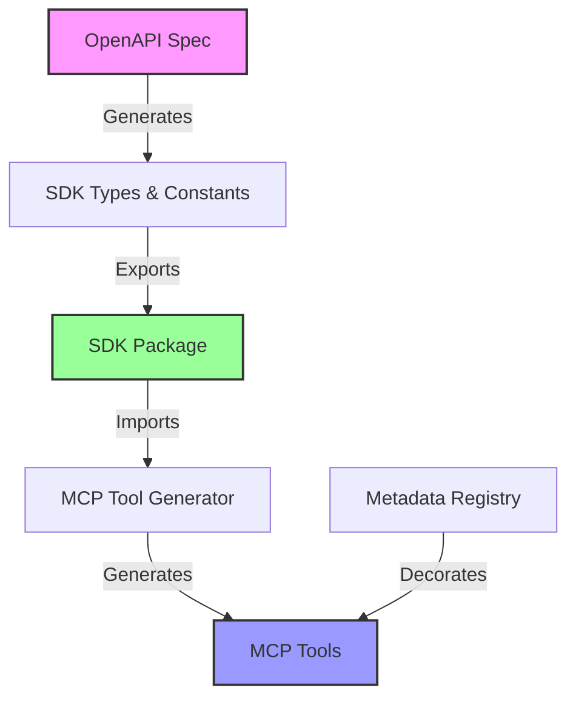

# Programmatic Tool Generation Architecture

**Status**: Proposed  
**Last Updated**: 2025-08-12  
**Context**: MCP Tool Generation from SDK

## Overview

This document describes the architecture for programmatically generating MCP tools from the Oak Curriculum SDK, ensuring automatic adaptation to API changes without manual intervention.

## Core Principles

### 1. Single Source of Truth

The SDK is the **sole authoritative source** for all API-related information:

- API endpoints and paths
- Parameter definitions and types
- Response schemas
- Operation identifiers
- Validation rules

### 2. Zero Manual API Data

The MCP must contain **NO hardcoded API structures**:

- ❌ No manual path definitions
- ❌ No manual parameter schemas
- ❌ No manual type definitions
- ✅ Only decorative metadata (descriptions, examples, categories)

### 3. Automatic Adaptation

When the API changes and the SDK is updated, the MCP tools must automatically reflect these changes without any manual code changes.

### 4. Generation-Time Extraction

**ALL metadata extraction and constant generation happens at build/generation time**:

- The OpenAPI schema is processed once during SDK build
- All runtime constants are pre-computed and written as TypeScript code
- Runtime code uses pre-generated constants with zero processing
- The `as const` schema is for type definitions only, not runtime iteration

## Architecture Components



## Implementation Strategy

### Phase 1: SDK Build-Time Generation

The SDK generation process extracts ALL metadata at build time:

```typescript
// In typegen-core.ts (build time)
function extractOperations(schema: OpenAPI3) {
  const operations = [];
  for (const path in schema.paths) {
    const pathItem = schema.paths[path];
    for (const method of ['get', 'post', 'put', 'delete']) {
      const operation = pathItem[method];
      if (operation) {
        operations.push({
          path,
          method,
          operationId: operation.operationId,
          summary: operation.summary,
          description: operation.description,
          parameters: operation.parameters || [],
        });
      }
    }
  }
  return operations;
}

// Generate TypeScript code as strings
const operationsCode = `
export const PATH_OPERATIONS = ${JSON.stringify(operations, null, 2)} as const;
`;

// Write to path-parameters.ts
fs.writeFileSync(outputPath, operationsCode);
```

### Phase 2: SDK Runtime Exports

The SDK provides pre-generated constants and utilities:

```typescript
// Required SDK exports (all pre-generated at build time)
export {
  // Raw OpenAPI schema (with 'as const')
  schema,

  // Validation namespace
  validation: {
    validateRequest(path, method, args),
    validateResponse(path, method, status, data),
  },

  // Tool generation namespace (pre-generated constants)
  toolGeneration: {
    PATH_OPERATIONS,      // Pre-generated at build time
    PARAM_TYPE_MAP,       // Pre-generated at build time
    parsePathTemplate,    // Runtime utility function
  },

  // Constants (pre-generated at build time)
  KEY_STAGES,
  SUBJECTS,
  // ... other API constants
}
```

### Phase 2: Tool Generation Pipeline

```typescript
// Build-time generation script
import { toolGeneration } from '@oaknational/oak-curriculum-sdk';

function generateAllTools() {
  const tools = [];

  // Generate from SDK's operation list
  for (const operation of toolGeneration.PATH_OPERATIONS) {
    const tool = {
      name: generateToolName(operation),
      description: operation.summary,
      inputSchema: generateSchema(operation.parameters),
      // Generated from SDK data only
    };

    tools.push(tool);
  }

  return tools;
}
```

### Phase 3: Metadata Decoration

Metadata provides **only decorative enhancements**, keyed by stable identifiers:

```typescript
// CORRECT: Keyed by operationId (stable)
const TOOL_METADATA = {
  getLessonTranscript: {
    description: 'Get lesson video transcript with timestamps',
    examples: ['Get transcript for "adding-fractions-2"'],
    category: 'content',
    priority: 'high',
  },
  // ... more metadata
};

// WRONG: Keyed by path (can change)
const BAD_METADATA = {
  '/lessons/{lesson}/transcript': {
    // ❌ Hardcoded path!
    // This breaks automatic adaptation
  },
};
```

### Phase 4: Runtime Integration

```typescript
// MCP runtime handler
export async function handleToolCall(toolName: string, args: unknown) {
  // Map tool to operation
  const operation = toolNameToOperation(toolName);

  // Validate using SDK
  const validated = validation.validateRequest(operation.path, operation.method, args);

  // Execute API call
  const response = await executeOperation(validated);

  // Validate response
  return validation.validateResponse(
    operation.path,
    operation.method,
    response.status,
    response.data,
  );
}
```

## File Structure (current)

```
apps/oak-curriculum-mcp-stdio/
├── scripts/
│   └── generate-tools.ts         # Build-time generation
├── src/
│   ├── tools/
│   │   ├── generated/
│   │   │   └── tools.generated.ts      # Auto-generated tools
│   │   └── handlers/
│   │       └── tool-handler.ts         # Runtime execution
│   ├── integrations/
│   └── app/
│       └── server.ts                   # MCP server integration
```

## Benefits

### 1. Automatic API Adaptation

- API changes flow through SDK automatically
- No manual updates needed in MCP
- Guaranteed consistency with API

### 2. Reduced Maintenance

- No duplicate API definitions to maintain
- Single source of truth (SDK)
- Fewer places for bugs to hide

### 3. Type Safety

- Full TypeScript support from SDK
- Compile-time type checking
- Runtime validation via Zod

### 4. Scalability

- Add new API endpoints automatically
- Remove deprecated endpoints automatically
- Handle API versioning through SDK

## Anti-patterns to Avoid

### ❌ Manual Path Definitions

```typescript
// NEVER DO THIS
const TOOLS = {
  'oak-get-lesson': {
    path: '/lessons/{lesson}', // Hardcoded!
    params: ['lesson'], // Manual!
  },
};
```

### ❌ Duplicate Type Definitions

```typescript
// NEVER DO THIS
interface LessonParams {
  lesson: string; // Duplicating SDK types!
}
```

### ❌ Manual Validation

```typescript
// NEVER DO THIS
function validateLesson(lesson: string) {
  if (!lesson.match(/^[a-z0-9-]+$/)) {
    // Manual validation!
    throw new Error('Invalid lesson');
  }
}
```

## Correct Patterns

### ✅ Import from SDK

```typescript
// ALWAYS DO THIS
import { KEY_STAGES, SUBJECTS, validation, toolGeneration } from '@oaknational/oak-curriculum-sdk';
```

### ✅ Generate from SDK Data

```typescript
// ALWAYS DO THIS
const tools = toolGeneration.PATH_OPERATIONS.map((op) => generateToolFromOperation(op));
```

### ✅ Validate with SDK

```typescript
// ALWAYS DO THIS
const result = validation.validateRequest(path, method, args);
if (!result.ok) {
  throw new ValidationError(result.issues);
}
```

## Migration Path

### Current State (Incorrect)

- Metadata registry contains hardcoded paths
- Manual validation functions
- Duplicate constant definitions

### Target State (Correct)

1. Remove all hardcoded paths from metadata
2. Key metadata by operationId
3. Import all constants from SDK
4. Use SDK validation functions
5. Generate tools programmatically

### Migration Steps

1. Wait for SDK Zod validators implementation
2. Refactor metadata registry structure
3. Implement tool generation script
4. Remove manual validators
5. Test automatic adaptation

## Testing Strategy

### Unit Tests

- Test metadata decoration logic
- Test tool name generation
- Test schema transformation

### Integration Tests

- Test tool generation from SDK
- Test runtime validation
- Test API execution

### Adaptation Tests

- Simulate API changes
- Verify automatic tool updates
- Ensure backward compatibility

## Related Documents

- [ADR-029: No Manual API Data Structures](architectural-decisions/029-no-manual-api-data.md)
- [ADR-030: SDK as Single Source of Truth](architectural-decisions/030-sdk-single-source-truth.md)
- [ADR-031: Generation-Time Extraction Pattern](architectural-decisions/031-generation-time-extraction.md)
- [Phase 6 Implementation Plan](../../.agent/plans/phase-6-oak-curriculum-api-implementation-plan.md)
- [SDK Zod Validators Plan](../../.agent/plans/oak-curriculum-sdk-zod-validators-2025-08-12.md)
