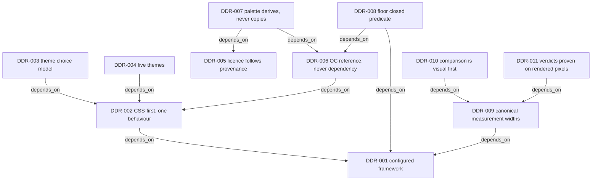

# Design Decision Records (DDRs)

**Last Updated**: 2026-08-07
**Status**: Active design-decision index

> **Navigation**: [Docs Home](../README.md) |
> [Architectural Decisions](../architecture/architectural-decisions/README.md)

Design Decision Records capture decisions about the **design system as a
designed artefact** — visual language, theming, palette derivation, licensing
of design content, and the system's relationship to its reference sources.
They are the design sibling of the ADR corpus (product architecture) and the
PDR corpus (Practice governance). Adopter test: a DDR is for the next person
styling, theming, or extending the design system, who would otherwise
re-derive the decision from scattered plans, reports, and PR bodies.

Founded 2026-08-07 at the owner's direction (Linear MCP-527), seeded by
harvest from the existing corpus — the strategic node, the completion plan,
the design reports, and the merged PR record. A DDR states the decision and
its consequences; execution detail stays in plans — the same discipline the
ADR corpus holds (decision records state the should-be; the means live in
plans).

## Sibling: the design-review instrument

[`design-review/`](./design-review/) is the design-review instrument's
home — the W0.7 rubric (a living instrument document), the owner-editable
wow-verdict register data, and the instrument's dated records. It is a
sibling artefact class, not a DDR: the rubric steers calls (its FAIL
blocks a render), so it lives here rather than in any report tree, and
its register's boundary parser lives with the estate's validators at
`agent-tools/src/validators/wow-verdict-register/`.

## The graph

The corpus is a graph from day 1. The ADR corpus already carries typed edges
as prose conventions (**Refines**, **Amends**, **Instantiates**); DDRs make
the edges machine-readable in frontmatter, consistent with ADR-221's
files-authoritative doctrine — the markdown files are the authority, and any
graph tooling ingests them, never the reverse.

Edge types (all lists, all optional):

- `depends_on` — DDRs this decision presupposes.
- `supersedes` / `superseded_by` — replacement lineage (paired).
- `informed_by` — inputs that shaped the decision (research, reports, PRs).
- `related` — records sharing substance (ADRs, PDRs, licence surfaces, PRs).

DDRs cite durable surfaces and artefact identities (a PR number, a repo
path), never lifecycle moments; execution detail lives in plans, and plans
cite DDRs — never the reverse.

Status grades the DECISION's authority: `proposed` (not yet decided) →
`accepted` (decided — at a delegated seat, or landed through owner-merged
work without explicit ratifying word) → `ratified` (explicit owner word on
the decision itself) → `superseded`.

The mermaid overview below is a curated subset: every drawn edge is a
declared edge with its declared direction; not every declared edge is drawn.

## Template

```markdown
---
ddr: DDR-NNN
iri: urn:uuid:<UUID-class, minted once at file creation — ADR-221 §3>
title: <decision as a sentence>
status: proposed | accepted | ratified | superseded
date: YYYY-MM-DD # date of the decision, not of the record
deciders: <who decided, at what authority>
edges:
  depends_on: []
  supersedes: []
  superseded_by: []
  informed_by: []
  related: []
---

# DDR-NNN: <title>

## Context

## Decision

## Consequences

## Provenance
```

## Index

| DDR                                                                                  | Title                                              | Status   |
| ------------------------------------------------------------------------------------ | -------------------------------------------------- | -------- |
| [DDR-001](design-decisions/001-the-design-system-is-a-configured-framework.md)       | The design system is a configured framework        | ratified |
| [DDR-002](design-decisions/002-css-first-with-one-shipped-behaviour.md)              | CSS-first, with one shipped behaviour              | ratified |
| [DDR-003](design-decisions/003-theme-state-is-the-choice-never-the-applied-value.md) | Theme state is the choice, never the applied value | accepted |
| [DDR-004](design-decisions/004-five-themes-access-themes-are-first-class.md)         | Five themes; access themes are first-class         | accepted |
| [DDR-005](design-decisions/005-licence-follows-provenance.md)                        | Licence follows provenance                         | ratified |
| [DDR-006](design-decisions/006-oak-components-is-reference-never-dependency.md)      | Oak Components is reference, never dependency      | ratified |
| [DDR-007](design-decisions/007-palette-values-derive-never-copy.md)                  | Palette values derive, never copy                  | ratified |
| [DDR-008](design-decisions/008-floor-conformance-is-a-closed-predicate.md)           | Floor conformance is a closed predicate            | accepted |
| [DDR-009](design-decisions/009-measurement-happens-at-canonical-widths.md)           | Measurement happens at canonical widths            | accepted |
| [DDR-010](design-decisions/010-comparison-is-visual-first.md)                        | Comparison is visual first, statistics direct it   | accepted |
| [DDR-011](design-decisions/011-design-verdicts-are-proven-on-rendered-pixels.md)     | Design verdicts are proven on rendered pixels      | accepted |


