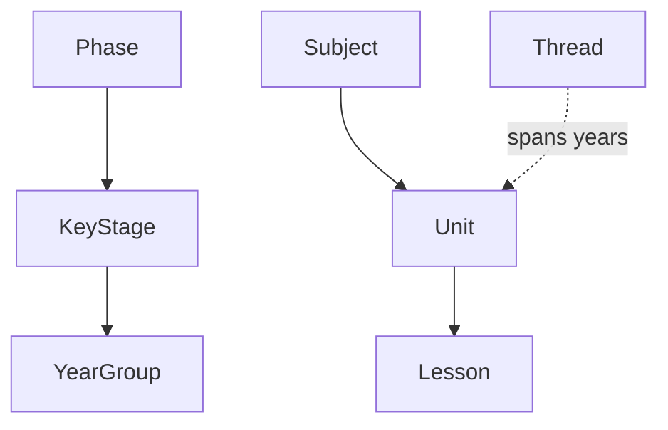

# Oak Curriculum Guide

**Audience**: Product owners, CEOs, and anyone who needs to understand what
curriculum data this repository works with — no TypeScript required.

---

## What is the Oak Curriculum?

[Oak National Academy](https://www.thenational.academy/) is an independent UK
public body whose mission is to improve pupil outcomes and close the
disadvantage gap by supporting teachers to teach, and enabling pupils to access,
a high-quality curriculum.

Oak publishes a **fully open curriculum**: openly licensed, free of third-party
copyright (where possible), and organised for reuse. The curriculum is
accessible through the
[Open Curriculum API](https://open-api.thenational.academy/), and this
repository builds tools and AI services on top of that public data.

## How the Curriculum is Organised

Oak's curriculum follows a hierarchy from broad groupings down to individual
teaching sessions:

> **Note for developers**: The API organises units within a subject using an
> intermediate concept called a "sequence" (e.g. `maths-primary`). One sequence
> can generate multiple user-facing "programme" views. This distinction matters
> for API traversal but not for understanding the curriculum itself. See
> [Data Variances](./DATA-VARIANCES.md) for details.

### Key Stages and Phases

The UK National Curriculum divides schooling into Key Stages:

| Key Stage | Ages  | Years | Phase     |
| --------- | ----- | ----- | --------- |
| **KS1**   | 5–7   | 1–2   | Primary   |
| **KS2**   | 7–11  | 3–6   | Primary   |
| **KS3**   | 11–14 | 7–9   | Secondary |
| **KS4**   | 14–16 | 10–11 | Secondary |

Primary covers KS1 and KS2 (ages 5–11). Secondary covers KS3 and KS4
(ages 11–16).

### Subjects

Oak covers subjects across primary and secondary education. Most subjects span
all four key stages (e.g. Maths, English, Science, History, Geography, Art,
Music, Physical Education, Computing). Some have different coverage: French and
Spanish begin at KS2, German begins at KS3, and Religious Education covers
KS1–KS3 only. Additional subjects including Citizenship, Cooking & Nutrition,
and Design & Technology appear in specific key stages and in thread
progressions.

### Units

A unit is a topic of study containing typically 4–8 ordered lessons. For
example, "Fractions, Year 4" is a unit within Maths. Units are the main
building blocks of the curriculum.

### Lessons

An individual teaching session. Each lesson can have up to 8 optional
components:

- **Curriculum information** (always present) — lesson summary and metadata
- **Slide deck** — presentation slides
- **Video** — teacher-delivered lesson video
- **Video transcript** — full text of the video content
- **Starter quiz** — prior knowledge assessment
- **Exit quiz** — learning assessment
- **Worksheet** — practice tasks with answers
- **Additional materials** — supplementary resources

Not every lesson has every component. Availability varies by subject.

### Threads

Threads are how ideas build over time across year groups. A thread groups
together units from different years that develop a common body of knowledge.

For example, the **Number** thread in Maths spans from Reception to Year 11
with 118 units, progressing from "Counting 0–10" through "Place value" and
"Fractions" to "Algebra" and "Surds". Threads are Oak's mechanism for showing
vertical curriculum progression — they answer questions like "what comes before
this topic?" and "how does this concept develop across the school years?"

Oak's curriculum contains **164 threads** across **16 subjects**.

## What Makes KS4 Different

Key Stage 4 (ages 14–16, Years 10–11) is significantly more complex than
KS1–3 because it involves GCSE preparation. Four additional factors come
into play:

| Factor            | What it means                                                     | Applies to                 |
| ----------------- | ----------------------------------------------------------------- | -------------------------- |
| **Tiers**         | Foundation or Higher difficulty level                             | Maths, Science             |
| **Exam boards**   | AQA, OCR, Edexcel, Eduqas, etc.                                   | Most KS4 subjects          |
| **Exam subjects** | Science splits into Biology, Chemistry, Physics, Combined Science | Science only               |
| **Pathways**      | Core or GCSE route                                                | Citizenship, Computing, PE |

These factors combine. A single Science sequence at KS4 can produce 8 or more
distinct programme views (e.g. "AQA Biology Foundation", "Edexcel Combined
Science Higher"). This complexity is a faithful reflection of how GCSE
qualifications work in England.

## What This Means for Search and Discovery

### Why threads matter for teachers

Teachers don't just want a single lesson — they want to understand how a topic
develops. Threads let them find the progression path for a concept, see what
comes before and after a unit, and plan across year groups.

### Why transcript availability varies

Video transcripts are the richest text content for search. Most subjects have
near-complete transcript coverage (96–100%). However, Modern Foreign Languages
(French, Spanish, German) have near-zero transcript coverage because the lesson
videos contain non-English speech that cannot be reliably transcribed. For these
subjects, search relies on structured metadata (lesson titles, key learning
points, keywords) rather than full-text transcript matching.

### How well search works

The semantic search system achieves an MRR (Mean Reciprocal Rank) of 0.983
across its benchmark suite — it finds the right lesson 98% of the time
(see [Vision](../foundation/VISION.md) for methodology). This is the result of combining
full-text search with semantic understanding and structured curriculum metadata.

## Three Ways People Use This Data

### Developers

Build education tools and services using the SDK. Developers get typed,
validated API access generated directly from the OpenAPI schema. They care about
data structure correctness, type safety, and reliable API responses. Start with
the [Quick Start Guide](../foundation/quick-start.md).

### AI Agents

Access curriculum content through MCP (Model Context Protocol) servers.
AI agents get structured, searchable content with curriculum-aware ontology
data. They care about accurate retrieval, curriculum relationships, and
consistent data formats. See [AGENT.md](../../.agent/directives/AGENT.md).

### Teachers (via AI tools)

Find lessons, explore progression paths, and adapt content for their classes.
Teachers care about relevance, pedagogical quality, and finding the right
resource quickly. They interact with the curriculum through AI-powered tools
like [Aila](https://labs.thenational.academy/) rather than directly with
this repository.

---

## Further Reading

- [Data Variances](./DATA-VARIANCES.md) — detailed technical reference for
  subject/key stage differences, transcript availability, and structural
  patterns
- [Vision](../foundation/VISION.md) — why this repository exists and how we measure
  impact
- [Ontology Data](../../packages/sdks/oak-curriculum-sdk/src/mcp/ontology-data.ts)
  — the domain model in TypeScript (for developers)
- [Open Curriculum API docs](https://open-api.thenational.academy/) — upstream
  API documentation and glossary
