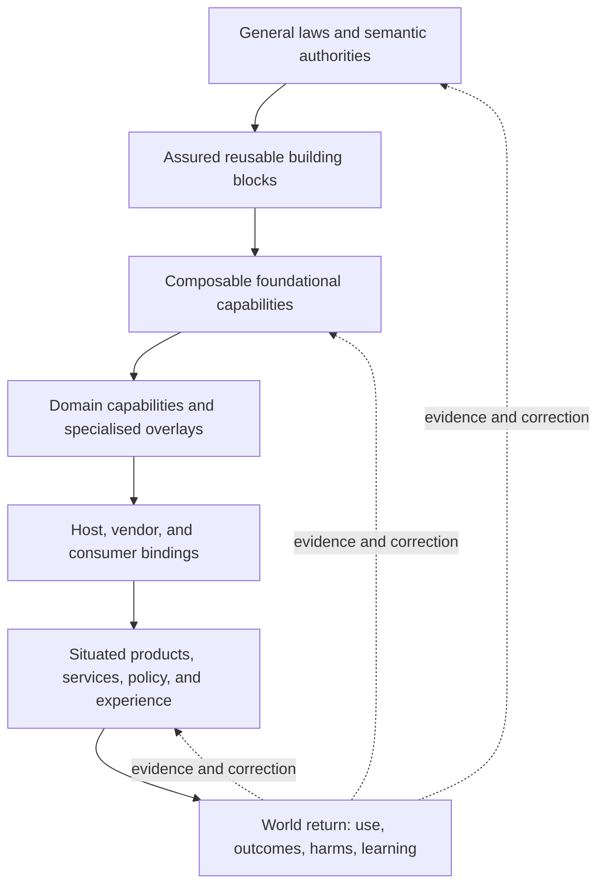

# The cost-of-change gradient

The **cost-of-change gradient** is a named systems pattern for putting reusable
mechanism, assurance, and context at the levels where each can do the most good.
Its proposed portable identity and normative definition live in
[PDR-135](../../.agent/practice-core/decision-records/PDR-135-cost-of-change-gradient.md).
This page is the human-facing guide to how that pattern appears in this
repository and in the wider human-agent Practice.

> Stable, recurring responsibilities need one semantic authority at the most
> general coherent layer. Reusable implementation and assurance belong there
> where the claim permits it; irreducible local implementation and proof stay
> visible at the host boundary. Useful impact must ultimately be tested where
> the system returns to the world.

The phrase names more than one software stack. It describes a relationship
between generality and specificity, repeated recursively across scales, while
preserving the independent dimensions that one hierarchy cannot honestly
represent.

## The shape



"Lower" in this shape means **more general**, not less important, simpler to
change, or physically lower in a directory. Foundations have more consumers and
a wider blast radius, so each foundational change normally needs stronger
assurance. When implementation can be shared, its responsibility and reusable
proof are paid for once and inherited many times. When only semantic authority
can be shared, hosts still pay for and prove their local implementations.

“Thin” does not mean trivial. A product or host may own difficult policy,
operations, judgement, accessibility, safeguarding, experience, and human
consequence. It is thin only in the mechanisms it should inherit rather than
reimplement.

## Three geometries and a loop

| Shape                 | Question it answers                                                                                                                                                   | Failure if collapsed                                                                           |
| --------------------- | --------------------------------------------------------------------------------------------------------------------------------------------------------------------- | ---------------------------------------------------------------------------------------------- |
| Generality ramp       | What is the most general coherent owner of this responsibility?                                                                                                       | Either every consumer reimplements it or a generic layer absorbs policy it cannot honestly own |
| Recursive scale       | At what grain does the whole responsibility exist: expression, module, package, system, repository, Practice, service, or ecosystem?                                  | A local proof is transported to a larger scale without a bridge                                |
| Orthogonal dimensions | What varies independently: authority, implementation, generation, assurance, evidence, lifecycle, domain, method, entitlement, human experience, or agent experience? | One convenient hierarchy or score hides important differences                                  |
| World-return loop     | What observable use, outcome, harm, or feedback can correct the system?                                                                                               | Internal excellence is mistaken for useful impact                                              |

The vertical ramp is often a partial order rather than one universal stack.
Different dimensions have different owners and validation instruments. A
generated carrier is not its semantic authority. A stronger runtime host does
not strengthen an evidence claim. Passing a structural check does not prove the
shipped form, and shipped correctness does not prove value for people.

## The economic mechanism

Duplicated responsibility amplifies change:

```text
many implementations + many assurance burdens + many maintenance paths
  -> every improvement is paid for repeatedly
```

A coherent shared owner creates two different economic paths.

For a shared implementation:

```text
one semantic authority + one reusable implementation + reusable proof
  -> thin explicit compositions
  -> implementation improvements inherited by consumers
```

For a portable contract with necessarily local implementations:

```text
one semantic authority + shared conformance obligations
  -> local host implementations + local proof
  -> shared discovery, specification, assurance design, and governance
  -> explicit per-host adoption when the contract changes
```

This is the route by which the marginal cost of reusing an already-understood,
already-assured shared implementation can approach zero. The local-contract
path has a different saving: semantic work and assurance design are amortised,
but implementation and proof are not. Neither is a claim that innovation as a
whole becomes free. Understanding real needs, making product and policy
judgements, integrating genuinely different contexts, operating services, and
learning from people remain irreducible. The purpose is to stop multiplying
costs that truly can be shared and expose the ones that cannot.

## Three worked projections

These examples share the pattern without sharing one literal topology.

### Software architecture

The repository's software projection is:

```text
semantic authorities and generators
  -> core building blocks
    -> foundational systems
      -> SDKs and domain libraries
        -> products and services
          -> observed value for people
```

Core owns small, context-independent laws and mechanisms. Foundational systems
compose them behind explicit ports. SDKs and libraries own reusable domain
capability. Applications and services concentrate on composition, policy,
operations, and experience. Vendor-specific adapters remain at the edge, and
generated repetition is cured at its authority or generator.

The detailed projection and core-admission test are in
[Foundations first](../architecture/foundations-first.md).

### Parallax

Parallax is a worked inquiry projection. Shared epistemic invariants and an
artifact protocol support independently discoverable capability seams;
stackable domain profiles and typed overlays add context without forking the
base; host and vendor entry surfaces remain outside the canonical collection;
and World-Return connects inquiry to outcomes and later learning.

It also demonstrates why the gradient cannot be one ladder. Scale is a vector,
not a `micro -> meso -> macro` rank. Bases, methods, profiles, inquiry depth,
assurance layers, execution hosts, and L0/L1/L2 learning vary independently.
Bridge claims are required when conclusions move between scales.

Parallax is currently evaluation-ready, not empirical proof that the pattern
reduces innovation cost. It demonstrates the architecture and supplies
falsifiable evaluation paths.

### The Practice

The Practice is a worked human-agent projection:

```text
portable philosophy and behavioural authority
  -> reusable structures, contracts, and assurance obligations
    -> skills, rules, review, memory, and coordination capabilities
      -> repo-specific structures and platform adapters
        -> situated human-agent work
          -> product and beneficiary outcomes
```

Its strongest form is **one portable semantic authority plus shared assurance
obligations plus intentionally local host implementations**. It does not require
one tool or technology stack everywhere. Canonical-first content makes a
semantic change once; generated adapters can inherit that change automatically;
local phenotypes must adopt and prove behavioural changes at their own host
boundaries without becoming rival portable doctrine.

The Practice also contains several independent orders and ramps: philosophy,
structure, and tooling; instance, repository, and Practice learning; knowledge
strata; seconds-to-session-to-cross-session feedback; scope and maturity; and
human and agent experience. These remain distinct rather than being renamed as
one generality axis.

Read [the Practice](../../.agent/practice-core/practice.md) and
[how the agentic engineering system works](./agentic-engineering-system.md) for
those two views.

## The human-agent experience

Foundations are products for downstream users.

For agents, an excellent gradient means one discoverable authority, smaller
context requirements, deterministic behaviour where needed, strict boundaries,
actionable failure, and fewer occasions to reconstruct settled mechanics.

For people, it means less engineering attention spent re-solving infrastructure
and more attention available for real outcomes, service policy, usability,
accessibility, dignity, trust, and learning. People still set purpose,
guardrails, and corrections. Agents still exercise judgement. Shared
foundations make correct action easier; they do not remove responsibility.

## Placement and losing conditions

A recurring form is a candidate for a more general home only when:

- at least two independent production consumers need the same responsibility;
- one behavioural invariant, rather than similar syntax, is shared;
- the proposed public contract is smaller and more stable;
- consumer, vendor, and product policy stays above the boundary;
- dependencies point toward the general owner;
- proof, documentation, or maintenance work is removed rather than displaced,
  or the shared semantic and assurance-design work is named separately from
  irreducible local implementation and proof;
- the semantic contract can be assured at its general owner and every shared or
  local implementation can be assured at its natural host boundary; and
- a losing condition says when to keep it local or remove it.

The abstraction loses when consumers change for different reasons, adapters
recreate the displaced complexity, context-specific branches invade the base,
no independent reuse exists, or total ownership cost rises.

## Evidence boundary

The cost-of-change gradient is an architectural and operating hypothesis with a
clear causal mechanism. Counts of removed duplicates, smaller consumer
contracts, centralised proof, mutation strength, built or packed consumption,
and reduced change footprint can test its internal effects. Product evaluation,
observability, use, human feedback, and adverse-outcome monitoring must test the
world-facing effects.

Excellent foundations enable useful systems. Shared implementations and shared
semantic authorities amortise different costs; neither proves value. Only
contact with the world shows whether useful systems have delivered real value
to real people.

## Related material

- [PDR-135: The Cost-of-Change Gradient](../../.agent/practice-core/decision-records/PDR-135-cost-of-change-gradient.md)
  — portable identity, decision, and falsifiers.
- [Foundations first](../architecture/foundations-first.md) — software
  architecture projection and core-building-block quality contract.
- [TypeScript estate review promotion frame](../../.agent/reports/typescript-estate-consolidation-review/foundational-building-blocks-frame.md)
  — one evidence programme applying the pattern without owning it.
- [Vision](../../VISION.md) — why the repository invests in these foundations.
