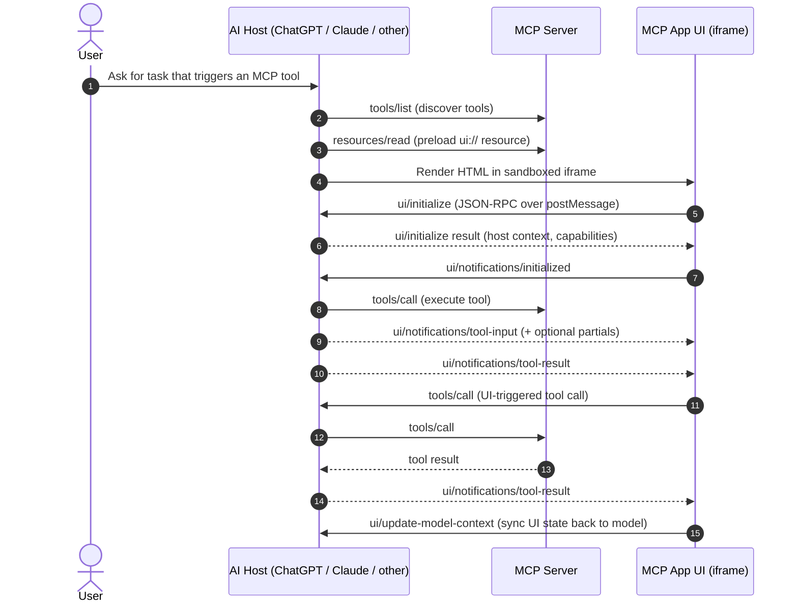

# MCP Apps Open Standard and Cross‑Platform Support in ChatGPT, Claude, and Gemini

## Executive summary

MCP Apps (also referred to as the “MCP Apps Extension”, SEP‑1865) is the first **official extension** to the Model Context Protocol (MCP) that standardises how an MCP server can deliver an **interactive web UI** (HTML) that renders **inline inside an AI host** (chat client) and communicates with that host using a **JSON‑RPC bridge over `postMessage`**. The stable SEP‑1865 specification is dated **2026‑01‑26**, created **2025‑11‑21**, and is maintained in the official extension repository `modelcontextprotocol/ext-apps`. citeturn9view3turn8view3turn20search7

The MCP Apps model is intentionally “web‑native” and security‑first: hosts render third‑party UIs in a **sandboxed iframe** (often a recommended **double‑iframe** architecture for web hosts), enforce a **declarative CSP allowlist** (`connectDomains`, `resourceDomains`, optional `frameDomains`, etc.), and gate powerful browser capabilities via a **permissions request** surface (camera, microphone, geolocation, clipboard write). citeturn24view0turn5view1turn20search2

As of **2026‑03‑05**, the evidence from **primary/official documentation** supports the following platform status:

- **ChatGPT (OpenAI)**: ChatGPT explicitly supports the **MCP Apps open standard** for embedded UIs and provides a strong compatibility story: build with `_meta.ui.resourceUri` and the `ui/*` bridge for portability, and optionally layer ChatGPT‑specific extensions via `window.openai` (checkout, file uploads, modals). citeturn4view2turn11view5turn22view0turn17view1
- **Claude (Anthropic)**: Claude supports MCP Apps as “interactive connectors” on **web and desktop**, positioned explicitly as an **open standard** usable beyond Claude. Claude’s docs include cross‑platform guidance (Claude + ChatGPT), plus host‑specific rules around the sandbox **domain** used for the UI origin (notably hashed `*.claudemcpcontent.com`). citeturn13view3turn13view0turn14view0turn12search1
- **Gemini (Google)**: Google has adopted **core MCP** broadly (Gemini SDK support for MCP tool calling; Gemini CLI MCP servers; Google Cloud managed MCP servers) but **no official Google documentation located** in this research indicates that the **Gemini chat apps** render **MCP Apps UIs (iframe widgets) inline**. Therefore, **MCP Apps UI support in the Gemini assistant UI is unspecified** based on primary sources, even though MCP tool/server support is clearly documented. citeturn4view4turn1search12turn18view5turn3search2turn15search6

The single biggest practical “portability gap” is that **MCP Apps specifies protocol and security primitives, but each host may impose host‑specific constraints**, especially around **sandbox origin/domain formats** and CSP enforcement details. The spec acknowledges host‑dependent domain validation; OpenAI’s and Anthropic’s docs each prescribe different domain derivations. citeturn24view0turn22view0turn14view0

## Official specifications, governance, versions, and changelogs

### What “MCP Apps” is formally

The authoritative protocol document is **SEP‑1865: “MCP Apps: Interactive User Interfaces for MCP”**, tracked under the MCP **Extensions** track. The stable revision is labelled **“Status: Stable (2026‑01‑26)”** and lists named authors (including contributors from MCP‑UI and OpenAI). citeturn9view3turn8view1

The extension is implemented and maintained in the official repository **`modelcontextprotocol/ext-apps`**, which positions itself as “Official repo for spec & SDK of MCP Apps protocol” and emphasises “render inline in Claude, ChatGPT and any other compliant chat client.” citeturn8view3turn20search0

The MCP core maintainers announced MCP Apps first as a **proposal** (dated **2025‑11‑21**) and later as an **official extension live for production** (dated **2026‑01‑26**), noting collaboration with **MCP‑UI** and the **OpenAI Apps SDK**, and stating that clients including **ChatGPT** and **Claude** had shipped support. citeturn8view1turn4view0

### Versioning model and how to interpret “versions”

MCP (core protocol) uses dated spec revisions (for example, **2025‑06‑18**) and has explicit version negotiation mechanics. The MCP GitHub releases describe that SDKs may adopt revisions at different paces, and that version negotiation enables forwards/backwards compatibility. citeturn18view2turn19view0

MCP Apps, as an extension, is negotiated via MCP’s extension capability mechanism: clients advertise support for `io.modelcontextprotocol/ui` including supported UI MIME types (like `text/html;profile=mcp-app`), and servers should only register UI‑enabled tools when capability negotiation indicates support. citeturn5view5turn10view7turn24view0

### Maintainers and contributors

The initial proposal post credits MCP maintainers and key contributors, explicitly including MCP‑UI authors and OpenAI contributors (direction from experience building the Apps SDK). citeturn8view1turn4view0

### Changelogs and release notes

There is no single “one true” changelog format across the ecosystem, but the following are primary, inspectable sources:

- The SEP‑1865 document includes explicit metadata fields (created date, stable date, author list) and normative requirements. citeturn9view3turn24view0
- The `ext-apps` repository appears to ship frequent version bumps (repository badge/versioning and tag comparisons). For example, the `v1.1.1…v1.1.2` compare view documents a feature addition: a `ui/download-file` method to enable host‑mediated downloads because sandboxed iframes typically block direct downloads. citeturn20search2turn20search25
- The official API docs site for `@modelcontextprotocol/ext-apps` is versioned (for example **v1.1.2**) and reflects the current SDK surface, including types for download‑file requests/results. citeturn20search21turn20search26

Where historical release notes are incomplete or inconsistent (for example, a truncated `RELEASES.md` not capturing the 1.x line), treat the compare/tags + generated API docs as the closest “ground truth” for shipped SDK changes. citeturn20search2turn20search26turn20search11

## Technical architecture, APIs, and security model

### Core architecture pattern

At a protocol level, MCP Apps combines two existing MCP primitives:

1. A **tool** whose definition includes a pointer to a UI resource: `_meta.ui.resourceUri` with a `ui://…` URI. citeturn24view0turn4view2
2. A **resource** served by the MCP server whose MIME type is `text/html;profile=mcp-app`, fetched via the standard MCP resource API (`resources/read`). citeturn24view0turn23view6

When an LLM/host triggers the tool, the host can preload the UI resource and then render it **in place** of (or alongside) traditional tool output, while sending tool input/output to the UI via notifications (e.g., `ui/notifications/tool-input`, `ui/notifications/tool-result`). citeturn20search15turn17view1turn23view4

### UI ↔ host communication protocol

MCP Apps mandates that embedded UIs communicate with the host using:

- **JSON‑RPC 2.0** messages
- transported via **`window.postMessage`**
- using a reserved `ui/*` namespace for UI‑specific requests/notifications (initialisation, messages, model context updates, etc.) citeturn5view3turn4view2turn17view4

The stable spec defines a lifecycle handshake: the UI sends `ui/initialize`, then emits `ui/notifications/initialized`; the host must not send messages before receiving initialisation. citeturn23view4turn5view6

The spec also explicitly permits the UI iframe to call a **subset of standard MCP methods** (via the host as broker), including `tools/call` and `resources/read`, and to log messages via `notifications/message`. citeturn23view4turn23view6turn17view4

### Capabilities and “allowed actions” in MCP Apps

From the stable spec, the key host‑mediated capabilities include:

- Opening links: `ui/open-link`, which the host may deny or mediate. citeturn23view0turn10view3
- Sending a follow‑up chat message: `ui/message`, which becomes part of the conversation context (host may require consent). citeturn10view3turn23view2
- Updating model‑visible UI context: `ui/update-model-context`, allowing the UI to push state that the model can use in future turns (each update overwrites prior UI context). citeturn10view2turn23view2
- Requesting display mode changes (inline/fullscreen/picture‑in‑picture): `ui/request-display-mode`, subject to declared UI capabilities and host policy. citeturn23view2turn24view0

An important security + UX nuance is that the **model cannot “see” user interactions inside the UI** unless the app explicitly syncs key state back (for example via `ui/update-model-context`). This is a recurring theme in OpenAI’s Apps SDK guidance and is also reflected in the MCP Apps protocol’s inclusion of model context updates as a first‑class method. citeturn10view2turn17view0

### Security model: sandboxing, CSP, and permissions

MCP Apps is designed for hosts to safely embed third‑party UIs without fully trusting the server author.

The SEP requires that hosts render UI resources in a sandboxed environment and enforce a **restrictive default CSP** when the server does not declare any allowlist. The spec provides a baseline “deny by default” policy (e.g., `default-src 'none'`, `connect-src 'none'`) and states the host **must not allow undeclared domains**, though it may further restrict them. citeturn24view0turn5view8

The resource `_meta.ui.csp` schema includes:

- `connectDomains`: allowlisted origins for network requests (maps to `connect-src`).
- `resourceDomains`: allowlisted origins for static assets (maps to `script-src`, `style-src`, `img-src`, etc.).
- `frameDomains`: allowlisted origins for nested iframes (maps to `frame-src`); default is no nested iframes.
- `baseUriDomains`: allowlisted origins for document base URI (maps to `base-uri`). citeturn24view0turn22view0

The resource `_meta.ui.permissions` is an explicit request surface for browser permission policy features (camera, microphone, geolocation, clipboard write). Hosts may honour these by setting iframe `allow` attributes, and apps are instructed to feature‑detect rather than assume permissions are granted. citeturn24view0turn5view1

For web hosts, the spec describes a recommended **double‑iframe “sandbox proxy”** architecture, reserving specific sandbox notifications (`ui/notifications/sandbox-*`) to coordinate the inner iframe loading with host mediation. citeturn5view1turn23view4

A practical implication of sandboxing is that certain browser features (like direct downloads) are blocked unless hosts opt into permissive sandbox flags. The `ext-apps` project’s `v1.1.2` changes explicitly added a `ui/download-file` method to support host‑mediated downloads specifically because “direct downloads are blocked” in sandboxed iframes (no `allow-downloads`). citeturn20search2turn20search21

### Authentication and authorisation

MCP Apps itself is primarily a **UI extension**; authentication is largely a property of how the host connects to MCP servers. Relevant “auth facts” therefore come from each platform’s MCP integration plus MCP core security evolution.

In MCP core, the **2025‑06‑18** revision introduced significant auth hardening: classifying MCP servers as **OAuth Resource Servers**, requiring MCP clients to implement **OAuth Resource Indicators (RFC 8707)** to mitigate token theft by malicious servers, and clarifying security considerations. citeturn19view0turn18view2

OpenAI’s Apps SDK auth guidance explicitly describes OAuth authorisation‑code + **PKCE** flows for ChatGPT, and supports **Dynamic Client Registration (DCR)** so ChatGPT can mint dedicated OAuth client IDs per connector/app. The docs also specify redirect URI patterns for ChatGPT’s OAuth callback endpoints. citeturn22view3turn25view0

Anthropic’s connector guidance similarly frames OAuth as the typical mechanism for custom connectors, advising users to review requested scopes carefully, and explicitly warning about prompt injection risks from malicious MCP servers. citeturn13view4turn12search8

## Reference implementations and SDKs

### Official MCP Apps SDK packages and roles

The `ext-apps` repository and its generated docs describe an SDK with distinct surfaces for different developer roles:

- `@modelcontextprotocol/ext-apps`: UI/view SDK (App class, postMessage transport) for building the embedded UI. citeturn8view3turn20search28
- `@modelcontextprotocol/ext-apps/react`: optional React hooks/utilities for building MCP Apps in React. citeturn20search22turn7search27
- `@modelcontextprotocol/ext-apps/app-bridge`: utilities for host developers embedding/communicating with views in a chat client. citeturn7search27turn20search21
- `@modelcontextprotocol/ext-apps/server`: helpers to register app‑enabled tools/resources on an MCP server, including capability checks (e.g., `getUiCapability`, `RESOURCE_MIME_TYPE`). citeturn10view7turn17view3turn6view0

The official docs also emphasise that hosts can implement the protocol directly (it is “all standard web primitives”), but the SDK provides convenience wrappers. citeturn7search8turn5view3

### Reference host implementation for testing

`ext-apps` ships a “basic-host” example that functions as a reference host for local development and testing, rendering tool UIs in a secure sandbox. citeturn20search16turn20search18

This is significant for developer experience because it provides a way to iterate without relying on a proprietary host’s publishing or review pipeline.

### MCP‑UI and compatibility adapters

MCP‑UI predates the official extension and is explicitly referenced in the SEP as a community “playground” that proved out the bidirectional communication model and content types; it also had notable early adopters spanning hosts/providers (Postman, HuggingFace, Shopify, Goose, ElevenLabs). citeturn4view5turn20search13

MCP‑UI documentation describes adapters for bridging legacy MCP‑UI widgets into MCP Apps hosts and vice versa, and maintains a host support page (with partial/legacy support distinctions). citeturn15search12turn0search26turn16search9

### OpenAI Apps SDK artefacts interacting with MCP Apps

OpenAI’s Apps SDK documentation positions MCP Apps as the standardised UI bridge underlying ChatGPT apps, while maintaining Apps SDK compatibility and optional extensions. citeturn4view2turn17view1turn17view4

OpenAI also publishes example repositories (for example `openai/openai-apps-sdk-examples`) demonstrating end‑to‑end widget development and MCP server integration, which—per OpenAI’s own docs—use MCP as the backbone to keep server, model, and UI in sync. citeturn16search1turn17view1turn17view3

## Platform support status and compatibility matrix

### ChatGPT support for MCP Apps

ChatGPT explicitly states it supports the **MCP Apps open standard**: UIs running in an iframe and communicating using the standard `ui/*` JSON‑RPC bridge over `postMessage`. OpenAI recommends building with MCP Apps standard keys/bridge by default, using ChatGPT‑specific extensions only when required. citeturn4view2turn11view0turn17view1

Compatibility and migration details are unusually explicit:

- Tool ↔ UI linkage: MCP Apps standard `_meta.ui.resourceUri` maps to a ChatGPT compatibility alias `_meta["openai/outputTemplate"]`. citeturn11view5turn17view3
- Host bridge mapping: MCP Apps `ui/initialize`, `ui/notifications/tool-result`, `tools/call`, `ui/message`, and `ui/update-model-context` map to various `window.openai.*` legacy APIs used in older ChatGPT widgets. citeturn11view5turn17view4

ChatGPT security posture for embedded UI is also clearly documented. OpenAI describes a **double‑nested iframe** and framing CSP configuration as “the new CORS,” with an app manifest declaring allowlists for `connectDomains`, `resourceDomains`, `frameDomains`, and `redirectDomains`. citeturn17view0turn22view0

Operational constraints and governance are important to portability:

- Developer mode / full MCP (including write actions) is rolling out in beta to **Business, Enterprise, and Edu**, with functionality/permissions subject to change. citeturn25view0
- **No mobile support** for MCP apps in the cited help centre article (“web only”). citeturn25view0
- ChatGPT currently does **not** support connecting to **local** MCP servers in the same help centre guidance (“Only remote servers are supported.”). citeturn25view0
- For write/modify actions, ChatGPT uses explicit **confirmation modals** and provides enterprise admin controls (RBAC, action approvals). citeturn25view0

### Claude support for MCP Apps

Anthropic positions MCP Apps as “interactive connectors” that appear inline in Claude conversations. Anthropic’s product announcement (dated **January 26, 2026**) states interactive connectors are available “on web and desktop” across Free and paid plans, with Claude Cowork “coming soon”. citeturn13view3

Claude’s developer docs for MCP Apps include:

- Explicit user consent flow: Claude prompts for permission to display the app, with an “Always allow” option. citeturn12search1
- Debugging guidance that confirms a nested iframe structure in Claude Desktop (“look for an iframe nested inside another iframe”). citeturn13view1turn5view1
- Cross‑platform guidance: “MCP Apps can run in both Claude and ChatGPT from a single codebase,” with helper APIs to generate platform‑specific metadata and client‑side auto‑detection of host environment. citeturn13view0turn14view0

Claude also documents a host‑specific rule for the UI sandbox origin domain:

- The spec itself states that `_meta.ui.domain` is host‑dependent and gives hash‑based subdomains (including `*.claudemcpcontent.com`) as an example format. citeturn24view0
- Anthropic’s cross‑compatibility doc provides a concrete method to compute the Claude domain based on a SHA‑256 hash of your server URL, yielding `{hash}.claudemcpcontent.com`. citeturn14view0

On the governance/security side, Anthropic’s connector help guidance highlights OAuth flows, scope review, and prompt injection risks, and Anthropic maintains a reviewed “Connectors Directory” intended to list servers vetted by Anthropic. citeturn13view4turn12search16turn12search31

### Gemini support for MCP Apps

Google’s primary documentation shows strong adoption of **MCP (core protocol)**, including:

- Gemini API documentation states that MCP is an open standard and that Gemini SDKs have built‑in support for MCP, including “automatic tool calling” for MCP tools. citeturn4view4turn3search2
- Gemini CLI documentation defines MCP servers and how they expose tools/resources to Gemini CLI via MCP. citeturn1search12turn2search1
- Google Cloud documentation describes Google/Google Cloud remote MCP servers with enterprise governance (IAM policies, org controls) and claims compliance with the MCP authorisation specification; it also highlights security controls like **Model Armor** for scanning prompts/responses to mitigate prompt injection/sensitive data disclosure/tool poisoning. citeturn18view5turn3search5turn3search13

However, MCP Apps specifically is an **embedded UI standard**: it requires a host to render `text/html;profile=mcp-app` resources in an iframe and implement the `ui/*` bridge. In the official MCP Apps client support page, the set of MCP Apps hosts listed includes Claude, Claude Desktop, VS Code GitHub Copilot, Goose, Postman, and MCPJam. **Gemini is not listed** there. citeturn15search6turn4view1

Based on this research, **no official Google documentation was found** stating that the Gemini consumer chat UI (or Gemini Enterprise UI) renders MCP Apps iframes inline. Therefore, **Gemini MCP Apps UI support is unspecified**. (This does not contradict Google’s well‑documented MCP server/tool support, which is separate.) citeturn4view4turn15search6turn18view5

### Compatibility matrix across ChatGPT, Claude, and Gemini

The table below compares “host” capabilities relevant to MCP Apps UI portability. Where a platform does not document a capability in primary sources, it is marked **unspecified**.

| Attribute                                                            | ChatGPT (OpenAI)                                                                                                                                                                        | Claude (Anthropic)                                                                                                                                                                                            | Gemini (Google)                                                                                                                                                        |
| -------------------------------------------------------------------- | --------------------------------------------------------------------------------------------------------------------------------------------------------------------------------------- | ------------------------------------------------------------------------------------------------------------------------------------------------------------------------------------------------------------- | ---------------------------------------------------------------------------------------------------------------------------------------------------------------------- |
| MCP Apps UI host support (render `text/html;profile=mcp-app` inline) | **Supported**; ChatGPT explicitly supports MCP Apps open standard for embedded UIs. citeturn4view2turn17view1                                                                       | **Supported** on web and desktop; Anthropic markets “interactive connectors” via MCP Apps. citeturn13view3turn12search1                                                                                   | **Unspecified** in official Google sources found; MCP Apps host support list does not include Gemini. citeturn15search6turn4view4                                  |
| Tool ↔ UI linkage field                                              | `_meta.ui.resourceUri` recommended; supports legacy alias `_meta["openai/outputTemplate"]`. citeturn11view5turn4view2                                                               | `_meta.ui.resourceUri` (standard). citeturn24view0turn13view0                                                                                                                                             | Unspecified for MCP Apps UI; core MCP tools supported via Gemini SDK/CLI. citeturn4view4turn1search12                                                              |
| UI ↔ host bridge                                                     | `ui/*` JSON‑RPC over `postMessage`; optional `window.openai` extensions (checkout, uploads, modals). citeturn4view2turn11view5turn17view4                                          | `ui/*` JSON‑RPC over `postMessage`; nested iframe architecture visible in Claude Desktop. citeturn23view4turn13view1                                                                                      | Unspecified for MCP Apps UI (no official iframe bridge described); core MCP tool calling is supported in SDKs. citeturn4view4                                       |
| CSP allowlist fields                                                 | Supports `_meta.ui.csp` (`connectDomains`, `resourceDomains`, optional `frameDomains`); also legacy `_meta["openai/widgetCSP"]` with snake_case. citeturn22view0turn17view0         | Spec supports `_meta.ui.csp`; Claude docs emphasise host‑dependent domain handling; CSP behaviour details are not comprehensively specified in the Claude docs excerpted here. citeturn24view0turn14view0 | Not documented for MCP Apps UI; Google Cloud MCP docs focus on server governance and auth, not iframe CSP for rendered UIs. citeturn18view5                         |
| UI sandbox origin / domain field                                     | `_meta.ui.domain` supported; OpenAI has compatibility alias `_meta["openai/widgetDomain"]`. citeturn22view0turn24view0                                                              | `_meta.ui.domain` format is Claude‑specific; computed as `{sha256(serverUrl)[:32]}.claudemcpcontent.com`. citeturn14view0turn24view0                                                                      | Unspecified for MCP Apps UI.                                                                                                                                           |
| User consent / vetting                                               | Enterprise developer mode: admins enable and publish; explicit confirmation modals for write actions; tool/action snapshot “frozen” until admin refresh. citeturn25view0turn22view2 | Claude prompts user permission to display app; Connectors Directory aims to list servers reviewed by Anthropic. citeturn12search1turn12search16                                                           | Unspecified for MCP Apps UI; Google Cloud provides IAM/org policy controls for MCP servers and security scanning (Model Armor) at endpoints. citeturn18view5        |
| Auth for connecting to MCP servers                                   | OAuth + PKCE + (optional) DCR documented; remote servers only (no local) per ChatGPT help centre article. citeturn22view3turn25view0                                                | OAuth typical for connectors; guidance on scopes + prompt‑injection risk; also supports local servers via desktop tooling (outside MCP Apps UI itself). citeturn13view4turn6view5                         | Gemini SDK supports MCP tool calling; Google Cloud remote MCP servers authenticate via Google credentials / OAuth and authorise via IAM. citeturn4view4turn18view5 |
| Runtime limits (UI CPU/memory/time, etc.)                            | **Unspecified** in cited primary docs (browser sandbox constraints implied).                                                                                                            | **Unspecified** in cited primary docs (browser sandbox constraints implied).                                                                                                                                  | Not applicable for MCP Apps UI (unspecified); Gemini CLI/core tool calling has its own limits outside scope. citeturn1search12                                      |
| Monetisation hooks                                                   | Planned monetisation; OpenAI cites planned support for “Agentic Commerce Protocol” and exposes `window.openai.requestCheckout` as an extension. citeturn17view2turn11view10         | No official monetisation surface identified in cited Anthropic MCP Apps docs/posts. **Unspecified**.                                                                                                          | No official monetisation surface identified for MCP Apps UI. **Unspecified**.                                                                                          |

## Ecosystem adoption, developer experience, compatibility pitfalls, and security/compliance implications

### Community and third‑party adoption signals

The spec explicitly acknowledges that MCP‑UI served as a proving ground and that early adopters (hosts/providers) like Postman, HuggingFace, Shopify, Goose, and ElevenLabs contributed feedback that shaped standardisation. citeturn4view5turn20search13

MCP’s own MCP Apps overview page lists multiple hosts supporting MCP Apps (Claude, Claude Desktop, VS Code GitHub Copilot, Goose, Postman, MCPJam). citeturn15search6

Some notable “first‑party style” interactive integrations in Claude are listed by Anthropic as launch/featured interactive connectors: Amplitude, Asana, Box, Canva, Clay, Figma, Hex, monday.com, and Slack, with Salesforce tools mentioned as “coming soon.” citeturn13view3

### Developer experience across the stack

MCP Apps development typically splits into three deliverables:

- An MCP server (tools + resources)
- A UI bundle served as an MCP resource (`ui://…` with `text/html;profile=mcp-app`)
- Host integration / testing loop

Official tooling support includes:

- The `basic-host` reference host for local iteration. citeturn20search18turn20search16
- Anthropic’s documentation and troubleshooting guidance for debugging iframe issues in Claude Desktop (including enabling developer tools and inspecting nested iframes). citeturn13view1turn13view4
- OpenAI’s Apps SDK documentation emphasising bridge‑first development with MCP Apps methods (`ui/notifications/tool-result`, `tools/call`, etc.) and an optional UI component library (`apps-sdk-ui`). citeturn17view1turn16search28

AI‑assisted scaffolding is now part of the “official” story: the `ext-apps` repo ships Agent Skills such as **create‑mcp‑app** and **migrate‑oai‑app**, and Anthropic’s docs mention installing these skills in Claude Code and other agents that support the Agent Skills standard. citeturn8view3turn4view3turn12search1

### Migration and compatibility issues

MCP Apps was explicitly designed to unify approaches pioneered by MCP‑UI and OpenAI’s Apps SDK, but real portability still requires attention to host differences.

The most common compatibility pain points are:

- **Tool metadata drift**:
  - MCP Apps standard is `_meta.ui.resourceUri`. citeturn24view0turn4view2
  - ChatGPT supports compatibility aliases (`_meta["openai/outputTemplate"]`), and OpenAI provides a mapping guide. citeturn11view5turn4view2
  - The spec itself deprecates an older flat key `_meta["ui/resourceUri"]` in favour of `_meta.ui.resourceUri`. citeturn24view0turn9view7

- **Host‑dependent sandbox origin (`_meta.ui.domain`)**:
  - The spec explicitly warns that format/validation rules are determined by each host and provides examples including `{hash}.claudemcpcontent.com` and URL‑derived `*.oaiusercontent.com`. citeturn24view0
  - Anthropic provides the domain derivation and tool to compute it. citeturn14view0
  - OpenAI documents domain/CSP keys and legacy aliases. citeturn22view0turn17view0

- **CSP strictness and iframe constraints**:
  - OpenAI emphasises strict CSP enforcement (double‑nested iframe; “CSPs are the new CORS”) and requires careful allowlisting for different resource types. citeturn17view0turn22view0
  - MCP Apps spec mandates restrictive defaults and forbids allowing undeclared domains. citeturn24view0turn5view8
  - Emerging SDK features like `ui/download-file` exist precisely because sandboxing blocks certain browser functionality, and hosts may not opt into permissive sandbox flags. citeturn20search2turn20search21

- **Availability differences by surface**:
  - OpenAI’s help centre documentation indicates MCP apps are **web only** (no mobile) and do not support local server connections in the described developer‑mode flow. citeturn25view0
  - Claude advertises interactive connectors on web and desktop with broad plan availability, but still has unique domain/sandbox behaviour. citeturn13view3turn14view0

### Security, privacy, and compliance implications

MCP Apps adds a new security layer: not only must the MCP server be authorised correctly, but the embedded UI must be treated as potentially untrusted code running inside the host.

Key implications and mitigations from primary sources include:

- **Prompt injection and tool poisoning risk**: Anthropic explicitly warns that malicious MCP servers can attempt prompt injection; users should connect only to trusted servers and monitor behaviour changes. citeturn13view4turn12search8
- **OAuth hardening in MCP core**: MCP’s 2025‑06‑18 revision mandates stronger OAuth patterns (resource indicators, resource server classification) to reduce the risk of malicious servers acquiring tokens. citeturn19view0turn18view2
- **Enterprise governance**:
  - OpenAI’s enterprise developer mode includes vetting, RBAC, “frozen” snapshots of tool definitions until admin refresh, and confirmation modals for write actions; it also notes Enterprise/Edu conversations (including those using apps) are available via a Compliance API. citeturn25view0turn22view2
  - Google Cloud’s managed MCP servers integrate IAM and organisation policy controls and can apply “Model Armor” scanning to mitigate prompt injection and sensitive data disclosure. citeturn18view5turn3search25

One especially important compliance nuance for portability: your obligations differ depending on whether the UI is purely presentational or whether it can initiate data‑modifying actions through tools. OpenAI’s described controls (confirmation modals, action gating, admin refresh) reflect awareness that “write” capabilities are higher risk than read/search. citeturn25view0turn6view3

### Key community threads and open questions

A few representative community discussions (useful for understanding unresolved edges) include:

- Discussion on whether `_meta` UI keys should be prefixed to avoid collisions (`_meta.ui` vs namespaced keys). citeturn8view5
- Issue discussing protocol discrepancies between MCP Apps and the OpenAI Apps SDK (highlighting real‑world “standardisation gaps” that still mattered during transition). citeturn7search10
- Feature request around pausing an agent until a user completes UI interaction (“rich UI elicitation” problem), illustrating that interactive UI introduces new orchestration semantics beyond tool calls. citeturn7search7
- On the SDK side, additions like `ui/download-file` show the protocol surface area is still evolving in response to browser sandbox constraints. citeturn20search2turn20search21

## Appendix: architecture diagrams

### High‑level MCP Apps flow



### Security sandbox model (conceptual)

```mermaid
flowchart TB
  Host[Host App UI]
  Outer[Outer iframe (host-controlled sandbox)]
  Inner[Inner iframe (app HTML)]
  Host <-- postMessage(JSON-RPC ui/*) --> Outer
  Outer <-- proxy/forward --> Inner

  subgraph Policies
    CSP[CSP enforced from _meta.ui.csp allowlists]
    Perm[Permission policy from _meta.ui.permissions]
  end

  Outer --> CSP
  Outer --> Perm
```
